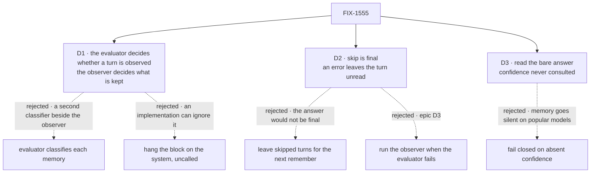

# FIX-1555 · Decisions

[Spec](SPEC.md) · **Decisions** · [Rules](BUSINESS-RULES.md) · [Plan](PLAN.md) · [Docs](DOCS.md) · [Evolution](EVOLUTION.md)

The owner's locks on [FIX-1553](https://linear.app/fixpoint-labs/issue/FIX-1553), the epic's
cards ([D1–D4](../../epics/FIX-1553/DECISIONS.md)) and the Linear acceptance on FIX-1555 (sketch
and seam, never a hard dependency, no second classifier) are decided input. The three cards are
the calls those leave to this issue.

## The tree

Solid edges are what you're signing. Dashed edges lost, and the label says why.

## D1 · The evaluator decides whether a turn is observed; the observer still decides what is remembered

| | |
|---|---|
| **Instead of** | The evaluator classifying each memory (store, salience, kind: the #1903 lab's questions) in place of the observer's own fields · or the lab's seam, which hung the block on the memory system and never called it |
| **Because** | Pulling memories out of a conversation is writing, which is a generator's job. Classifying each one beside the observer's own fields is the second classifier the owner ruled out, and rewriting capture is past this issue's sketch bar. The lab's seam fails the epic's bar for ER-7: an implementation that ignores the evaluator passes it. One known question, asked before the observer, is the smallest call whose answer changes what happens |
| **Locks in** | The evaluator can save observer calls and keep chatter out of memory. It cannot make memory better at what it keeps. A turn it passes costs one evaluate call more than today, so an app gains only where most turns are skips. Classifying memories with an evaluator is a later cut with its own owner |

**What would change my mind:** evidence that the observer's importance and durability fields are
the main source of bad memories. Then the evaluator belongs on those fields, and a gate is the
wrong first seam.

## D2 · A skip is final: the turn is marked read and never observed. An error is not an answer: the turn stays unread, and nothing falls back to the observer

| | |
|---|---|
| **Instead of** | Leaving a skipped turn unread, so the next "remember" sweeps it up · or running the observer when the evaluator fails |
| **Because** | The epic's [D3](../../epics/FIX-1553/DECISIONS.md#d3): a passed evaluator's answer is final, and an error does not fall through to another classifier. An unread skip also grows: every later evaluator call would re-read the whole run of chatter. An error, by contrast, is no answer at all, and today a failed observer already leaves its turn unread |
| **Locks in** | A wrong skip loses that turn's facts for good; how often that happens is the app's model choice. While the evaluation model is down, capture stops, and the missed turns are read late when it recovers. Nobody gets a silent observer run they didn't configure |

**What would change my mind:** an app that needs "skip means later" (say, turns that only make
sense in hindsight). Then skip leaves the turn unread, as a separate answer, not a changed one.

## D3 · Memory reads the bare answer and never consults confidence

| | |
|---|---|
| **Instead of** | Failing closed on absent or low confidence, as `cascadingRouter` does |
| **Because** | The popular providers' evaluation models report no confidence ([epic D2](../../epics/FIX-1553/DECISIONS.md#d2)). Failing closed would make every turn a skip on them, and memory would go empty without an error. "Closed" is not even one direction here: skipping loses data, observing spends a call. The gate is a plain branch on an answer, which is the case the epic sends to a plain `router`. With no threshold, memory computes no number of its own (ER-3) |
| **Locks in** | On a model that reports confidence, a hesitant skip is still a skip. An app that wants a floor puts its own gate before capture; memory grows no floor option. Adding one later is additive |

**What would change my mind:** apps asking for "observe when unsure" on Jev. Then a floor that
turns a low-confidence skip into remember is the addition, still never the reverse.

## Decided, not asked

- **The option is on `system()` only.** `createMemoryCapability` builds no capture.
- **One question, published by memory.** `captureQuestions` carries its wording and two options;
  the app builds the evaluator and picks the model ([epic D3](../../epics/FIX-1553/DECISIONS.md#d3)).
  Extra questions on the app's evaluator are ignored.
- **The option's name follows FIX-1559's slot.** `evaluator` unless that seam shipped otherwise.
- **The evaluator reads the observer's window**, computed once, `source` override included.
- **No new messages, no evaluator call.**
- **On a skip, the clock tick, consolidation checks and hygiene run as today.**
- **Nothing is added to the returned system.** The lab's `mem.classifier` is not carried.
- **No persisted state changes.** The watermark and counters keep their shape.
- **One PR, `tdd`.**

## Considered and dropped

| Alternative | Why not |
|---|---|
| A docs recipe: the app wraps capture in its own sequencer behind an evaluator, and memory ships nothing | Needs no API, and loses: the app would own when a turn counts as read. Getting that wrong observes a turn twice or never. One place decides (tenet 5) |
| A yes/no question read as "remember when P(true) ≥ 0.5" | Memory would pick the threshold, a number of its own. Two named options need none |
| Storing the evaluator's answers on memories as facets | That is [FIX-1557](https://linear.app/fixpoint-labs/issue/FIX-1557)'s shape; memory can adopt it later |
| Evaluator decisions in consolidation or prune | Bigger than a seam, and neither is a known-options question today |
| Cutting FIX-1555, as the epic allows | The epic's trigger is scope past a seam and a proof. This stays at one of each |

## How it got here

- **Draft** — framed as a gate before the observer rather than a capture rewrite; skip is final,
  errors leave the turn unread, confidence unread; one PR in `memory`, with leg (f) and a
  real-model seam goal.

**Open: none.**
