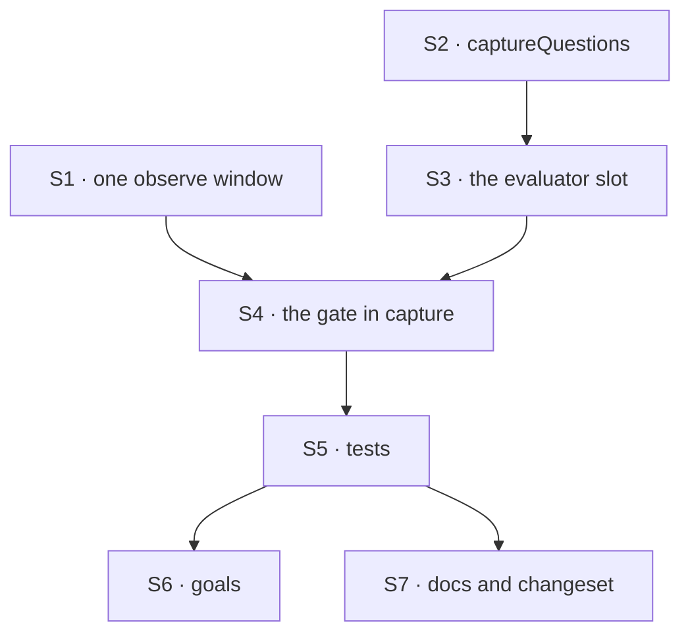

# FIX-1555 · Plan

[Spec](SPEC.md) · [Decisions](DECISIONS.md) · [Rules](BUSINESS-RULES.md) · **Plan** · [Docs](DOCS.md) · [Evolution](EVOLUTION.md)

Written for the implementing agent. IDs cross-reference [BUSINESS-RULES.md](BUSINESS-RULES.md)
(BR-n), [DECISIONS.md](DECISIONS.md) (D-n) and the epic's rules (ER-n). `tdd`. **One PR**, in
`@flow-state-dev/memory`, built only after [FIX-1554](https://linear.app/fixpoint-labs/issue/FIX-1554)
merges (the evaluator block, its answer types and the testing package's mock evaluation model).

## Surfaces

| ID | Package · role | Change | Rules |
|---|---|---|---|
| S1 | `memory` · the observe window | Lift the observer's "new messages since the watermark, else `source`, else the block input" into one function. The observer and the gate both call it | BR-3 BR-9 |
| S2 | `memory` · the published question | `captureQuestions`: one choice question, options `remember` and `skip`, with wording that matches the observer's durability guidance | BR-8 BR-10 |
| S3 | `memory` · `system()` and the blocks config | An optional evaluator slot, typed on core's evaluator block with string input and S2's answer. Named as FIX-1559's slot is | BR-10 BR-12 |
| S4 | `memory` · the capture pipeline | Only when S3 is set: window (S1) → none, stop → evaluator → **remember**: observe and reflect on that window · **skip**: mark the window read. The tick and every side chain run as today on both branches. With S3 unset, the pipeline is built exactly as today | BR-1 BR-3 to BR-7 BR-11 |
| S5 | `memory` tests | V1 to V8 below | all |
| S6 | `goals/memory-evaluator-seam/` | VG1, the epic's leg (f), and VG2, the seam on a real evaluation model | ER-7 ER-15 (f) |
| S7 | Docs, README, changeset | Publish [DOCS.md](DOCS.md). A `minor` changeset for `@flow-state-dev/memory` naming the option and `captureQuestions` | — |

**Removed:** nothing. The lab's `classifier` field on #1903 never shipped and is not lifted
([EVOLUTION.md](EVOLUTION.md)).

## Sequence



S1 is a pure refactor: the existing suite passes before S2 starts.

## Checks

| ID | Runs after | Passes when |
|---|---|---|
| V0 | S1 | The whole existing memory suite passes unchanged |
| V1 | S4 | BR-1: no slot, the pipeline and its trace contain no evaluator step; writes match the no-slot baseline |
| V2 | S4 | BR-4 on the mock: **skip** gives observer call count 0, all three stores unchanged, the watermark past the turn; the next capture with no new messages makes no evaluator call. **This is the ignored-evaluator control:** a pipeline that never calls the slot fails it |
| V3 | S4 | BR-3: **remember** gives one observer call, whose context equals the text the evaluator received, and today's writes |
| V4 | S4 | BR-5 and BR-6: a throwing mock fails the capture, the observer is never called, the watermark is unchanged, and the next capture's evaluator input contains the failed turn |
| V5 | S4 | BR-7 and D3: the same choice with and without `confidence` gives identical outcomes; a low `confidence` on **skip** still skips |
| V6 | S3 | BR-8, BR-9 and BR-10: extra questions ignored; `source` text reaches the evaluator; a type test where missing S2's key fails to compile; the run-time error names `captureQuestions` |
| V7 | S4 | BR-11: a skipped turn's trace has the evaluator row with its answer and no observer row |
| V8 | S3 | BR-12: `packages/memory/package.json` lists no new dependency, and no file under `packages/memory/src` imports a provider package, Jev or the lab. **Negative control:** a planted import fails it |
| VG1 | S6 | **Goal, real model, the epic's leg (f)** (ER-13): `pnpm tsx goals/memory-evaluator-seam/captures-without-an-evaluator/run.mts` on `openai/gpt-5.4-mini`. A turn stating a durable fact lands in working memory; the trace has no evaluator row. **Anti-game:** assert an entry exists, never its wording. **Control:** `GOAL_CONTROL=throwing-evaluator` builds capture with a slot that throws and must fail |
| VG2 | S6 | **Goal, real evaluation model:** `pnpm tsx goals/memory-evaluator-seam/evaluator-decides-observation/run.mts` with Jev via the gateway, or `openai.evaluationModel(...)` when no gateway key is set. Over a held-out mix of fact and small-talk turns, the observer ran on a turn **if and only if** the evaluator answered remember, and a skipped turn wrote nothing. **Anti-game:** never assert which answer a turn got. **Control:** `GOAL_CONTROL=ignore-evaluator` must fail |

One check per decision: D1 is V2 and V3, D2 is V2 and V4, D3 is V5. BP-035's off path is V1 and
VG1.

## Pinned names

| Where | Name | Why pinned |
|---|---|---|
| Memory export | `captureQuestions` | Public. An app passes it to its evaluator |
| Its question key and options | `capture` · `remember`, `skip` | Memory reads them; an app writing its own wording must match |
| The `system()` option | `evaluator`, unless FIX-1559's slot shipped under another name | One inject shape across the epic ([epic D3](../../epics/FIX-1553/DECISIONS.md#d3)) |
| Goal directory | `goals/memory-evaluator-seam/` | FIX-1556 assembles leg (f) from it |

Everything else is yours to name.

## Guardrails

| Rule | Because |
|---|---|
| With no slot, the capture pipeline is constructed exactly as today, not built with a gate that passes everything | Leg (f) and every app today (BP-035's off path). A pass-through gate is still a new step in the trace |
| The gate and the observer read one window, from S1 | Two copies drift, and then the evaluator judges text the observer never sees (tenet 5) |
| Memory never names a model, imports a provider or builds an evaluator | ER-11. The block arrives built |
| No number of memory's own: no threshold, no default confidence | ER-3 and D3 |
| An error or refusal never runs the observer | Epic D3; D2 |
| Do not touch attach, tier isolation or standalone working-memory capture | FIX-1364 and FIX-1396 are other issues' calls; the Linear issue fences them off |

## Docs

Reconcile and publish [DOCS.md](DOCS.md) after V2 and V4 pass: the option row and section on the
configuration page, the pointer from the memory overview, and the README section. No new page.

## Sketch · pseudocode, illustrative, react to the shape

```
system(config):
    capture ← today's pipeline                             when config has no evaluator
    otherwise:
        window  ← the observe window                        S1, computed once
        if window is empty: stop                             BR-5
        answer  ← config.evaluator(window).answers.capture   the choice; confidence unread (D3)
        if answer is "skip": mark window read                D2, nothing written
        else: observe(window) → reflect                      today's path
        tick; side chains as today
```

**POC:** none. The premise that an optional block slot on `system()` is enough was shown by the
lab on #1903 ([epic, What the end-state POC showed](../../epics/FIX-1553/DECISIONS.md#what-the-end-state-poc-showed));
what that lab did not do, call the block, is exactly V2. No counted facts rest on hand
derivation, so no checker applies.

## At implement time

- Read FIX-1554's shipped names: the evaluator factory, `choice`, the answer and block types, and
  the testing package's mock evaluation model. Type S3 on what shipped.
- If FIX-1559 has merged, copy its slot's name and typing. If not, use `evaluator` and note it
  for FIX-1559's author.
- Re-read the capture pipeline in `packages/memory/src/memory-system-blocks.ts`: which step
  advances the watermark, and whether FIX-1396 has changed the resource factories.
- Compare [EVOLUTION.md](EVOLUTION.md)'s lab claims against #1903 at `b33a072`.

## Follow-ups

- Classifying individual memories with an evaluator (D1's later cut). Flag only.
- A floor that turns a hesitant skip into remember on confidence-reporting models (D3). Flag only;
  file when an app asks.
