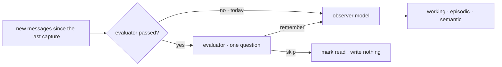

# FIX-1555 · Consumer — memory capture / memory system seam

**Spec** · [Decisions](DECISIONS.md) · [Rules](BUSINESS-RULES.md) · [Plan](PLAN.md) · [Docs](DOCS.md) · [Evolution](EVOLUTION.md)

Feature · `memory` · small · 1 PR · epic [FIX-1553](../../epics/FIX-1553/SPEC.md) · blocked by
[FIX-1554](https://linear.app/fixpoint-labs/issue/FIX-1554) · copies the slot shape of
[FIX-1559](https://linear.app/fixpoint-labs/issue/FIX-1559)

## Six people, before and after

| Someone who… | Today | After |
|---|---|---|
| **captures memory and passes nothing new** | The observer model reads each turn and writes what it finds | The same, call for call. No evaluator code runs |
| **hands memory an evaluator** | Has nowhere to put it | Each turn, the evaluator answers one question first: is anything here worth remembering? On **skip**, the observer never runs and nothing is written. On **remember**, the observer runs on the same messages, as today |
| **runs a chatty agent** ("ok", "thanks", "try again") | Pays an observer call on every turn, most of which store nothing | Pays one evaluate call per turn, and the observer call only on turns the evaluator passes |
| **uses an OpenAI or Anthropic evaluation model** | n/a | Gets the same gate. Memory reads the answer, not a confidence those models don't report ([D3](DECISIONS.md#d3)) |
| **has an evaluation model that fails mid-turn** | n/a | That capture fails, as an observer failure does today. The turn stays unread and the next capture picks it up. Memory never quietly runs the observer instead ([D2](DECISIONS.md#d2)) |
| **debugs capture in the DevTool** | Sees the observer run every turn | Sees the evaluator's answer, and no observer on a skipped turn |

This is the third, and smallest, consumer in the epic: a seam and its proof, not a capture
rewrite. What it buys is a documented place for an evaluator in memory, so memory never grows a
classifier of its own.

## What changes


Follow the skip arrow: it is the only new path, and it writes nothing. Everything on the remember
path, and everything when no evaluator is passed, is today's pipeline unchanged.

**What an app writes:**

```diff
+ import { evaluator } from "@flow-state-dev/core";
- import { system } from "@flow-state-dev/memory";
+ import { system, captureQuestions } from "@flow-state-dev/memory";
+
+ const worthRemembering = evaluator({
+   name: "memory-gate",
+   model: "typesafe-ai/jev",          // or openai.evaluationModel("gpt-5.4-mini")
+   questions: captureQuestions,       // memory's one question; the model is yours
+ });

  const mem = system({
    model: "openai/gpt-5.4-mini",
    working: true,
    episodic: true,
    semantic: true,
+   evaluator: worthRemembering,
  });
```

## How a turn reaches the stores



The evaluator reads exactly the messages the observer would, so the two never disagree about
which turn they judged. Memory builds no evaluator and names no model. It takes the block the
app built.

## What stays as it is

- **Memory with no evaluator.** Same observer, same writes, same state. This is the epic's
  leg (f), and this issue supplies it.
- **What gets remembered.** The observer still extracts and classifies every memory, and
  consolidation, prune, digest and hygiene run as today.
- **Attaching memory to your own agent kind** ([FIX-1364](https://linear.app/fixpoint-labs/issue/FIX-1364)),
  per-tier isolation ([FIX-1396](https://linear.app/fixpoint-labs/issue/FIX-1396)), the
  read-only `createMemoryCapability`, and standalone working-memory capture.
- **Memory's dependencies.** Core only. No Jev, no lab, no provider package.

## Sign off

1. **[D1](DECISIONS.md#d1) · The evaluator decides whether a turn is observed; the observer
   still decides what is remembered.** If wrong: the evaluator can cut calls and noise but never
   improve what memory keeps, and doing that later is a new cut.
2. **[D2](DECISIONS.md#d2) · A skip is final: the turn is marked read and never observed. An
   error leaves the turn unread, and nothing falls back to the observer.** If wrong: a wrong
   skip loses that turn's facts for good.
3. **[D3](DECISIONS.md#d3) · Memory reads the bare answer and never consults confidence.** If
   wrong: on a model that reports confidence, a hesitant skip still drops the turn.

**Open: none.** Number 2 is the one to weigh: it is where a bad evaluator costs an app data. The
reasoning and what lost are in [DECISIONS.md](DECISIONS.md); the cases in
[BUSINESS-RULES.md](BUSINESS-RULES.md).
