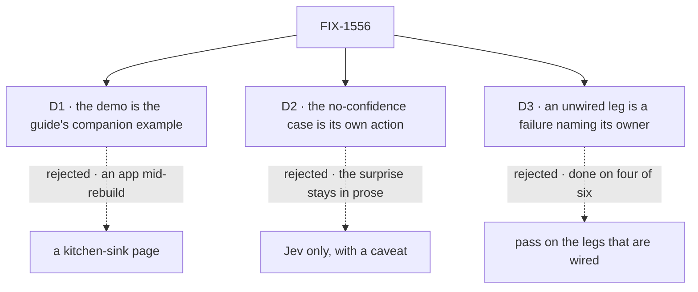

# FIX-1556 · Decisions

[Spec](SPEC.md) · **Decisions** · [Rules](BUSINESS-RULES.md) · [Plan](PLAN.md) · [Docs](DOCS.md) · [Evolution](EVOLUTION.md)

What was considered, what was chosen, and what each choice locks in. The epic's decisions
([FIX-1553 D1 to D4](../../epics/FIX-1553/DECISIONS.md)) and the owner's locks are input here, not
reopened. The epic left two walls open for this issue: where the demo lives, and the guide's
path. D1 closes the first; the path is decided below without an ask.

## The tree

Solid edges are what you're signing. Dashed edges lost, and the label says why.

## D1 · The demo is the guide's companion example, `examples/guides/routing-with-evaluators`, not a kitchen-sink page

| | |
|---|---|
| **Instead of** | A page in the kitchen-sink · or a fixture under `labs/` |
| **Because** | Three guides already ship this way: a guide on the site, and a tested, `fsdev`-runnable package beside it under `examples/guides/` (research team, board lifecycle, custom pattern). It is the smallest surface that already boots, which is what the issue asked for. It depends only on published packages, so "no kitchen-sink-only API" holds by construction and a check can prove it (BR-8). The kitchen-sink is mid-rebuild under FIX-1455 and its chat agent carries the shed thinking-style router; adding a routing demo beside that invites the confusion the owner ruled out. `labs/` is for applications with real data, not teaching snippets (`examples/README.md`) |
| **Locks in** | The kitchen-sink shows no evaluator in this epic. If FIX-1455 wants one later, it copies the example; nothing here has to move. No coordination with FIX-1455 is needed to ship |

**What would change my mind:** the owner wanting the reference app to exercise every block kind
as a standing rule. Then the example still ships, and a kitchen-sink follow-up is filed against
FIX-1455.

## D2 · The example runs the same tree on a model with no confidence, as its own action, and it always lands on review

| | |
|---|---|
| **Instead of** | Running the example on Jev only and stating the no-confidence behaviour in the guide's prose |
| **Because** | The epic's hardest sign-off ([epic D2](../../epics/FIX-1553/DECISIONS.md#d2)) is that a `cascadingRouter` tree on the popular providers routes everything to `ambiguous`. That is the behaviour most likely to read as a bug to a newcomer. Seeing it happen, beside the Jev run that routes, teaches it better than a paragraph does. The same action is leg (c)'s second half, so the goal drives it through `fsdev run` rather than a hand-built harness |
| **Locks in** | Running every action needs two credentials: the gateway for Jev, and whatever the adapter model needs. The README and the guide label that action as the no-confidence case up front, so nobody runs it first and concludes the router is broken |

## D3 · The assembled goal fails closed: an unwired leg is a failure naming its owner, on the shared verdict protocol

| | |
|---|---|
| **Instead of** | A goal that passes on whichever legs are wired, and lists the rest as a note · or a bespoke PASS/FAIL/PENDING per-leg report with a `GOAL_LEGS` subset selector (the first draft of this decision) |
| **Because** | The epic may only wrap when all six legs hold ([epic ER-15](../../epics/FIX-1553/BUSINESS-RULES.md#the-proof)). Legs (e) and (f) belong to FIX-1557 and FIX-1555, which are not blocking this issue and may land weeks later ([epic PLAN](../../epics/FIX-1553/PLAN.md#what-each-issue-entails)). A goal that says PASS with two legs missing is the same soft-fail the whole epic forbids for routing: missing evidence read as good evidence. The repo already has the mechanism: `goals/lib/verdict.mts`'s `runGoal`/`pass`/`fail` is the one verdict shape every goal uses, and `goals/hire-plane/keeps-a-hired-seat-with-its-owner` is an assembled goal grown across several PRs with leg-tagged failures. An unwired leg is one placeholder, `fail('e', 'not yet wired — owned by FIX-1557')` and `fail('f', 'not yet wired — owned by FIX-1555')`, so the run is FAIL until each owner replaces it. No new CLI surface and no third verdict state |
| **Locks in** | The full goal is red from this issue's merge until both siblings replace their placeholders. This issue's merge bar is legs (a) to (d) showing no failures: no `[a]` to `[d]` line in the failure list. The epic's lead measure is the count of legs with no failure line, read off that list, not the exit code. Running only some legs means reading the list; there is no subset flag |

**What would change my mind:** FIX-1555 being cut. The epic already says its leg then leaves by
amendment, and its placeholder is deleted rather than failing forever.

## Decided, not asked

- **The guide is `apps/docs/guides/routing-with-evaluators.md`**, confirming the epic's proposed
  path. It sits in the Guides sidebar just before *Adding skills to your app*, since its third
  step hands off there.
- **The lab page graduates by rewrite, not copy.** Its lab imports, its "POC / DNM" framing and its
  invent-kill table don't go on a published page (the outsider rule in `docs/contributing/user-docs.md`).
  The kills already live as epic rules ER-9 to ER-12.
- **The guide's prose is drafted in [DOCS.md](DOCS.md)** and published through the `docs-writer`
  then `docs-editor` agents, per `CLAUDE.md`.
- **The example's CI tests use the mock evaluation model FIX-1554 adds to `@flow-state-dev/testing`.**
  No key in CI; the real-model proof is the goal's job.
- **The goal drives the example, not the blocks in isolation.** FIX-1554's own goal already proves
  the block alone; legs (a) and (b) here prove it inside an app someone would copy.
- **Facets and memory get one pointer line each** in the guide, only to pages that exist when it
  publishes. The teach path omits them, as the issue says.
- **No changeset.** The example and `goals/` are private; docs need none (BP-022).
- **The skill catalog in the example is two or three `SKILL.md` folders**, written for the demo,
  not borrowed from the kitchen-sink.

## Considered and dropped

| Alternative | Why not |
|---|---|
| Teach every slice of the lab (facets, memory, index-time search) | The issue scopes the teach to evaluate, one cascade and the activator. The others have owners and their own docs |
| One goal per leg, each owned by its child | Six green goals prove six pieces. The epic's gap is the proof that they work together |
| Reuse FIX-1554's goal for legs (a) and (b) | It runs the block bare. It can't catch an example wired wrong, which is what a reader copies |
| Snippets written for the page, separate from the example | They drift. A page snippet that no test compiles is how a guide teaches an API that changed |
| Hold this issue until facets and memory land, so the goal is green at merge | It would put the cut candidate (FIX-1555) on the critical path, which the epic rejected |

## How it got here

- **Draft** — framed as the epic's teach and proof child; the demo is a guide companion example,
  the no-confidence case is runnable, and the assembled goal fails closed on a missing leg.
- **Review round 1** — D3 kept its fail-closed premise but dropped its own PENDING report and
  `GOAL_LEGS` selector for the shared `runGoal` protocol with leg-tagged placeholder failures
  (second-look finding, EM call). BR-16 to BR-18 became one rule. Leg (d) now proves no evaluator
  code loads at the load boundary; the import fence allows relative imports inside the example and
  covers `fsdev.config.ts`; the excerpt rule covers source snippets only.
- **Cross-spec alignment against [#2208](https://github.com/fixpoint-labs/flow-state-dev/pull/2208)**
  (FIX-1559 owns the activator; EM call: FIX-1559 wins). BR-13 and the guide now say an evaluator
  error fails the activator (`.rescue` to carry on), there is no "unsure" state, an explicit "no
  skill" activates nothing, and confidence never gates. BR-14's "nothing is imported" became
  FIX-1559's definition: no evaluator block built or resolved, no value import of the helper in
  the activator module; V3 and leg (d) spy on construction and resolution, not module import. The
  guide and example use `skillEvaluator(model)` / `skillQuestions`, and memory's
  `captureEvaluator(model)` / `captureQuestions` from FIX-1555.

**Open: none.**
