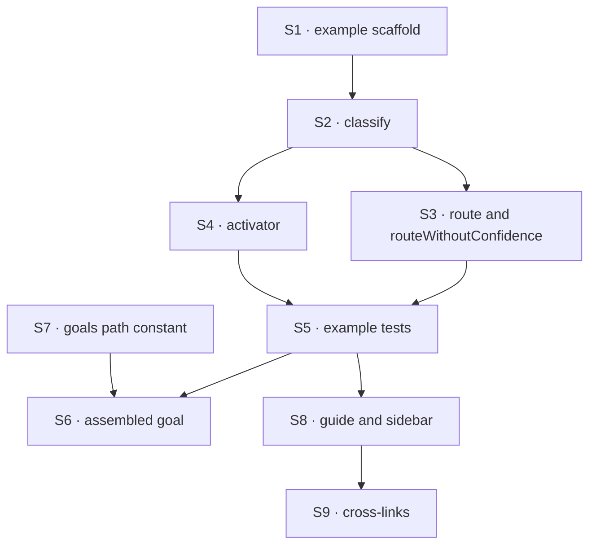

# FIX-1556 · Plan

[Spec](SPEC.md) · [Decisions](DECISIONS.md) · [Rules](BUSINESS-RULES.md) · **Plan** · [Docs](DOCS.md) · [Evolution](EVOLUTION.md)

Written for the implementing agent. IDs cross-reference [BUSINESS-RULES.md](BUSINESS-RULES.md)
(BR-n), [DECISIONS.md](DECISIONS.md) (D-n) and the epic's rules (ER-n). `tdd`. **One PR**, built
only after FIX-1558 and FIX-1559 merge (and FIX-1554 through them).

## Surfaces

| ID | Package · role | Change | Rules |
|---|---|---|---|
| S1 | `examples/guides/routing-with-evaluators` · package scaffold | New private workspace package, shaped like `examples/guides/research-team`: `package.json`, `fsdev.config.ts`, `tsconfig.json`, `vitest.config.ts`, README. Dependencies: published `@flow-state-dev/*` packages only | BR-8 BR-15 |
| S2 | same · the `classify` action | One `evaluator` asking a choice, a score and a boolean about a support ticket, on `typesafe-ai/jev` | BR-10 |
| S3 | same · the `route` and `routeWithoutConfidence` actions | One two-level `utility.cascadingRouter` tree built by `triage(model)`, in FIX-1558's shape ([FIX-1558 D1](../FIX-1558/DECISIONS.md#d1)): `triage` builds each level's evaluator with that model and passes it as the level's `ask` (`{ ask, on, branches }`); the cascade itself never takes a model. The first level may reuse S2's `team` question. `route` passes Jev; `routeWithoutConfidence` passes an evaluation adapter that reports no confidence. Leaves are plain handlers; the required `ambiguous` is a review leaf ([D2](DECISIONS.md#d2)) | BR-11 BR-12 |
| S4 | same · the activator action | A small `SKILL.md` catalog (two or three skills) and `createSkillActivator` with `evaluator: skillEvaluator(model)` for tier 3, per FIX-1559's shipped option | BR-13 |
| S5 | same · tests | Vitest on FIX-1554's mock evaluation model: S2 to S4's behaviour, the no-evaluator activator (BR-14) with the evaluator construction and resolution boundary instrumented, and an import-boundary test (V1) | BR-8 BR-9 BR-13 BR-14 |
| S6 | `goals/evaluator/holds-as-an-assembled-set/` | The assembled goal: `goal.md`, `run.mts`, `fixtures/`, on `goals/lib/verdict.mts`'s `runGoal`, with leg-tagged failures as in `goals/hire-plane/keeps-a-hired-seat-with-its-owner`. Legs (a) to (d) drive the example through `runFsdev`; (e) and (f) ship as placeholders, `fail('e', 'not yet wired — owned by FIX-1557')` and `fail('f', 'not yet wired — owned by FIX-1555')`, which their owners replace. Plus the `fake-confidence` control ([D3](DECISIONS.md#d3)) | BR-16 BR-19 to BR-21 |
| S7 | `goals/lib` · paths | One repo-anchored constant for the example's directory, beside `HELLO_CHAT` | — |
| S8 | `apps/docs/guides/routing-with-evaluators.md` + `apps/docs/sidebarsGuides.ts` | Publish the guide from [DOCS.md](DOCS.md), snippets reconciled to S2 to S4; sidebar entry before `adding-skills-to-your-app` | BR-1 to BR-7 |
| S9 | Cross-links | The evaluator section of `fundamentals/blocks.md`, `skills/activation.md`, and FIX-1558's `#cascadingrouter` section on `patterns/utility-blocks/core.md` each gain one line pointing at the guide ([DOCS.md](DOCS.md)) | BR-7 |

**Removed:** nothing. The kitchen-sink is not touched ([D1](DECISIONS.md#d1)).

## Sequence



S8 waits on S5 so every snippet is cut from tested code. S6 and S8 can run side by side.

## Checks

| ID | Runs after | Passes when |
|---|---|---|
| V1 | S1 | An import-boundary test walks every runtime TS/JS file in the example, root `fsdev.config.ts` included, skipping only generated and vendor code (`node_modules`, build output), and fails on an import outside BR-8's list. A relative import passes only if it resolves inside the example directory. **Negative controls:** a planted `import … from "../../../apps/kitchen-sink/…"` in `src/` fails it, and so does a planted `labs/` import in `fsdev.config.ts`; a sibling `./route` import passes. Each is then removed |
| V2 | S3 | On the mock: `classify` returns typed answers, with `confidence` present only when the mock scripted it (assert with `in`). `route` lands on the gated leaf when the mock gives choice and confidence; on review when it gives the choice with no confidence, and with confidence under the edge's minimum. Checks [D2](DECISIONS.md#d2) |
| V3 | S4 | Slash wins over the evaluator; keyword wins over the evaluator; the evaluator picks by description when neither resolves, and a pick the mock scripts with low or no confidence still activates. An explicit "no skill" activates nothing. A throwing evaluator fails the action with that error and no generator classifier runs; wrapped in `.rescue`, the rescue handler's result comes back. With none passed, no evaluator is built or resolved, proved at the construction and resolution boundary: a spy on the evaluator's construction and its model resolution records zero calls. Module import is not asserted: the helper module may load with the package. A trace with no evaluator row is not enough on its own. **Negative control:** eagerly constructing the evaluator in the no-evaluator path fails the check |
| V4 | S1 to S4 | Each command in the example README runs from its directory. The no-key commands run in CI through the tests; the model-backed ones are run by hand and recorded in the PR |
| V5 | S8 | The docs site builds with no broken links. Every source code block in the guide names an example file in its title and matches a region of it. Command fences are exempt from that and are run instead (V4); the refusal output fence matches the shipped error. A grep over the page finds no issue or PR ids and none of BR-6's names. The refusal text matches the shipped error |
| VG | S6 | **Goal, real models** (ER-13): `pnpm tsx goals/evaluator/holds-as-an-assembled-set/run.mts` exits FAIL, and its failure list holds only the `[e]` and `[f]` placeholders, each naming its owner. No failure tagged `[a]` to `[d]` is this issue's merge bar. Leg (d)'s no-evaluator half asserts at the construction and resolution boundary, as V3 does. **Control:** `GOAL_CONTROL=fake-confidence` must FAIL leg (c) and only leg (c). Checks [D3](DECISIONS.md#d3) |

One check per decision: D1 is V1, D2 is V2's no-confidence case and VG's control, D3 is VG's full
run. The second path (BP-035) is the no-evaluator activator (V3) and the no-confidence tree (V2).

## Pinned names

| Where | Name | Why pinned |
|---|---|---|
| Guide | `apps/docs/guides/routing-with-evaluators.md` | The epic proposed it; siblings' docs link to it |
| Example | `examples/guides/routing-with-evaluators`, flow `routing-with-evaluators` | The guide and the goal both name it |
| Actions | `classify`, `route`, `routeWithoutConfidence` | The guide's commands and the goal's legs call them |
| Goal | `goals/evaluator/holds-as-an-assembled-set/`, leg letters (a) to (f) as in ER-15 | FIX-1557 and FIX-1555 wire their legs into it by letter |
| Goal knobs | `GOAL_CONTROL=fake-confidence`. No leg selector: every run runs every leg, and failures are tagged by leg letter | Siblings and the wrap run them |

The activator action's name, file layout and test names are yours.

## Guardrails

| Rule | Because |
|---|---|
| The example uses only what the siblings shipped. If teaching needs something they didn't ship, stop and raise it to the epic | A demo-only helper is the "kitchen-sink-only API" the owner killed, just in a different folder |
| Build the tree once, with the model as a parameter | Two copies of the tree would let the Jev and no-confidence runs drift, and the comparison is the lesson |
| A leg's slot is a small, documented seam in `run.mts`: one placeholder `fail(<letter>, 'not yet wired — owned by <issue>')`. The owner replaces that line with the leg's assertions; nothing else in the goal changes | FIX-1557 and FIX-1555 wire legs later, in their own PRs. A goal they have to restructure will get forked |
| Assert what a user sees: the leaf the output names, the activated skill in session state, the refusal error. Never the router's internal path | An internal path can report the gated leaf while the output is review |
| Snippets are cut from the example, never written on the page | A snippet no test compiles drifts from the API it teaches |
| No confidence is supplied anywhere in the example, mock setups aside | The example would teach the exact thing the epic forbids (ER-9) |

## Docs

Publish [DOCS.md](DOCS.md) after V2 and V3 pass, through `docs-writer` then `docs-editor`.
Reconcile its builder and option names to what FIX-1558 and FIX-1559 shipped; the prose promises
stand. No changeset.

## Sketch · pseudocode, illustrative, react to the shape

```
the tree, built once:
    triage(model) = utility.cascadingRouter; each level's `ask` is an evaluator built with model
        root level: "which team?"
        billing, gated  → next question "how urgent?"
            urgent, gated → urgent-billing leaf
            routine, gated → billing-queue leaf
        technical, gated → tech-queue leaf
        ambiguous → review leaf
flow actions:
    classify               → one evaluator, three questions
    route                  → triage(Jev via gateway)
    routeWithoutConfidence → triage(an evaluation adapter with no confidence)
    activate               → skill activator, skillEvaluator(model) for tier 3
the goal:
    legs = { a: classify on Jev, b: refused generate-only model, c: route + routeWithoutConfidence,
             d: activate with and without an evaluator, e: slot (facets), f: slot (memory) }
    runGoal over every leg; an unwired leg is a placeholder fail naming its owner;
    any failure fails the run, each line tagged with its leg letter
```

**POC:** none. The end-state POC on #1903 already showed the pieces compose
([epic](../../epics/FIX-1553/DECISIONS.md#what-the-end-state-poc-showed)), and a new one would
have to stand in for APIs that are still being specced. No factual-base checker either: the spec
rests on no counted facts.

## At implement time

- Read the shipped names from `main`: FIX-1554's builders and mock model, FIX-1558's tree and
  gate options, FIX-1559's evaluator option. The lab's names in [DOCS.md](DOCS.md) are placeholders
  where they differ.
- Which adapter serves `routeWithoutConfidence` depends on the credentials present and on how
  FIX-1554's resolver routes a string through the gateway. Prefer a string; fall back to an
  adapter instance if the gateway has no evaluation door for it. Say which in the README.
- Check whether FIX-1557 or FIX-1555 have merged. If one has, wire its leg in this PR.
- If FIX-1555 has been cut, drop leg (f) from the goal, per the epic.

## Follow-ups

- If the owner wants every block kind shown in the kitchen-sink, file it against FIX-1455
  ([D1](DECISIONS.md#d1)).
