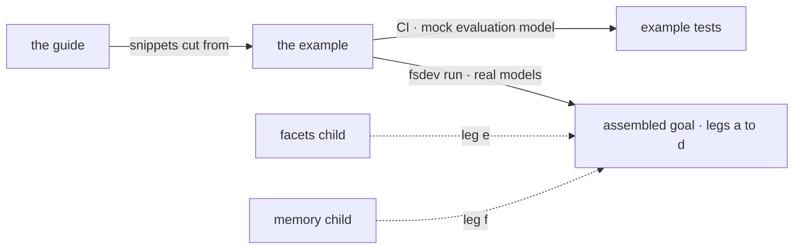

# FIX-1556 · Docs + kitchen-sink teach path

**Spec** · [Decisions](DECISIONS.md) · [Rules](BUSINESS-RULES.md) · [Plan](PLAN.md) · [Docs](DOCS.md) · [Evolution](EVOLUTION.md)

Feature · `apps/docs` + `examples/guides` + `goals` · medium · 1 PR · epic
[FIX-1553](../../epics/FIX-1553/SPEC.md) · blocked by FIX-1558 and FIX-1559

## Five people, before and after

| Someone who… | Today | After |
|---|---|---|
| **wants to classify input with a model** | Finds nothing in the docs. The only teaching page is on an unmerged lab branch and imports a package that will never ship | Reads one guide, *Routing with evaluators*: ask typed questions first, then one routing tree, then the skill activator. Each step is copy-paste from shipped packages |
| **wants to run it before trusting it** | Has nothing to run | Runs a companion example from its own directory with `fsdev`. Its tests pass with no API key |
| **is on OpenAI or Anthropic, not Jev** | Would copy a tree and find it never routes, with no explanation | Sees it in the guide and runs it in the example: the same tree on a model with no confidence sends every ticket to review. The guide says why, and says to use a plain `router` instead |
| **maintains the kitchen-sink** | Carries a rebuild in flight | Carries nothing new from this epic. The example is the teach surface ([D1](DECISIONS.md#d1)) |
| **wraps the epic** | Has six children with separate PRs and no proof they work together | Runs one assembled goal on real models. It reports each of the six legs, and it cannot pass while any leg is missing ([D3](DECISIONS.md#d3)) |

The epic's other children each prove their own piece. This issue is the only one that runs them
together, teaches them in order, and says plainly what a model without confidence does to a
routing tree ([epic ER-15, ER-16](../../epics/FIX-1553/BUSINESS-RULES.md#the-proof)).

## What changes

![Three columns, read to run to prove. Today: a lab teaching page on an unmerged branch, no runnable demo, no assembled check. After: a published guide in the Guides sidebar; a companion example under examples/guides with three flow actions (classify, route on Jev, route on an adapter with no confidence) plus the skill activator, tested with a mock evaluation model; and an assembled goal with six legs, four driven through the example and two slots owned by the facets and memory children. A fence under the example: it imports only published packages, never a lab or the kitchen-sink.](figures/what-changes.svg)

Read left to right. Every snippet in the guide is cut from the example's tested source, and the
goal drives that same example on real models. The fence under the example is the epic's "no
kitchen-sink-only APIs" rule made checkable.

**What a reader types, after the guide:**

```diff
+ cd examples/guides/routing-with-evaluators
+ pnpm fsdev run routing-with-evaluators classify -i '{"message":"I was charged twice for March"}'
+ pnpm fsdev run routing-with-evaluators route -i '{"message":"I was charged twice for March"}'
+ # → the billing-urgent leaf, on Jev
+ pnpm fsdev run routing-with-evaluators routeWithoutConfidence -i '{"message":"I was charged twice for March"}'
+ # → review, every time: the adapter reports no confidence
```

## How the three pieces hold each other honest



Solid edges are this issue's. Dashed ones are slots the facets and memory children fill; until
they do, each is a placeholder failure naming its owner, and the goal does not pass.

## What stays as it is

- **The kitchen-sink.** No evaluator demo there, and its chat agent's thinking-style router is
  neither revived nor removed ([FIX-1455](https://linear.app/fixpoint-labs/issue/FIX-1455) owns
  that app).
- **Every API.** This issue adds no exports. It teaches what FIX-1554, FIX-1558 and FIX-1559 ship.
- **Reference pages owned by siblings:** the evaluator section of the blocks page, the
  `cascadingRouter` options, the activator's evaluator option. The guide links to them.
- **Model strings.** Examples use the strings current at publication; the `provider:model`
  rewrite is [FIX-1495](https://linear.app/fixpoint-labs/issue/FIX-1495)'s.

## Sign off

1. **[D3](DECISIONS.md#d3) · The assembled goal fails closed: a leg not yet wired is a failure
   naming its owner.** This issue merges when legs (a) to (d) show no failures; the full goal
   stays red until facets and memory land. If wrong: a goal sits red in the sweep for weeks, or,
   the other way, the epic reports done on four legs of six.
2. **[D2](DECISIONS.md#d2) · The example runs the no-confidence case as its own action, so readers
   see a tree route everything to review.** If wrong: the example looks broken to a reader who
   runs that action first, and running every action needs a second provider key.
3. **[D1](DECISIONS.md#d1) · The demo is the guide's companion example under `examples/guides/`,
   not a kitchen-sink page.** If wrong: the canonical reference app lacks the fifth block kind
   until someone ports the example.

**Open: none.** Number 1 is the one to weigh: it decides when the epic can say it is done. The
reasoning and what lost are in [DECISIONS.md](DECISIONS.md); the cases in
[BUSINESS-RULES.md](BUSINESS-RULES.md).
