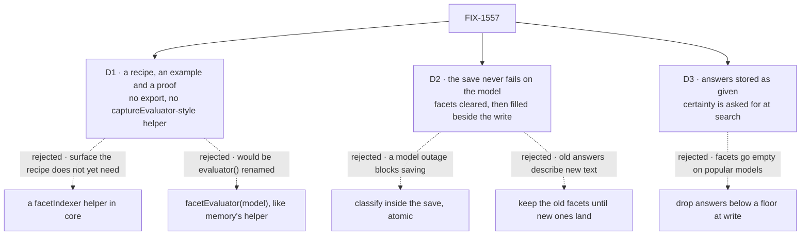

# FIX-1557 · Decisions

[Spec](SPEC.md) · **Decisions** · [Rules](BUSINESS-RULES.md) · [Plan](PLAN.md) · [Docs](DOCS.md) · [Evolution](EVOLUTION.md)

The owner's locks on [FIX-1553](https://linear.app/fixpoint-labs/issue/FIX-1553) and FIX-1557
(index-time, query-time classify as an escape hatch only, one classify stack, split from
FIX-1482, prefer-when-available), the epic's cards ([D1–D4](../../epics/FIX-1553/DECISIONS.md))
and FIX-1554's answer shape ([its D3](../FIX-1554/DECISIONS.md#d3)) are decided input. The three
cards are the calls those leave here, including the two walls the issue left open: storage and
reindex.

## The tree

Solid edges are what you're signing. Dashed edges lost, and the label says why.

## D1 · Facets ship as a recipe, a runnable example and a proof. No new export, and no helper like memory's `captureEvaluator`

| | |
|---|---|
| **Instead of** | A `facetIndexer(evaluator)` block factory in core that returns the reaction · or a `facetEvaluator(model)` helper paralleling memory's `captureEvaluator(model)` (FIX-1555's D4, on its spec PR [#2195](https://github.com/fixpoint-labs/flow-state-dev/pull/2195)) |
| **Because** | Every piece ships: `evaluator`, `reactTo.contentUpdated` (whose docs already name re-indexing), `.sideChain()`, collection state. Tenet 2: a composition in disguise. Memory's helper earns its place because memory owns the question; here the questions are the app's, so `facetEvaluator(model)` would be `evaluator()` renamed. A reaction factory would absorb D2's three rules, which the example carries in about twenty lines. Tenet 3: an export is a contract, and no host package exists to carry it |
| **Locks in** | Apps copy the reaction from `examples/guides/index-time-facets/`; the resources search page teaches it. The example's flow takes the evaluator block and never names a model inside ([epic D3](../../epics/FIX-1553/DECISIONS.md#d3)). **Collapse trigger:** a second app copies the recipe, or a review finds a copy missing one of D2's rules. Then the reaction becomes one helper, additively |

**What would change my mind:** a real app wiring facets outside a flow turn, where `reactTo`
doesn't fire. That is a missing primitive, not a recipe.

## D2 · A save never fails because classification failed. Old facets are cleared first, new ones are stored beside the write, and only if the body hasn't moved on

| | |
|---|---|
| **Instead of** | Classifying inside the save, so a failed evaluate fails the write turn · or leaving the old facets in place until new ones arrive |
| **Because** | A reaction is atomic by default: a throw fails the writing turn, after the body is already stored. An outage would fail the save and leave old answers on new text, the one wrong result a deterministic search can't detect. Clearing first makes every failure look the same: no facets. The side chain keeps the save independent of the model. The current-body rule stops a slow classification landing over a newer write |
| **How "current" is enforced** | Checking the body and then writing facets is two steps, and a newer write can land between them: its reaction clears the facets, the older side chain restores its own, and if the newer classification then fails the stale answers stay (review on #2210). So every body write gets a **generation token**: the reaction's blocking step writes a fresh one in the same state write that clears `facets`. The side chain stores facets only through `ref.updateState(s => s.indexedAs === mine ? { ...s, facets } : s)`. That updater runs inside the resource CAS driver (`runResourceCAS`, `packages/engine/src/stores/resource-cas.ts`) against the stored row and re-runs against the winner's row on a version conflict, so the token check and the write commit together or not at all. **No new primitive:** `updateState` ships on every collection instance. The blocking step writes the token before it reads the body, so the reaction whose token is current also read the body last: two concurrent turns whose reactions land out of order still classify the newest body. Between a newer body landing and its reaction's clear, a search can briefly see the older answers; that reaction runs before its turn completes. If it fails, the write turn fails and says so |
| **Locks in** | A document written during an outage is invisible to facet search, not wrong in it, until reindex runs. The side chain drains before the turn ends, so the next turn's search sees the facets. The failure shows in the trace, not the user's stream. The collection's state carries `indexedAs` beside `facets`. The atomic guarantee is the store's: memory, SQLite and Postgres check the version on the row; the filesystem store locks each record in-process only, so two processes over one directory can still interleave |

**What would change my mind:** an app where a save must not complete unless it is classified (a
compliance label, say). Then that app binds the same reaction blocking, and the docs say how.

## D3 · Answers are stored as the model gave them. Nothing is dropped for low or missing confidence at write; a search that wants certainty asks for it

| | |
|---|---|
| **Instead of** | Dropping an answer below a confidence floor when writing, as the lab did (`facetsFromAnswers` with `minConfidence`) |
| **Because** | The popular adapters report no confidence ([epic D2](../../epics/FIX-1553/DECISIONS.md#d2)). A write-time floor would store no facets on them, and every search would come back empty with no error. A floor also picks a number of the consumer's own (ER-3). Stored as given, the answer keeps its confidence when there is one, and the gate moves to the search, where the epic puts gates |
| **Locks in** | A plain facet search matches on the choice alone. The example's search takes an optional minimum confidence; when set, an answer without confidence fails it, the same fail-closed rule as `cascadingRouter` (ER-4). The stored facets are FSD's answer type verbatim, so a change to that type is a change to stored rows (BP-030) |

**What would change my mind:** apps that only ever search with a floor. Then storing below-floor
answers is dead weight, and dropping them at write is cheaper.

## Decided, not asked

- **Storage (open wall): the document's own state**, one nullable `facets` field keyed by
  question id. Not a separate index collection: two stores drift.
- **Trigger: `contentUpdated`.** A facet write is a state write, so it cannot loop. Text held in
  state binds `created` and `stateUpdated` with a `when` on the text fields.
- **Reindex (open wall) is explicit:** an action over unfaceted documents, or all with `force`
  after the questions change. No automatic detection in v1.
- **Search is app code over the collection**, offered to agents as a handler tool; a projected
  collection uses its `filter` query. No core search tool; a later filter joins FIX-1482's tool.
- **Query-time classify** is one docs paragraph with its cost. The example doesn't ship it.
- **Teach slice (open wall): no kitchen-sink.** The example is `examples/guides/index-time-facets/`;
  FIX-1556's guide stays without facets.
- **Leg (e)** replaces FIX-1556's placeholder line, or FIX-1556 wires it if it merges later.
- **One PR, `tdd`, no changeset:** only private example, docs and goal files change.

## Considered and dropped

| Alternative | Why not |
|---|---|
| The lab's `createSystemOneIndexCapability` with a default-on search tool | Named for the killed System One package, resolved its own model, and floored at write (D3) |
| A new core `filterResources` tool | A second query system beside lexical search and FIX-1482's work-query |
| Classifying the search string by default | The owner's lock: query-time classify is the escape hatch |
| Embeddings or RAG | Not the FSD resource-search story (owner lock) |
| Content hash plus schema version on every row (the lab's `needsReindex`) | Only pays off with automatic reindex, which v1 doesn't do. Additive later |

## Settled

- **A facet write cannot re-trigger the reaction.** **CONFIRMED** from `main`: the dispatcher
  routes a state write to `stateUpdated` and only a `writeContent` to `contentUpdated`
  (`packages/engine/src/context/reactive-dispatch.ts`); the resources docs say the same.
- **A side-chain failure doesn't fail the turn, and the side chain drains before the turn ends.**
  **CONFIRMED** from `apps/docs/docs/sequencers/composing-blocks.md` and the reactive-blocks page.
- **A collection instance's `updateState` is a conditional write.** **CONFIRMED** from `main`: it
  runs the updater through `persistNamespaceInstanceState` into `runResourceCAS`, which hands it
  the stored row, writes at that row's version, and on a conflict refreshes and re-runs it
  (`packages/engine/src/context/resource-registry.ts`, `packages/engine/src/stores/resource-cas.ts`).
  A `contentUpdated` payload carries only `key` and `ref`, no content version
  (`reactive-dispatch.ts`), so the token is minted by the reaction, not read from the write.

## How it got here

- **Draft** — framed as the one consumer with no host package; shipped as a recipe on shipped
  primitives with a runnable example and leg (e); clear-then-classify beside the write; answers
  stored as given.
- **Review round 1** — Codex found the current-body check and the facet write were two steps a
  newer write could land between, restoring stale facets that survive a failed reclassify. D2 now
  stores through a generation token (`indexedAs`) and a CAS-conditional `updateState`, with the
  token written before the body is read. BR-5 and V9 cover it.

**Open: none.**
