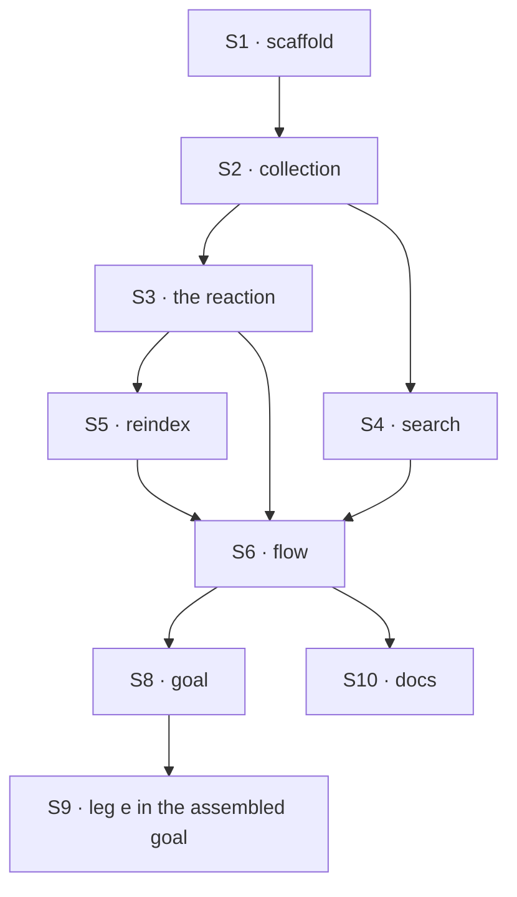

# FIX-1557 · Plan

[Spec](SPEC.md) · [Decisions](DECISIONS.md) · [Rules](BUSINESS-RULES.md) · **Plan** · [Docs](DOCS.md) · [Evolution](EVOLUTION.md)

Written for the implementing agent. IDs cross-reference [BUSINESS-RULES.md](BUSINESS-RULES.md)
(BR-n), [DECISIONS.md](DECISIONS.md) (D-n) and the epic's rules (ER-n). `tdd`. **One PR**, built
only after [FIX-1554](https://linear.app/fixpoint-labs/issue/FIX-1554) merges: it needs the
`evaluator` block, its answer types and the testing package's mock evaluation model. No shipped
package changes; no changeset.

## Surfaces

| ID | Where · role | Change | Rules |
|---|---|---|---|
| S1 | `examples/guides/index-time-facets/` · package scaffold | New private example, shaped like `examples/guides/board-lifecycle/`: `package.json`, `fsdev.config.ts`, `vitest.config.ts`, `tsconfig.json`, `README.md`. The config builds the evaluator (model named here, once) and passes it to the flow | BR-17 |
| S2 | the example · the collection | A user-scoped collection with the body as content and a nullable `facets` field in state (BP-023). No client content-edit grant. `reactTo.contentUpdated` bound to S3 | BR-1 BR-6 BR-7 BR-16 |
| S3 | the example · the reaction | A sequencer on the content-change payload. Blocking: clear `facets`, read the body. Side chain: the passed evaluator on the body, then store its `answers` as `facets` only if the body still equals what was classified | BR-1 to BR-5 |
| S4 | the example · search | A handler: facet values plus an optional minimum confidence in, matching keys out. Lists the collection and filters stored answers. The same handler is offered to agents as a tool | BR-8 to BR-12 |
| S5 | the example · reindex | An action that runs S3's classify step over documents with no facets, or over all with `force` | BR-14 BR-15 |
| S6 | the example · the flow | `defineFlow` with actions `write`, `search`, `reindex`, built by a factory that takes the evaluator block | BR-17 |
| S7 | the example · tests | V1 to V8 on the mock evaluation model; no API key | all |
| S8 | `goals/index-time-facets/found-without-a-model-call/` | VG: `goal.md`, `run.mts`, `fixtures/`, on `goals/lib/verdict.mts` | ER-15 (e) |
| S9 | `goals/evaluator/holds-as-an-assembled-set/run.mts` (FIX-1556's) | Replace the `fail('e', …)` placeholder line with a call into S8's check. Nothing else in that goal changes | ER-15 (e) |
| S10 | Docs | Publish [DOCS.md](DOCS.md) | BR-13 BR-16 |

**Removed:** nothing shipped. The lab's facets slice on #1903 is superseded, not lifted
([EVOLUTION.md](EVOLUTION.md)).

## Sequence



S7 grows with S3 to S5. S9 only if FIX-1556 has merged; otherwise note it on FIX-1556.

## Checks

| ID | Runs after | Passes when |
|---|---|---|
| V1 | S3 | BR-1, BR-2, BR-7: a body write gives one mock call on that body and `facets` deep-equal to the mock's answers, `confidence` key present exactly when the mock set it. Creating without a body gives zero calls |
| V2 | S4 | BR-8, BR-9, BR-12: after two writes with different answers, a search returns only the match; the mock call counter does not move during the search, and the search turn's trace has no evaluator or generator row. An unclassified document never matches. The tool form returns the same |
| V3 | S3 | BR-3, BR-4: write a body (classified), then rewrite it with a throwing mock. The write turn succeeds, `facets` is null, and the old match is gone from search. **Control:** a reaction without the clear step fails this check |
| V4 | S4 | BR-10, BR-11, D3: same choice stored with confidence 0.9, with 0.3, and with none. No minimum: all three match. Minimum 0.5: only the first |
| V5 | S3 | BR-5: a mock that holds the first classification open; a second write lands; release the first. Stored facets are the second body's answers. **Control:** drop the still-current check and it fails |
| V6 | S3 | BR-6: after one write, the mock call count is 1 and stays 1 once facets are stored |
| V7 | S5 | BR-14, BR-15: reindex classifies only unfaceted documents; `force` reclassifies all |
| V8 | S1 · S6 | BR-16 to BR-18: the collection grants no client content update; the example's source imports no lab, kitchen-sink, `intentClassifier` or generator; `git diff --stat origin/main -- packages/` is empty. **Negative control:** a planted lab import fails it |
| VG | S8 | **Goal, real model, leg (e)** (ER-13): `pnpm tsx goals/index-time-facets/found-without-a-model-call/run.mts`, Jev via the gateway, else `openai.evaluationModel(...)`. On one store, turn 1 writes held-out documents; turn 2 searches for a facet value turn 1 stored. Passes when that document is returned and turn 2's trace has no evaluator or generator row and zero token usage. **Anti-game:** take the search value from stored facets; never assert a label. **Control:** `GOAL_CONTROL=classify-at-query` routes search through the evaluator and must fail |

One check per decision: D1 is V8, D2 is V3 and V5, D3 is V4. BP-035's second paths: failure (V3),
concurrency (V5), legacy documents (V7).

## Pinned names

| Where | Name | Why pinned |
|---|---|---|
| Stored field | `facets`, nullable, default null, keyed by question id | The docs teach it; a later FIX-1482 filter reads it |
| Example directory | `examples/guides/index-time-facets/` | The docs link it |
| Example actions | `write`, `search`, `reindex` | The docs and the goal call them |
| Goal directory | `goals/index-time-facets/found-without-a-model-call/` | FIX-1556's assembled goal calls it for leg (e) |

Everything else is yours to name.

## Guardrails

| Rule | Because |
|---|---|
| Nothing under `packages/` changes | [D1](DECISIONS.md#d1). A needed package change means the recipe is wrong; raise it to the epic, don't add surface |
| The model is named once, at the app edge; the flow takes the block | Epic D3 and ER-11. The example is what apps copy |
| Clear in the blocking step, classify on the side chain, store only if the body is current | [D2](DECISIONS.md#d2). Each of the three alone still lets stale answers through |
| No confidence floor and no default at write; confidence read only at search | [D3](DECISIONS.md#d3), ER-3 |
| The search path calls no block but the search handler | ER-6. The goal's control exists because a search that "just checks" with the evaluator passes every other test |
| Docs snippets are cut from the example's tested source | A snippet that drifted from a tested file is how a recipe teaches a bug |

## Docs

Reconcile and publish [DOCS.md](DOCS.md) after V2, V3 and V5 pass, cutting each snippet from S2 to
S4 as built.

## Sketch · pseudocode, illustrative, react to the shape

```
flow(evaluator):
  docs collection: state { title, facets = null }, body = content
    on content written → index(change)
  index(change):                                   blocking
    patch facets = null                            D2 · BR-3
    body ← read content of change.key
    side chain:
      answers ← evaluator(body).answers            one call
      if read content of change.key == body:       BR-5
        patch facets = answers                     stored as given · D3
  search(values, minConfidence?):                  no model
    list docs → keep where every value matches facets[q].choice
                and (no minimum or facets[q].confidence ≥ minimum)
  reindex(force?): for docs with a body and (force or facets null) → index
```

**POC:** none. Both premises (a facet write can't re-trigger the reaction; a side-chain failure
doesn't fail the turn) are confirmed from code and docs ([Settled](DECISIONS.md#settled)), and
the #1903 lab already ran classify-on-write with a deterministic filter. No counted facts, so no
checker applies.

## At implement time

- Type `facets` on FIX-1554's shipped answer types and use its mock evaluation model.
- FIX-1556 merged: do S9. Not yet: comment on FIX-1556 with S8's path.
- Re-check whether client content edits now fire reactions (BR-16 would relax).
- FIX-1482's tool shipped: don't wire facets into it here; file the follow-up.

## Follow-ups

- A reaction helper, if D1's collapse trigger fires. Flag only.
- Automatic reindex on a question-set change (a version on stored facets). Flag only.
- An optional facet filter on FIX-1482's work-query tool. Flag only, owned there.
