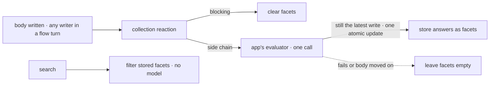

# FIX-1557 · Composition — index-time facets on evaluate answers

**Spec** · [Decisions](DECISIONS.md) · [Rules](BUSINESS-RULES.md) · [Plan](PLAN.md) · [Docs](DOCS.md) · [Evolution](EVOLUTION.md)

Feature · `apps/docs` + `examples/guides` + `goals` · no package changes · small · 1 PR · epic
[FIX-1553](../../epics/FIX-1553/SPEC.md) · blocked by
[FIX-1554](https://linear.app/fixpoint-labs/issue/FIX-1554) · supplies the epic's leg (e)

## Six people, before and after

| Someone who… | Today | After |
|---|---|---|
| **wants "every open billing ticket" from their own documents** | Asks a model to classify the search on every lookup, or greps for words and misses the ticket that says "refund" | Classifies each document once, when its body is written, and filters the stored answers. The search makes no model call |
| **is tempted to build a separate classify service for search** | Has nothing that says not to | Follows one recipe on the shipped `evaluator` block and resource reactions. Nothing new to install ([D1](DECISIONS.md#d1)) |
| **saves a document while the evaluation model is down** | n/a | The save succeeds. The document has no facets until classification lands, so a facet search doesn't find it, and never finds it under stale answers ([D2](DECISIONS.md#d2)) |
| **uses OpenAI or Anthropic, not Jev** | n/a | Gets facets. Answers are stored as the model gave them, confidence or not. A search that asks for certainty skips answers that carry none ([D3](DECISIONS.md#d3)) |
| **changes the questions, or already has documents** | n/a | Runs the recipe's reindex action once. Nothing reclassifies behind their back |
| **wraps the epic** | Leg (e) of the assembled goal is a placeholder failure | Leg (e) passes on a real evaluation model: a document classified at write is found by a search whose trace has no model call |

The fourth consumer in the epic, and the only one with no host package: the app's own collection
is where facets live, so what ships is a recipe, a runnable example and a proof.

## What changes


Follow the model call. Today it sits on the search path, once per lookup. After, it moves to the
write path, once per body, and the search path has none.

**What an app writes** (the reaction is recipe code copied from the example, not an export):

```diff
  const tickets = defineResourceCollection({
    pattern: "tickets/*",
    scope: "user",
-   stateSchema: z.object({ title: z.string() }),
+   stateSchema: z.object({
+     title: z.string(),
+     facets: ticketFacets.nullable().default(null),
+     indexedAs: z.string().nullable().default(null),  // which write the facets may describe
+   }),
+   reactTo: { contentUpdated: indexFacets(triage) },  // triage: the app's evaluator block
  });

- // "open billing tickets": a model call per search, or a grep for "billing"
- const hits = await classifyThenGrep("open billing tickets");
+ const hits = (await ctx.resources.tickets.list()).filter(
+   (t) => t.state.facets?.topic.choice === "billing" && t.state.facets?.status.choice === "open",
+ );
```

## How a write becomes a facet



The reaction hangs on the collection, so an action, a tool or an agent's content write all index
the same way.

## What stays as it is

- **Every package.** No new export, option or dependency. The recipe uses `evaluator`
  ([FIX-1554](https://linear.app/fixpoint-labs/issue/FIX-1554)), `reactTo`, `.sideChain()` and
  collection state as they ship.
- **Lexical search.** `resourceSearchTools()` is unchanged; facets are a fourth way to find, beside it.
- **Query-time classify** stays an escape hatch the docs name in one sentence and never teach as
  the default. No second classify stack, no embeddings.
- **The kitchen-sink and the teach path.** No facets demo there; FIX-1556's guide omits facets.
- **Board work-query** ([FIX-1482](https://linear.app/fixpoint-labs/issue/FIX-1482)) is related,
  not a child. A facet filter may join its tool later.

## Sign off

1. **[D1](DECISIONS.md#d1) · Facets ship as a recipe, a runnable example and a proof: no new
   export, and no helper like memory's `captureEvaluator`.** If wrong: every app copies three
   rules, and a copy that drops one serves stale or missing facets until a helper lands.
2. **[D2](DECISIONS.md#d2) · A save never fails because classification failed. Until it lands the
   document has no facets and a facet search skips it.** If wrong: during an outage, new
   documents are invisible to facet search until someone runs reindex.
3. **[D3](DECISIONS.md#d3) · Answers are stored as the model gave them; nothing is dropped for low
   or missing confidence when written.** If wrong: on Jev, a hesitant label shows up in plain
   searches.

**Open: none.** Number 1 is the one to weigh: it is the consistency question with memory's helper.
The reasoning and what lost are in [DECISIONS.md](DECISIONS.md); the cases in
[BUSINESS-RULES.md](BUSINESS-RULES.md).
