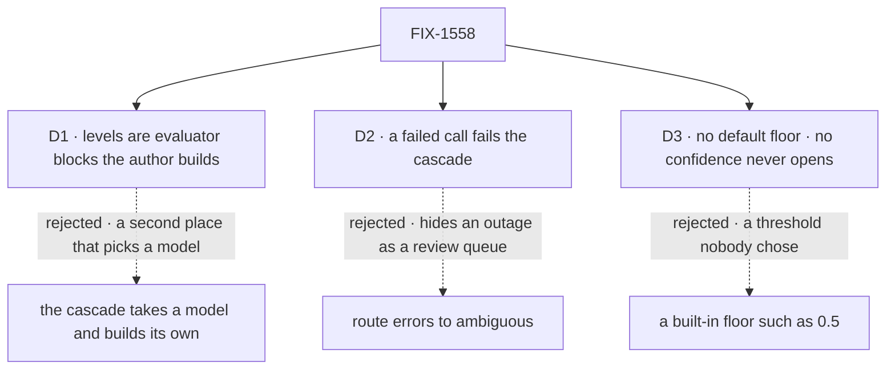

# FIX-1558 · Decisions

[Spec](SPEC.md) · **Decisions** · [Rules](BUSINESS-RULES.md) · [Plan](PLAN.md) · [Docs](DOCS.md) · [Evolution](EVOLUTION.md)

The owner's locks on [FIX-1553](https://linear.app/fixpoint-labs/issue/FIX-1553), the epic's cards
([D1–D4](../../epics/FIX-1553/DECISIONS.md)) and FIX-1554's answer shape
([D3](../FIX-1554/DECISIONS.md#d3)) are decided input. Locked and not reopened here: the name, a
utility and not a kind, trees in code, and ER-4's gate (absent confidence fails every edge, floor
or not). The three cards are the calls those locks leave to this issue.

## The tree

Solid edges are what you're signing. Dashed edges lost, and the label says why.

## D1 · The tree is built from evaluator blocks the author makes; the cascade never takes a model

| | |
|---|---|
| **Instead of** | The lab's shape: the cascade takes `model`, writes each level's choice question from the branch descriptions, and calls evaluate inside the router |
| **Because** | Epic D3: a consumer takes an evaluator block and never names a model, because the block is where a model is chosen and refused. Each level being its own block also gives each level its own model and `state`, its own trace row, and replay on resume. A router that calls a model inside its selector breaks the router's purity contract: on resume it asks again and may pick differently (`docs/architecture/execution-and-errors.md`) |
| **Locks in** | A level is `{ ask, on, branches }`: an evaluator, the id of one of its choice questions, and one branch per option. Branch keys are typed against that question's options, so a typo fails to compile. The cascade owns no model, no resolver and no SDK import |

**What would change my mind:** authors consistently writing one-question evaluators only to feed
a cascade. Then a `question:` shorthand that builds that evaluator is worth adding, and it's additive.

## D2 · A failed evaluation fails the cascade; it never routes to `ambiguous`

| | |
|---|---|
| **Instead of** | Treating a thrown call (provider error, refused model, malformed result) as one more reason to take `ambiguous` |
| **Because** | `ambiguous` means "the model answered and wasn't sure enough". An outage isn't that. Folding the two turns a broken key or a down provider into a quietly growing review queue with no error anywhere. The evaluator already fails loudly with one call and no retry (FIX-1554 BR-21); `.rescue` in a sequencer already turns that into a review route for an author who wants it |
| **Locks in** | Errors propagate with the evaluator's own error. Cancelled stays cancelled. Only three outcomes of a successful answer reach `ambiguous`: no confidence, below the floor, no branch for the choice |

**What would change my mind:** a real app that needs the review route on errors and can't use
`.rescue`. Then an `onError: "ambiguous"` option is additive.

## D3 · There is no default floor. An edge without one opens on any confidence the model reports, and never on none

| | |
|---|---|
| **Instead of** | A built-in floor on every edge (the lab used 0.5) · or making `minConfidence` required on every edge |
| **Because** | ER-4 applies a floor "where the author set a floor". A default number is a threshold nobody chose, the same family as the synthetic confidence the owner invent-killed. Requiring a floor everywhere adds a number to edges where "the model gave any confidence" is the author's real rule. The fail-closed promise that matters is kept: no confidence never opens an edge, floor or not |
| **Locks in** | `minConfidence` is optional, in [0, 1], compared inclusively ("reaches it"). The docs teach setting it on every edge where a wrong branch is costly. Adding a cascade-wide default later is additive |

**What would change my mind:** evidence that authors ship Jev trees without floors and get
low-confidence routes they didn't expect. Then a required floor is the fix, and it's a breaking one.

## Decided, not asked

- **Gate, one function.** An edge opens only when the answer to `on` is a choice with a branch,
  the model reported a finite confidence in [0, 1], and it reaches the edge's floor if set. A
  boolean's `probability` and a choice's `probabilities` are never read.
- **`ambiguous` is required** and receives the cascade's own input, like every leaf; its output
  passes through.
- **The verdict is traced**, with its reason and level; only walked levels run.
- **Choice questions only** route. Branching on a score is a choice whose options are the bands.
- **Core, `utility` namespace**, beside `intentRouter` and `keyedRouter`; no new dependency.
- Build-time validation, options without a branch, and a leaf under two edges are cases, in
  [BUSINESS-RULES.md](BUSINESS-RULES.md).

## Considered and dropped

| Alternative | Why not |
|---|---|
| The lab's cascade (`model` on the router, evaluate inside `execute`, 0.5 default, `minProbability`, a depth cap of 8) | D1, D3 and the purity contract. The depth cap existed because the lab walked the tree at run time; a tree built once can't loop |
| A `minProbability` floor on the chosen option's probability | ER-4 gates on confidence. The adapters return no distribution either, and Jev's is a second number for one question. Additive later |
| Extending `intentRouter` with an evaluator option | One level, a self-reported score, and it throws with no fallback. The tree and the fail-closed exit are the point |
| Passing the reason to the `ambiguous` block | Changes the block's input from the cascade's own. The trace carries it. Follow-up if review queues need it |
| Score or boolean edges | A choice with bands says the same thing and keeps one gate |

## Settled

- **The popular adapters report no confidence and no distribution; Jev can omit confidence per
  answer.** **CONFIRMED** by the POC
  ([`poc/adapter-confidence`](poc/adapter-confidence/README.md)): `openai.evaluationModel` and
  `anthropic.evaluationModel` are the AI SDK's generic wrapper, which returns a bare choice even
  when the provider's metadata carries logprobs; Jev's library fills confidence from its API and
  drops it when the API sends `null`. The planted control fails as it should. So the epic's D2
  holds: on those adapters every edge lands on `ambiguous`.

## How it got here

- **Draft** — framed as the one place that decides on an evaluator's answer; levels are
  author-built evaluators read through one pure gate, errors propagate, no default floor; one PR
  in core plus a real-model goal for epic leg (c).

**Open: none.**
