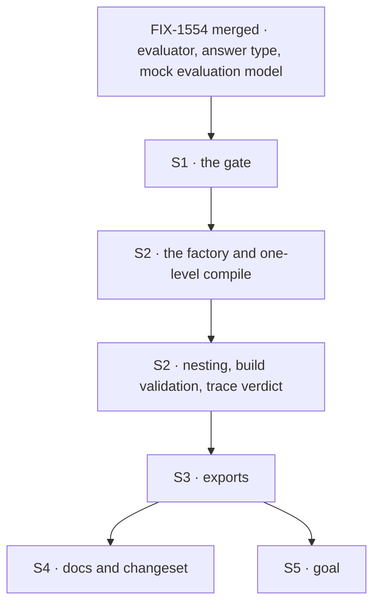

# FIX-1558 · Plan

[Spec](SPEC.md) · [Decisions](DECISIONS.md) · [Rules](BUSINESS-RULES.md) · **Plan** · [Docs](DOCS.md) · [Evolution](EVOLUTION.md)

Written for the implementing agent. IDs cross-reference [BUSINESS-RULES.md](BUSINESS-RULES.md)
(BR-n), [DECISIONS.md](DECISIONS.md) (D-n) and the epic's rules (ER-n). `tdd`. **One PR.**
**Starts only after FIX-1554 merges**: this builds on its `evaluator`, its answer type and its
mock evaluation model (FIX-1554 S5, S8).

## Surfaces

| ID | Package · role | Change | Rules |
|---|---|---|---|
| S1 | `core` · the gate (new, one pure function) | Given a level's answers, `on`, the branches and their floors, return the edge taken or `ambiguous` with a reason (`no-confidence`, `below-floor`, `no-branch`). Reads `confidence` only, as FIX-1554's answer type carries it ([D3](DECISIONS.md#d3), ER-4) | BR-1 to BR-9 |
| S2 | `core` · `utility/cascading-router` (new) | The factory and its types. Validates the tree at build, then compiles each level into ordinary composition: the level's evaluator as its own step, the gate as a traced step whose output is the verdict, and a router whose selector only reads that verdict. Routes are the level's leaves and `next` levels, each wrapped to receive the cascade's own input, plus `ambiguous` | BR-10 to BR-14, BR-18 to BR-27 |
| S3 | `core` · `utility/index.ts` and root `utility` namespace | Export `cascadingRouter` and its config types | — |
| S4 | Docs, README, changeset | Publish [DOCS.md](DOCS.md). `minor` changeset for `@flow-state-dev/core` | ER-16 |
| S5 | `goals/cascading-router/fails-closed-on-a-real-evaluation-model/` | The goal check VG, which is epic leg (c) | ER-15 (c) |

**Removed:** nothing shipped. The lab's `cascading-router.ts` on #1903 is superseded, not lifted
([EVOLUTION.md](EVOLUTION.md)). No change to the evaluator, the `router` kind, the engine or the
DevTool.

## Sequence



Tracer bullet first: one level, one leaf, one `ambiguous`, on the mock (BR-4 is the first test).

## Checks

| ID | Runs after | Passes when |
|---|---|---|
| V1 | S1 | A table test over the gate: BR-1 to BR-9, including a no-floor edge with an answer that has no `confidence` key → `ambiguous` / `no-confidence` (BR-4). **Negative control:** a planted gate that treats a missing confidence as 1 fails BR-4, BR-5 and BR-6 |
| V2 | S2 | On the mock evaluation model, two levels: BR-10 to BR-14. A call counter proves one call per level walked and none on other branches |
| V3 | S2 | A throwing mock ends the cascade failed with the mock's error, `ambiguous` not run (BR-15); a `.rescue` around it runs (BR-16); a signal-aware mock cancelled mid-level ends cancelled (BR-17) |
| V4 | S2 | Each BR-18 to BR-24 case refused at build, error naming the cascade; type tests (`@ts-expect-error`) for a wrong `on`, a wrong branch key, and a missing `ambiguous` |
| V5 | S2 | Engine-level: an `ambiguous` landing shows the evaluator row with no `confidence` and a verdict naming `no-confidence` and the level (BR-4, BR-25). A leaf that suspends, then resumes: the mock's call counter doesn't move and the route matches (BR-26; pattern of `packages/engine/test/router-resume.test.ts`). DevTool trace-tree test renders the cascade with existing kinds (BR-27) |
| VG | S5 | **Goal, real models** (ER-13): `pnpm tsx goals/cascading-router/fails-closed-on-a-real-evaluation-model/run.mts`. The SPEC's two-level tree on held-out tickets: with Jev via the gateway, a clear billing-urgent ticket lands on the gated leaf and each walked level's answer carries `confidence`; with `openai.evaluationModel("gpt-5.4-mini")`, every ticket lands on `ambiguous` with `no-confidence`. **Anti-game:** assert the route and the verdict reasons, never Jev's exact numbers. **Control:** `GOAL_CONTROL=open-on-missing` swaps in a gate that opens on missing confidence and must fail the OpenAI leg |

One check per decision: D1 is V4's type tests plus V2 (levels run the author's evaluators), D2 is
V3, D3 is V1's BR-1 and BR-4 rows.

## Pinned names

| Where | Name | Why pinned |
|---|---|---|
| Factory | `cascadingRouter`, exported as `utility.cascadingRouter` | The owner locked the name; `utility` is where its siblings live |
| Config | `ambiguous` | The epic's rules and docs name it |
| Edge floor | `minConfidence` | The epic's docs teach "minimum confidence" on an edge |
| Verdict reasons | `no-confidence`, `below-floor`, `no-branch` | Visible in traces and asserted by the goal |

Level and branch field names (`ask`, `on`, `branches`, `block`, `next`) are yours; reconcile
[SPEC.md](SPEC.md) and [DOCS.md](DOCS.md) to whatever ships.

## Guardrails

| Rule | Because |
|---|---|
| **The convergence point:** every edge, at every level, is decided by S1. No level, wrapper or `ambiguous` path inlines its own check | ER-4 is the whole promise. A second, hand-written check at level 2 is where a missing score quietly becomes a pass (tenet 5) |
| The model call is its own step; the router's selector reads only the gate's verdict. Don't copy `intentRouter`'s `asRuntime` call inside a handler | The router's purity contract: resume re-runs the selector, and a selector that calls a model can re-decide and throw on resume |
| No number the model didn't return: no default floor, no `0`, never `probability` or `probabilities` | ER-3, D3, and the invent-kill on synthetic confidence |
| Nothing added to the evaluator; the cascade takes the answer type as FIX-1554 ships it and never imports the AI SDK | ER-10; FIX-1554's seam is the only importer of the SDK's experimental types |
| No new block kind, no DevTool change | The owner's lock: a utility, not a kind |

## Docs

Publish [DOCS.md](DOCS.md) after V5 passes. FIX-1556 owns the teaching guide and links to this
section.

## Sketch · pseudocode, illustrative, react to the shape

```
cascadingRouter(config):
    validate(config.root, seen = {})                  ← BR-18 to BR-24, at build
    return compileLevel(config.root, path = "root")

compileLevel(level, path):
    routes ← for each branch: branch.block, or compileLevel(branch.next, path/key), each fed the cascade input
    return sequence named <name>/<path>:
        parallel: { input ← pass-through, answers ← level.ask }   ← the evaluator is its own traced step, replayed on resume
        step: gate  { input, verdict ← gate(answers[level.on], level.branches) }   ← traced output
        router: pick routes[verdict.edge], or ambiguous             ← pure read of verdict

gate(answer, branches):
    if answer.choice has no branch            → ambiguous, no-branch
    if answer.confidence is not a finite 0..1 → ambiguous, no-confidence
    if branch.minConfidence and confidence < it → ambiguous, below-floor
    → branch
```

**POC:** [`poc/adapter-confidence`](poc/adapter-confidence/README.md), run with
`node check.mjs` after `npm install --no-package-lock`. It showed D2 of the epic holds on the
published OpenAI and Anthropic adapters (no confidence, no distribution) and that Jev can omit
confidence per answer, which added BR-6. Recorded in [Settled](DECISIONS.md#settled). Counted
facts: none; the spec rests on one behavioural claim, and that POC is its check.

## At implement time

- Read FIX-1554 as merged: the evaluator's config (how to read a block's static questions for
  BR-19 and BR-20), `EvaluatorAnswers<Q>` for typing branch keys, and the mock evaluation model.
- Re-run the POC against the adapter versions `core` pins then; if an adapter starts reporting
  confidence, the docs' "every edge goes to `ambiguous`" sentence narrows.
- If [FIX-1495](https://linear.app/fixpoint-labs/issue/FIX-1495) landed, use its model strings.

## Follow-ups

- Passing the `ambiguous` reason to the `ambiguous` block, if review queues need it.
- A `question:` shorthand that builds a one-question evaluator ([D1](DECISIONS.md#d1)).
- `intentRouter` still gates a generator's self-reported confidence. Whether it should take an
  evaluator is the epic's wholesale-migration question, deliberately out.
