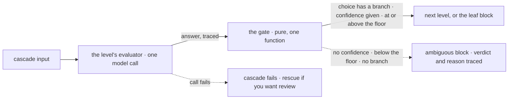

# FIX-1558 · Utility — `cascadingRouter`

**Spec** · [Decisions](DECISIONS.md) · [Rules](BUSINESS-RULES.md) · [Plan](PLAN.md) · [Docs](DOCS.md) · [Evolution](EVOLUTION.md)

Feature · `core` (one utility) + one goal · medium · 1 PR · epic
[FIX-1553](../../epics/FIX-1553/SPEC.md) · builds on [FIX-1554](../FIX-1554/SPEC.md), implementation
blocked by it

## Five people, before and after

| Someone who… | Today | After |
|---|---|---|
| **routes a ticket through two levels of questions** | Hand-rolls each level: a classifier, then a check, then a router. A missing score is easy to treat as a pass | Writes the tree once with `utility.cascadingRouter`. Each level asks an evaluator they built, and each edge opens only on a matching answer the model is confident in |
| **runs the tree on Jev** | Gets confidence the model made up in a generator's output | Gets Jev's own confidence. An edge with a floor (`minConfidence: 0.7`) opens only at or above it; anything else lands on their `ambiguous` block |
| **runs the same tree on OpenAI or Anthropic** | Gets a branch picked on a self-reported number | Every edge lands on `ambiguous`, floor or not, because those models report no confidence. The docs say so and point them to a plain `router` to branch on the bare answer |
| **is on call when the provider is down** | Sees whatever their hand-rolled code does with a thrown call | Sees the request fail with the provider's error. Nothing is quietly queued as "ambiguous"; `.rescue` routes it to review if they want that ([D2](DECISIONS.md#d2)) |
| **debugs a case that went to review** | Reads a hand-rolled log line, if they wrote one | Sees, per level walked, the evaluator's answer and the verdict: which edge opened, or `ambiguous` and why (`no-confidence`, `below-floor`, `no-branch`) |

The kind (FIX-1554) answers; this utility is the one place in the framework that decides on an
answer. It is a utility beside `intentRouter` and `keyedRouter`, not a block kind, and nothing is
added to the evaluator ([epic D2](../../epics/FIX-1553/DECISIONS.md#d2), ER-10).

## What changes


Follow the red exits. Every gate has one, they all go to the same author-supplied block, and a
model that reports no confidence takes it at every level.

**What an author writes:**

```diff
- // Level 1 on a generator's self-reported confidence, level 2 hand-rolled inside a branch.
- const triage = utility.intentRouter({
-   name: "triage",
-   model: "openai/gpt-5.4-mini",
-   confidenceThreshold: 0.6,
-   fallback: review,
-   categories: {
-     billing: { description: "Payments and refunds", handler: billingUrgencyRouter }, // a second intentRouter
-     technical: { description: "Bugs and outages", handler: techQueue },
-   },
- });
+ const department = evaluator({
+   name: "department",
+   model: "typesafe-ai/jev",
+   questions: { team: choice("Which team should handle this?", { billing: "Payments and refunds", technical: "Bugs and outages" }) },
+ });
+ const urgency = evaluator({
+   name: "billing-urgency",
+   model: "typesafe-ai/jev",
+   questions: { urgency: choice("How urgent is this billing issue?", { high: "Needs someone now", low: "Can wait in the queue" }) },
+ });
+
+ const triage = utility.cascadingRouter({
+   name: "triage",
+   ambiguous: review,                                  // required: where every failed gate goes
+   root: {
+     ask: department, on: "team",
+     branches: {
+       billing: {
+         minConfidence: 0.6,
+         next: { ask: urgency, on: "urgency", branches: {
+           high: { minConfidence: 0.7, block: escalate },
+           low: { block: billingQueue },                // no floor: opens on any reported confidence, never on none
+         } },
+       },
+       technical: { minConfidence: 0.6, block: techQueue },
+     },
+   },
+ });
```

## How one level runs



Each level is ordinary composition: the evaluator is its own traced step, and the choice of
branch is a pure read of its answer, so a resumed request replays the answer instead of asking
the model again.

## What stays as it is

- **The evaluator.** No floor, tree, retry or fallback on it (ER-10). The cascade reads its
  answer type as FIX-1554 ships it.
- **`intentRouter` and `keyedRouter`.** Unchanged. `intentRouter` still gates a generator's
  self-reported confidence; the docs say when to pick which.
- **Block kinds, the engine and the DevTool.** A cascade is a sequencer, evaluators, handlers and
  routers. Nothing new renders.

## Sign off

1. **[D1](DECISIONS.md#d1) · The tree is built from evaluator blocks the author makes; the
   cascade never takes a model.** If wrong: authors write each level's options in the evaluator
   and again as branch keys (a typo is a compile error, not a runtime surprise), where the lab
   wrote them once.
2. **[D2](DECISIONS.md#d2) · A failed evaluation fails the cascade; it never routes to
   `ambiguous`.** If wrong: during a provider outage, apps that didn't add `.rescue` return errors
   instead of queueing every case for review.
3. **[D3](DECISIONS.md#d3) · There is no default floor. An edge without one opens on any
   confidence the model reports, and never on none.** If wrong: a Jev tree written without floors
   routes a 0.2-confidence answer down a branch.

**Open: none.** Number 3 is the one to weigh: it is where "fail closed" stops and the author's
floor starts. The re-check the epic asked for is [settled](DECISIONS.md#settled): the popular
adapters report no confidence, so on them every edge goes to `ambiguous`.
