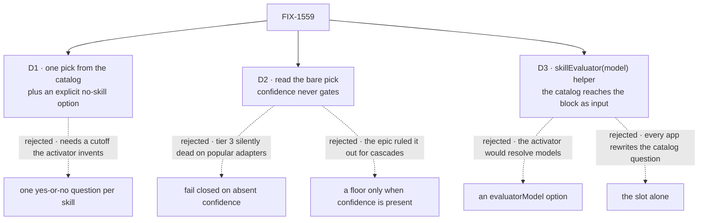

# FIX-1559 · Decisions

[Spec](SPEC.md) · **Decisions** · [Rules](BUSINESS-RULES.md) · [Plan](PLAN.md) · [Docs](DOCS.md) · [Evolution](EVOLUTION.md)

The owner's locks on [FIX-1553](https://linear.app/fixpoint-labs/issue/FIX-1553), the epic's
cards ([D1–D4](../../epics/FIX-1553/DECISIONS.md)) and FIX-1554's merged evaluator API
([its spec](../FIX-1554/SPEC.md)) are decided input. In particular: the generator classifier stays
the default when nothing is passed, a passed evaluator replaces it, and a failed evaluation never
falls back to it ([epic D4](../../epics/FIX-1553/DECISIONS.md#d4)); orchestration takes an
optional block typed on core and never builds one unasked, names a model, or imports Jev or the lab
([epic D3](../../epics/FIX-1553/DECISIONS.md#d3), ER-11). The three cards are the calls those
leave to this issue.

## The tree

Solid edges are what you're signing. Dashed edges lost, and the label says why.

## D1 · With an evaluator, tier 3 picks at most one skill: one choice over the catalog plus an explicit "no skill"

| | |
|---|---|
| **Instead of** | One yes-or-no question per skill, so several can activate · or keeping the generator's zero-or-more list shape |
| **Because** | FIX-1554's kind asks choice, score and boolean questions; there is no multi-select. A boolean answer is P(true) with no confidence, so turning N of them into activations needs a cutoff the activator picks, a number of its own (ER-3). FIX-1555 dropped the same shape for the same reason. One choice with a named "no skill" option needs no number: the model must pick a skill to activate one. The Linear ask is "Choice or multi-select"; this is the choice half |
| **Locks in** | A message that needs two skills and matches no keyword gets one from tier 3. Keyword still activates several. If the kind grows multi-select, switching is additive: the slot and the helper keep their names |

**What would change my mind:** activation traces showing the generator classifier regularly
returning two or more skills above its floor on real catalogs. Then one pick loses real matches, and
multi-select is worth asking FIX-1554 for.

## D2 · The activator reads the bare pick and never gates on confidence. The "no skill" option is the closed direction

| | |
|---|---|
| **Instead of** | Failing closed on absent confidence, as [epic D2](../../epics/FIX-1553/DECISIONS.md#d2) words it and the #1903 lab did (absent read as `0`, below 0.65) · or applying `confidenceThreshold` only when the model reports one |
| **Because** | The popular providers' evaluation adapters report no confidence (FIX-1554 [Settled](../FIX-1554/DECISIONS.md#settled)). Failing closed would make tier 3 activate nothing on them, with no error: the "any model works, then it never routes" trap the epic names for cascades, without the `ambiguous` leaf that makes a cascade's failure visible. A floor only when present is the shape the epic rejected in review round 1: an answer without confidence walking a floored gate. Here the model already says "no skill" when nothing fits, so the pick is a plain branch on an answer, the case the epic sends to a plain `router`. Same call as [FIX-1555 D3](../FIX-1555/DECISIONS.md#d3) |
| **Locks in** | On Jev, a hesitant pick still activates. `confidenceThreshold` stays the generator classifier's option and is refused beside an evaluator, so nobody believes it applies. A reported confidence is copied onto the match for the trace, never compared. An opt-in floor that fails closed on absent confidence is additive later |

**What would change my mind:** the owner reading epic D2's "absent fails closed" as binding on every
consumer, not on cascades. Then tier 3 with an adapter activates nothing, and the docs must say so
as plainly as they do for cascades.

## D3 · `skillEvaluator(model)` makes the common case one line. The activator hands the catalog to the block as input

| | |
|---|---|
| **Instead of** | An `evaluatorModel` option on `createSkillActivator` that builds the block · or only the slot, with every app writing the catalog question itself · or a question function that reads the skills collection from context |
| **Because** | The owner chose this pattern for memory ([FIX-1555 D4](../FIX-1555/DECISIONS.md#d4)). A model option would make the activator resolve and check models, which epic D3 keeps in core. The question depends on the catalog, which only the activator reads, so the slot alone leaves every app rebuilding it. Passing the catalog as the block's input means a hand-built block and the helper see the same allowed, capped skill list; a question that read the collection itself would need `collectionKey`, `allowed` and the cap configured twice |
| **Locks in** | Two exports, `skillEvaluator` and `skillQuestions`, and one option, `evaluator`. The helper passes the app's model to core's `evaluator()` untouched; core resolves it at run time. ER-11's "build its own evaluator" is read as the activator building one unasked, as FIX-1555 reads it. If the epic owner reads it otherwise, the helper becomes a docs recipe and nothing else changes |

**What would change my mind:** decided for memory by the owner; this mirrors it. A reason to break
symmetry would be activator users wanting per-app question wording, which `skillQuestions` does not
cover.

## Decided, not asked

- **The option is `evaluator`**, the name FIX-1555 copies.
- **An evaluator failure fails the activator**, as a generator-classifier failure does today. No
  fallback, no silent "no skill". An app that prefers the turn to go on wraps the activator in
  `.rescue`.
- **Matches keep `source: "classifier"`.** A new source value would widen a persisted core enum.
- **An evaluator match has an empty `input`.** An evaluator can't extract arguments; slash does.
- **Empty catalog, no call.** Nothing ambient is offered in its place ([FIX-1372](https://linear.app/fixpoint-labs/issue/FIX-1372) stays visible).
- **`maxSkillsInClassifier` caps the offered options too.** One catalog lister serves both paths.
- **Contradictory config is refused when the activator is built**: `evaluator` with
  `classifierModel`, `confidenceThreshold` or `enableLlmClassifier: false`, or a block that isn't
  an evaluator.
- **The stock agent kind and the kitchen-sink are not edited.** FIX-1556 demos the option.
- **One PR, `tdd`, `orchestration` only**, with a `minor` changeset.

## Considered and dropped

| Alternative | Why not |
|---|---|
| The lab's untyped `classifier` slot, where the passed block patches the activator's sequencer state itself | Exposes internal state as a contract, and any handler fits the slot. Epic D3 types it on an evaluator |
| Treat an evaluator error as "no skill" and carry on | Makes an outage look like quiet non-activation, and differs from today's classifier. `.rescue` gives it to apps that want it |
| A no-skill option keyed `none` (the lab) | `none` is a valid skill name; that skill could never be picked. The key sits outside the skill-name grammar |
| Letting a stock agent seat pass an evaluator | Reopens the stock fence ([FIX-1363](https://linear.app/fixpoint-labs/issue/FIX-1363), ER-11) |

## Settled

- **The popular adapters report no confidence; Jev reports it for choice.** Settled on FIX-1554
  ([Settled](../FIX-1554/DECISIONS.md#settled)); D2 rests on it and does not reopen it.
- **No counted facts here.** The spec asserts no totals, so no factual-base checker is needed.

## How it got here

- **Draft** — framed as the first consumer's slot, not a classifier rewrite: one pick with an
  explicit "no skill", the bare answer read as final, the catalog passed as input, and a
  `skillEvaluator(model)` helper mirroring memory; one PR in `orchestration`.

**Open: none.**
