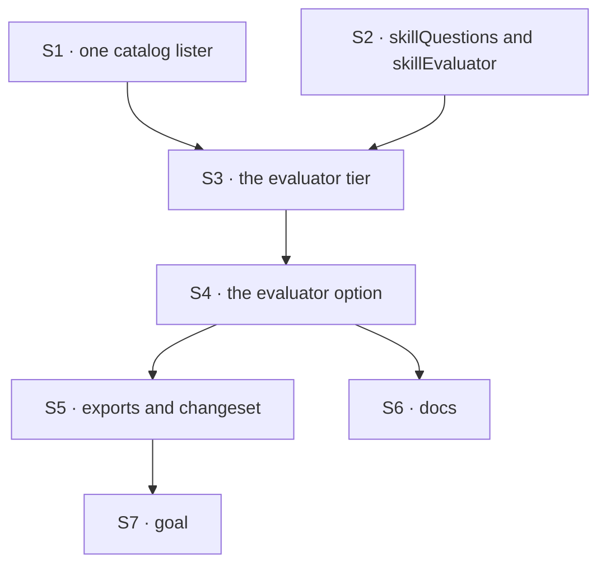

# FIX-1559 · Plan

[Spec](SPEC.md) · [Decisions](DECISIONS.md) · [Rules](BUSINESS-RULES.md) · **Plan** · [Docs](DOCS.md) · [Evolution](EVOLUTION.md)

Written for the implementing agent. IDs cross-reference [BUSINESS-RULES.md](BUSINESS-RULES.md)
(BR-n), [DECISIONS.md](DECISIONS.md) (D-n) and the epic's rules (ER-n). `tdd`. **One PR**, in
`@flow-state-dev/orchestration`. **Build only after FIX-1554's implementation merges**: it supplies
`evaluator`, `choice`, the answer types and the mock evaluation model this plan uses.

## Surfaces

| ID | Package · role | Change | Rules |
|---|---|---|---|
| S1 | `orchestration` · the catalog lister | Lift the skill-listing loop out of the generator classifier into one function both paths call: allowed set, `disableModelInvocation`, cap, `description` plus `whenToUse`. The generator path's prompt output stays byte for byte | BR-1 BR-4 |
| S2 | `orchestration` · the skill-evaluator helper module (new) | `skillQuestions`: a question function over the block's input `{ message, skills }` returning one `skill` choice, the skills as options plus a "no skill" key outside the skill-name grammar. `skillEvaluator(model)`: core's `evaluator()` with that question, `state` the message, and the app's model untouched. Exports the input type for hand-built blocks. **The only module that imports core's evaluator values** | BR-6 BR-17 BR-18 BR-19 |
| S3 | `orchestration` · the evaluator tier (new) | A sequencer the activator's `tapIf(!resolved)` targets: a handler that lists the catalog (S1) and builds `{ message, skills }` from the collection alone, short-circuiting on an empty list; the passed evaluator; a handler that reads `answers.skill`, checks the pick against the offered list, and patches the activator state (one match or none; confidence copied only when present; aggregate `null` when absent) | BR-3 to BR-5 BR-7 to BR-11 BR-14 |
| S4 | `orchestration` · `createSkillActivator` | The `evaluator` option, typed on core's evaluator block. Build-time refusals (BR-15, BR-16). Tier 3 builds S3 when an evaluator is passed and today's generator tier otherwise; never both | BR-1 BR-2 BR-3 BR-15 BR-16 |
| S5 | `orchestration` · exports, README, changeset | Export `skillEvaluator`, `skillQuestions` and the input type from the skills barrel. README note under "Skills and delegation". `minor` changeset naming the option | — |
| S6 | Docs | Publish [DOCS.md](DOCS.md) | — |
| S7 | `goals/skill-activator/evaluator-picks-a-skill/` | The goal check VG | acceptance |

**Removed:** nothing. The generator classifier and its options stay, unchanged ([epic D4](../../epics/FIX-1553/DECISIONS.md#d4)).
**Not touched:** `packages/workforce`, `apps/kitchen-sink`, core.

## Sequence



S1 first as a pure refactor, with the generator path's existing tests green before anything is added.

## Checks

All on FIX-1554's mock evaluation model unless named. Every "the generator makes no call" assertion
uses a counting mock generator model, not the absence of a trace row.

| ID | Runs after | Passes when |
|---|---|---|
| V1 | S4 | **Off path (BP-035).** No evaluator: the generator classifier's prompt, model and filtered output match the pre-change snapshot; the built activator contains no evaluator-kind block; a static check finds no value import from S2 in the activator module (BR-1) |
| V2 | S4 | A slash hit and a keyword hit each leave the evaluation mock's call count at 0 (BR-2) |
| V3 | S3 | Tiers 1 and 2 miss: one evaluate call, options exactly the allowed, enabled, capped catalog plus "no skill"; generator mock count 0 (BR-3, BR-4) |
| V4 | S3 | Empty catalog, and separately a catalog outside `allowed`: evaluate count 0, no skills written (BR-5) |
| V5 | S3 | A pick with confidence `0.1` activates with `confidence: 0.1`; a pick with none activates with no `confidence` key (assert with `in`) and aggregate `null`; `input` is `""` (BR-8, BR-10, BR-11). **Control:** the same pick through the generator path at `0.1` is dropped, so the check proves the two paths differ on purpose ([D2](DECISIONS.md#d2)) |
| V6 | S3 | "No skill" activates nothing. A catalog skill named `none` is offered and, when picked, activates (BR-6, BR-9) |
| V7 | S3 | A throwing mock, a malformed-result mock, and a string that resolves to a generate-only path each fail the activator; generator mock count 0; the active-skills field is not written. **Control:** the same activator wrapped in `.rescue` returns the handler's result (BR-12) |
| V8 | S3 | A mock held open until its signal aborts: cancel mid-call, the activator ends cancelled (BR-13) |
| V9 | S3 | Action input carrying `skills: [{ name: "evil" }]`: offered options unchanged (BR-7) |
| V10 | S4 | Build-time refusals: a handler, a generator, and `evaluator` with each of `classifierModel`, `confidenceThreshold`, `enableLlmClassifier: false` (BR-15, BR-16) |
| V11 | S3 | A hand-built evaluator asking a different question: the activator fails naming the block and the `skill` question (BR-14) |
| V12 | S2 | `skillEvaluator("…")` resolves through a mock flow resolver's `resolveEvaluationModel`, called once; an instance is used as given; a generate-only instance throws at the helper call. `orchestration/package.json` dependencies unchanged, and a grep of `packages/orchestration/src` for the Jev library, the lab and model-id literals in S2 to S4 finds nothing (BR-17 to BR-19) |
| V13 | S4 | The workforce agent kind's existing skill tests pass unchanged (BR-20) |
| V14 | S4 | Trace: the evaluator row is nested under the activator with options and answer (BR-21) |
| VG | S7 | **Goal, real model** (ER-13): `pnpm tsx goals/skill-activator/evaluator-picks-a-skill/run.mts`. A three-skill catalog and a held-out message that matches no keyword. With `skillEvaluator("typesafe-ai/jev")` the right skill activates with a confidence; with `skillEvaluator("openai/gpt-5.4-mini")` it activates with none ([D2](DECISIONS.md#d2)); a small-talk message activates nothing. **Anti-game:** assert the activated skill is a catalog name and matches for the two targeted messages only. **Control:** `GOAL_CONTROL=fail-closed` makes the S3 handler drop picks without confidence and must fail the adapter leg |

One check per decision: D1 is V5 and V6, D2 is V5's control and VG's adapter leg, D3 is V12.

## Pinned names

| Where | Name | Why pinned |
|---|---|---|
| Activator option | `evaluator` | FIX-1555 copies it; FIX-1556's guide teaches it |
| Helper | `skillEvaluator(model)` | The docs lead with it ([D3](DECISIONS.md#d3)); parallel to `captureEvaluator` |
| Question function | `skillQuestions` | Hand-built blocks use it |
| Question id, input fields | `skill`; `message`, `skills` (each `{ name, description }`) | The contract a hand-built block meets (BR-14) |
| No-skill key | any key the skill-name grammar rejects | BR-6. Which one is yours; it shows in traces |

Everything else is yours to name.

## Guardrails

| Rule | Because |
|---|---|
| Only S2 imports core's `evaluator` and question builders as values; the activator types its slot only | With nothing passed, no evaluator is built or resolved (leg (d), BR-1) |
| One catalog lister for both paths | One place decides which skills are offered (tenet 5). Two loops drift, and a drifted `allowed` filter offers a skill the binding never granted |
| When an evaluator is passed, the generator tier is not built | "Never falls back" is structural, not a branch someone can add ([epic D3](../../epics/FIX-1553/DECISIONS.md#d3)) |
| The pick decides; no threshold, no default, no copy of a number the model didn't return | [D2](DECISIONS.md#d2), ER-3 |
| The offered options come from the collection, never from the action input | BP-031. The input carries the user's message, nothing that chooses skills |
| No edit to the generator classifier's behaviour, the workforce agent kind, or core | [Epic D4](../../epics/FIX-1553/DECISIONS.md#d4), ER-11, and FIX-1554 owns core |

## Docs

Reconcile and publish [DOCS.md](DOCS.md) after V5 passes. The activation page's tier-3 section is
this issue's; the teaching guide is FIX-1556's and links here
([epic DOCS](../../epics/FIX-1553/DOCS.md#ownership)).

## Sketch · pseudocode, illustrative, react to the shape

```
createSkillActivator(options):
    refuse if options.evaluator is not an evaluator block                 ← BR-15
    refuse if evaluator and (classifierModel | confidenceThreshold | llm off)  ← BR-16
    ... seed, slash, keyword as today ...
    tier3 ← evaluator ? evaluatorTier(evaluator) : generatorTier(...)        ← never both
    pipeline.tapIf(not resolved, tier3).tap(apply)

evaluatorTier(block):
    sequencer
      .step(list catalog → { message, skills }; if empty, resolve with none and stop)
      .step(block)                                   ← the app's evaluator, one call
      .tap(read answers.skill → one match or none; confidence only if reported)
```

**POC:** none. The composition is a sequencer over an existing block kind, the #1903 lab already
ran the same shape end to end, and FIX-1554 settled what the adapters report.

## At implement time

- Read FIX-1554's shipped exports: the evaluator block type the slot is typed on, where `choice`
  lives, and the mock evaluation model's API. Reconcile [DOCS.md](DOCS.md) imports to them.
- Check whether the SDK limits choice option count or key characters; if it does, the cap and the
  no-skill key follow it.
- Re-read [FIX-1555](https://linear.app/fixpoint-labs/issue/FIX-1555)'s shipped helper; if its
  naming moved, keep the two parallel.
- [FIX-1372](https://linear.app/fixpoint-labs/issue/FIX-1372) may have changed first-turn seeding.
  BR-5 holds either way.

## Follow-ups

- Retiring the generator classifier: the epic's named later cut ([epic D4](../../epics/FIX-1553/DECISIONS.md#d4)).
- Multi-select, if the kind grows it ([D1](DECISIONS.md#d1)).
- An opt-in confidence floor that fails closed on absent confidence, if Jev users ask ([D2](DECISIONS.md#d2)).
