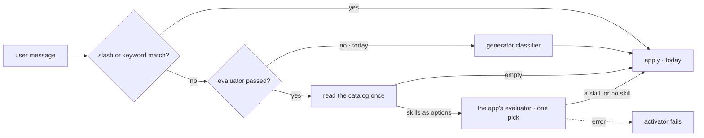

# FIX-1559 · Consumer — skill-activator tier 3 inject

**Spec** · [Decisions](DECISIONS.md) · [Rules](BUSINESS-RULES.md) · [Plan](PLAN.md) · [Docs](DOCS.md) · [Evolution](EVOLUTION.md)

Feature · `orchestration` · small · 1 PR · epic [FIX-1553](../../epics/FIX-1553/SPEC.md) · blocked by
[FIX-1554](https://linear.app/fixpoint-labs/issue/FIX-1554) (implementation only) · first consumer; sets
the slot shape [FIX-1555](https://linear.app/fixpoint-labs/issue/FIX-1555) copies

## Six people, before and after

| Someone who… | Today | After |
|---|---|---|
| **uses `createSkillActivator` and passes nothing new** | Slash, then keyword, then a generator classifier over the skill descriptions | The same, call for call. No evaluator is built or resolved |
| **passes an evaluator** | Has nowhere to put it | When slash and keyword don't match, the evaluator picks one skill from the catalog, or *no skill*. The generator classifier is never built ([D1](DECISIONS.md#d1)) |
| **uses an OpenAI or Anthropic evaluation model** | n/a | Gets working activation. The activator reads the pick, not a confidence those models don't report ([D2](DECISIONS.md#d2)) |
| **has an evaluation model that fails mid-turn** | A classifier failure fails the activator | Still fails it, the same way. Nothing quietly runs the generator classifier instead |
| **runs the built-in agent kind** | Per-seat `enableLlmClassifier`, off by default | Unchanged. The stock kind gets no evaluator option |
| **debugs activation in the DevTool** | Sees a generator call with a free-text reasoning field | Sees an evaluator node: the skills it was offered and the one it picked |

The epic's four consumers all copy one slot shape, and this issue sets it: an optional block,
typed on core's evaluator, whose answer is final.

## What changes

![Two tier-3 pipelines side by side. Today: when slash and keyword don't resolve, a generator classifier reads the skill descriptions and returns zero or more skills, each kept only above a 0.65 self-reported confidence. After, with an evaluator passed: the activator reads the catalog once, hands the skills to the app's evaluator block as options plus a no-skill option, and the evaluator picks one. A skill pick activates that skill; no skill activates nothing; an error fails the activator. A dashed fence shows the generator classifier is not reached on that path. A band under both says that with no evaluator passed, after is today.](figures/what-changes.svg)

Follow the right panel: the catalog goes in as options, one pick comes out, and there is no arrow
back to the generator. Slash and keyword above it are untouched.

**What an app writes:**

```diff
- import { createSkillActivator } from "@flow-state-dev/orchestration";
+ import { createSkillActivator, skillEvaluator } from "@flow-state-dev/orchestration";

  export const skillActivator = createSkillActivator({
    initialSkills,
+   evaluator: skillEvaluator("typesafe-ai/jev"),   // or openai.evaluationModel("gpt-5.4-mini")
  });
```

`skillEvaluator(model)` builds core's evaluator block with the activator's one question and the
model the app names ([D3](DECISIONS.md#d3)). An app that wants its own block name, state or
`uses` builds it from `skillQuestions` and passes that; the slot takes either.

## How a turn reaches tier 3



The activator reads the catalog and hands it to the evaluator as input, so a hand-built block and
the helper see exactly the skills this binding allows. Orchestration never resolves a model: core
does, when the block runs.

## What stays as it is

- **Slash and keyword tiers.** Same matching, same order, same `source` values.
- **The generator classifier** as the default when nothing is passed: model, prompt, 0.65 floor,
  multi-skill output ([epic D4](../../epics/FIX-1553/DECISIONS.md#d4)). Retiring it is a later cut.
- **The built-in agent kind** and its per-seat `enableLlmClassifier`
  ([FIX-1362](https://linear.app/fixpoint-labs/issue/FIX-1362), ER-11).
- **Activation state.** Same slot, same entry shape; matches still say `source: "classifier"`.
- **Orchestration's dependencies.** Core only. No Jev, no lab, no provider package.

## Sign off

1. **[D2](DECISIONS.md#d2) · The activator reads the bare pick and never gates on confidence;
   the "no skill" option is the closed direction.** This departs from
   [epic D2](../../epics/FIX-1553/DECISIONS.md#d2)'s "absent fails closed", as FIX-1555 did for
   memory. If wrong: on Jev a hesitant pick still activates a skill, where today's 0.65 floor
   would have dropped it.
2. **[D1](DECISIONS.md#d1) · With an evaluator, tier 3 activates at most one skill.** If wrong: a
   message that needs two skills and matches no keyword gets one.
3. **[D3](DECISIONS.md#d3) · `skillEvaluator(model)` makes the common case one line, mirroring
   memory's `captureEvaluator`.** If wrong: two exports to deprecate, and the helper becomes a docs
   recipe.

**Open: none.** Number 1 is the one to weigh: it is the only place this spec reads an epic lock
differently from the words. Reasoning and what lost: [DECISIONS.md](DECISIONS.md). The cases:
[BUSINESS-RULES.md](BUSINESS-RULES.md).
