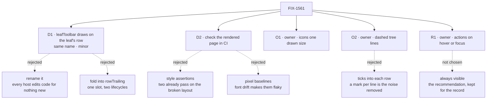

# FIX-1561 · Decisions

[Spec](SPEC.md) · **Decisions** · [Rules](BUSINESS-RULES.md) · [Plan](PLAN.md) · [Docs](DOCS.md) · [Evolution](EVOLUTION.md)

Two decisions are the sign-off surface. Three owner decisions, made in review and in session,
are recorded as given; nothing is open. A fourth, after merge, is the one exception to D1: a
new [`leafDetail`](#d1-leafdetail) slot. Everything else here is context for them.

## The tree

Solid edges are what you're signing. Dashed edges lost, and the label says why.

## D1 · `leafToolbar` keeps its name and arguments and draws on the open leaf's own row; released as a `minor`

| | |
|---|---|
| **Instead of** | Renaming the slot, say to `leafActions`, so every host's code breaks loudly · folding the leaf's state into `rowTrailing` and deleting `leafToolbar` |
| **Because** | What the slot is for (actions on one open leaf) and what it's handed don't change; only where it draws does. A rename makes both in-repo hosts and any outside app edit code to get nothing new. Folding it into `rowTrailing` gives one slot two lifecycles, always-on and only-while-open, and the developer tool's stand-in for the missing open event ([FIX-1494](https://linear.app/fixpoint-labs/issue/FIX-1494)) depends on the second. Pre-1.0, a change existing code can trip over is a `minor` |
| **Locks in** | Toolbar content has to fit a row: a few icon buttons. There is no longer anywhere to put a full-width strip inside an open leaf, which is the line the owner asked to remove. An outside app with a wide toolbar learns from the release note, not a type error. Nothing persisted moves and nothing is renamed; the doc comment, README and docs page that say "inside an open instance" move with it |

**What would change my mind:** knowing of an app outside this repo that renders text or a form
in `leafToolbar`. Then a rename that fails loudly is worth the churn.

### The one exception, after merge: a `leafDetail` slot for content inside an open leaf

**Approved by the product owner, 2026-09-24.** D1 above is kept as written, for the record. Its
*Locks in* left nowhere to put a full-width strip inside an open leaf, and PLAN's guardrails
added no new slot. One slot is now added: `leafDetail` (working name), optional, for content
inside an open leaf. It draws on its own line directly under the open leaf's row, inside the
rail, indented at the leaf's column, and shows only while the leaf is open. `leafToolbar` keeps
D1's meaning: actions on the row, shown on hover or focus. The row stays one line.

**Why.** FIX-1500's seat pane, a seat's kind, instructions and "Hire another" form, drew in
`leafToolbar`. On D1's one-line row it overflowed the 256px rail and this spec's goal checks
failed. The owner chose to keep a seat's details in the rail, under the seat
([FIX-1500 E4](../FIX-1500/DECISIONS.md#e4)). A row holds a few icons, so that content needs a
line of its own.

**Locks in:** one more published slot on `@flow-state-dev/react`, in the same `minor`.
**Instead of** one row icon opening the details outside the rail, in a popover or a side panel,
which needed no new slot (FIX-1500 E4's option A).

## D2 · The rail's layout is checked on the rendered page, in CI, for both rails

| | |
|---|---|
| **Instead of** | Asserting style values in the unit suite, which has no layout engine · pixel-baseline screenshots · waiting for a Storybook story |
| **Because** | Two checks already guard this rail's indentation and both pass on the photographed layout: they compare padding, not where text lands. A check that can't fail on the defect isn't one (tenet 7). The [POC](poc/rail-geometry/README.md)'s measurement fails today and passes on the sketch. Pixel baselines shift with a machine's fonts and become the check everyone re-records |
| **Locks in** | One existing kitchen-sink end-to-end scenario is replaced, not added to, so the suite stays at nine; it now covers the developer tool's rail and the app's own. It proves geometry, not taste, so the implementation PR also carries both screenshots for a human to look at |

## Owner decisions

Both from the owner's review of the first draft ([comment](https://github.com/fixpoint-labs/flow-state-dev/pull/2173#issuecomment-5821385718)): *"Make sure icons
are same sizes, you have the copy icon much bigger than Add and refresh. Should include tree
lines as well (dashed lines to show tree structure)"*. Decided, not forks.

### O1 · Every row action is drawn at one size, with one stroke, in one hit area

The boxes already match; the drawings don't ([Settled](#settled)). So "same size" is checked on
the drawing (G5), and the fix is the host's, since it owns its icons: size each until the
drawings match. The first draft's own figures drew copy bigger too; they are redrawn.

### O2 · Dashed tree lines show the structure

One dashed line per open parent, from its twisty's centre down its whole child list, on the
16px grid, taking no space and hidden from assistive technology (BR-26 – BR-28). The shared
component draws it, so both rails get it. No horizontal ticks: a mark on every row is the noise
the owner asked to remove.

## Closed by the owner

### R1 · Row actions: always visible, or revealed on hover?

**Decided by the product owner, 2026-09-24: on hover.** The owner, in session: *"Only on hover.
Screens look good"*. A row's copy, refresh and new-session icons stay hidden until the row is
pointed at or focused. The accepted cost: kitchen-sink's only "New session", on the Assistant
row, is hidden until that row is hovered or focused. "Screens look good" also approves the
icon size and tree lines as drawn ([O1](#o1), [O2](#o2)).

The first is the rail with one row pointed at; the second is one row's four states.

**The calls that come with it, mine:**

- **Shown while the pointer is over the row, and while focus is anywhere inside it**: the
  effect of `:hover` and `:focus-within`. The package ships no stylesheet, so it gets that from
  the row's own pointer and focus events, as the sketch does. Tab reaches the actions and shows
  them.
- **Hidden means invisible, never removed.** The actions stay in the tab order; removing them
  would lock keyboard users out.
- **A selected row keeps its actions shown; an open one doesn't.** Selection belongs to session
  rows, so this never pins an instance's copy, refresh or new session. Pinning every open leaf
  would show actions on most rows and undo the owner's call.
- **No hover pointer (`@media (hover: none)`) means always shown**, so touch users aren't locked
  out.
- **The space is kept.** Hidden actions keep their width, so a label truncates at the same point
  whether the row is pointed at or not, and nothing reflows. The other way, laying actions over
  the label's end, would need a background colour behind them, and the package can't know a
  host's. The cost: a long label on a row with actions truncates about 70px earlier.
- **The developer tool's dispatch-run label rides along.** It sits in the same trailing area, so
  it hides until hover too; the run is still marked by its extra step of indent.

*The question as it was asked, kept for the record* (the always-visible layout it recommended is
[`after.svg` at a15fe8e](https://github.com/fixpoint-labs/flow-state-dev/blob/a15fe8e283dc7cceac1c5c356140f8c931084422/specs/issues/FIX-1561/figures/after.svg)):

**Plain terms.** After this change the copy, refresh and new-session icons sit at the right end
of the row they act on. They can always show there, or appear only when someone points at the
row or tabs into it. Touch screens have no pointer, so there they would always show.

**The trade-off.** Hover reveal makes a rail full of open rows quieter. It also hides
kitchen-sink's only "New session" until a visitor finds the right row. Always visible shows
three small, muted icons on each *open* instance and nothing extra on closed ones.

**Recommendation at the time: always visible.** Most of the noise in the screenshot was the extra lines
and the ragged indent, and both go either way. The reference app's main call to action
shouldn't need discovering.

**What would change my mind:** looking at the always-visible picture and still finding it busy, or a plan
to give kitchen-sink a second way to start a conversation.

**Cost of being wrong: low.** It's a styling rule inside the component. Switching later is a
patch release with no change to anyone's code.

## Decided, not asked

- **The developer tool is in scope: it is the rail in the screenshot**, served at
  kitchen-sink's `/devtool`. `navigator/flow-item.tsx`, which the issue names, was deleted by
  FIX-1477; the tool's rail is `flows/flow-rail.tsx`. The fix lives in the shared component
  both rails render (FIX-1455 D8).
- **One level is the width of the twisty column, 16px.** Every row reserves that column, open
  or not, so labels at one level share an x and a child's twisty sits under its parent's label.
- **Notes start on the label column of the level they stand in for.** Loading, empty and retry
  lines alike.
- **A session with no title shows `<prefix>_…<last 6>` only when its id is engine-shaped**
  (`sess_1790206121611_42636c63df102` → `sess_…3df102`). Any other id, a channel's
  `support.noticeboard` say, shows whole. The full id is the row's tooltip. No title source is
  invented; `title` is the only one that exists today.
- **An open leaf's actions show only while it is open**, as today.
- **No Storybook story here.** [FIX-1544](https://linear.app/fixpoint-labs/issue/FIX-1544)
  must first decide where `react`'s stories live; adding one here would decide that for it.
- **A failed "new session" in the developer tool is shown on the row**, not on a new line.
- **`--fsd-nav-guide` is public**, documented beside the other `--fsd-nav-*` properties, with a
  neutral fallback that reads on light and dark. A host sets it to `transparent` to hide lines.
- **A dispatch run gets no tree line of its own.** Its one-step indent stays a view, not a
  level to navigate (FIX-1440).

## Considered and dropped

| Alternative | Why not |
|---|---|
| Fix the developer tool's rail alone, in its own CSS | Leaves kitchen-sink's rail ragged and forks the layout the epic says ships once |
| A new `rowActions` slot beside `leafToolbar` | Two routes to one job (tenet 3) |
| Shorten ids to the first 8 and last 4 characters, as the tool's header does | `sess_179…` is the same for every session minted in the same four months or so; the tail is what tells them apart |
| Call icons "one size" when their boxes match | Every box already matches today, and the owner still saw copy drawn bigger |
| Draw tree lines in each host | Two rails, two sets of lines, and the second navigator the epic rules out |

## Settled

- **The misalignment is in the component, not the data** — **CONFIRMED**. A row with no twisty
  starts its label 16px short, and a level steps only 12px: sessions land 4px left of their
  instance, the channel 16px left of its level ([POC](poc/rail-geometry/README.md)).
- **It can be fixed without changing when sessions are read** — **CONFIRMED**. The sketch
  passes G1–G8 with the read untouched.
- **The developer tool's icons share a box but not a drawn size** — **CONFIRMED**. 16px boxes
  and 20px hit areas; drawings of 13.3 (copy), 12 (refresh) and 9.3px (plus). The declared
  `h-3 w-3` is overridden by the button's descendant rule ([POC](poc/rail-geometry/README.md)).

## How it got here

- **Draft** — framed as one component's row and indent layout, inherited by both rails; the
  leaf's actions move onto its row under the same slot; checked by measuring the rendered page;
  one PR.
- **Owner review round 1** — added O1 (one drawn icon size) and O2 (dashed tree lines), because
  the owner asked for both ([comment](https://github.com/fixpoint-labs/flow-state-dev/pull/2173#issuecomment-5821385718)); the goal check gained G5 and G6.
- **Review round 1** — the goal check gained G7 (a long label at 256px) and moved into an
  existing end-to-end scenario, because the first plan left a rule unchecked and went over the
  suite's size budget.
- **Owner answer: hover reveal** — the row-actions fork closed as the owner's call, and the goal
  check gained G8 (hidden at rest, shown on hover or keyboard focus, always on touch).
- **Amendment after merge: `leafDetail`** — FIX-1500's seat pane no longer fit on the row. The
  owner approved one new slot under an open leaf's row ([the exception](#d1-leafdetail)), and
  the goal check gained G9 ([EVOLUTION](EVOLUTION.md#amendment-leafdetail)).
