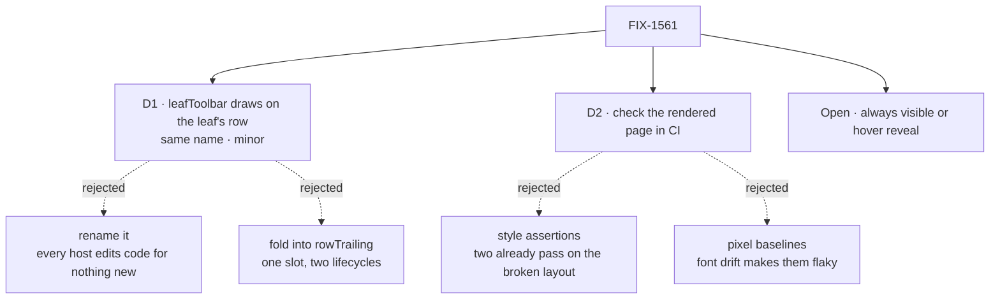

# FIX-1561 · Decisions

[Spec](SPEC.md) · **Decisions** · [Rules](BUSINESS-RULES.md) · [Plan](PLAN.md) · [Docs](DOCS.md) · [Evolution](EVOLUTION.md)

Two decisions and one open fork are the sign-off surface. Everything else here is context for
them.

## The tree

Solid edges are what you're signing. Dashed edges lost, and the label says why.

## D1 · `leafToolbar` keeps its name and arguments and draws on the open leaf's own row; released as a `minor`

| | |
|---|---|
| **Instead of** | Renaming the slot, say to `leafActions`, so every host's code breaks loudly · folding the leaf's state into `rowTrailing` and deleting `leafToolbar` |
| **Because** | What the slot is for (actions on one open leaf) and what it's handed don't change; only where it draws does. A rename makes both in-repo hosts and any outside app edit code to get nothing new. Folding it into `rowTrailing` gives one slot two lifecycles, always-on and only-while-open, and the developer tool's stand-in for the missing open event ([FIX-1494](https://linear.app/fixpoint-labs/issue/FIX-1494)) depends on the second. Pre-1.0, a change existing code can trip over is a `minor` |
| **Locks in** | Toolbar content has to fit a row: a few icon buttons. There is no longer anywhere to put a full-width strip inside an open leaf, which is the line the owner asked to remove. An outside app with a wide toolbar learns from the release note, not a type error. Nothing persisted moves and nothing is renamed; the doc comment, README and docs page that say "inside an open instance" move with it |

**What would change my mind:** knowing of an app outside this repo that renders text or a form
in `leafToolbar`. Then a rename that fails loudly is worth the churn.

## D2 · The rail's layout is checked on the rendered page, in CI, for both rails

| | |
|---|---|
| **Instead of** | Asserting style values in the unit suite, which has no layout engine · pixel-baseline screenshots · waiting for a Storybook story |
| **Because** | Two checks already guard this rail's indentation and both pass on the photographed layout: they compare padding, not where text lands. A check that can't fail on the defect isn't one (tenet 7). The [POC](poc/rail-geometry/README.md)'s measurement fails today and passes on the sketch. Pixel baselines shift with a machine's fonts and become the check everyone re-records |
| **Locks in** | Kitchen-sink's end-to-end job gains one spec over the developer tool's rail and the app's own. It proves geometry, not taste, so the implementation PR also carries both screenshots for a human to look at |

## Open

### Row actions: always visible, or revealed on hover?

Top is the recommendation, bottom the alternative. Same tree and columns; the only difference
is whether a row's icons wait to be pointed at.

**Plain terms.** After this change the copy, refresh and new-session icons sit at the right end
of the row they act on. They can always show there, or appear only when someone points at the
row or tabs into it. Touch screens have no pointer, so there they would always show.

**The trade-off.** Hover reveal makes a rail full of open rows quieter. It also hides
kitchen-sink's only "New session" until a visitor finds the right row. Always visible shows
three small, muted icons on each *open* instance and nothing extra on closed ones.

**My recommendation: always visible.** Most of the noise in the screenshot was the extra lines
and the ragged indent, and both go either way. The reference app's main call to action
shouldn't need discovering.

**What would change my mind:** looking at the top picture and still finding it busy, or a plan
to give kitchen-sink a second way to start a conversation.

**Cost of being wrong: low.** It's a styling rule inside the component. Switching later is a
patch release with no change to anyone's code.

## Decided, not asked

- **The developer tool is in scope, and it is the rail in the screenshot.** "Navigator", the
  "Flows" section and the copy icon are the developer tool's, served at kitchen-sink's
  `/devtool`. The file the issue names, `navigator/flow-item.tsx`, was deleted by FIX-1477; the
  tool's rail is `flows/flow-rail.tsx` and already renders the shared component.
- **The fix lives in the component, not the hosts.** One navigator (FIX-1455 D8).
- **One level is the width of the twisty column, 16px.** Every row reserves that column, open
  or not, so labels at one level share an x and a child's twisty sits under its parent's label.
- **Notes start on the label column of the level they stand in for.** Loading, empty and retry
  lines alike.
- **A session with no title shows `<prefix>_…<last 6>` only when its id is engine-shaped**
  (`sess_1790206121611_42636c63df102` → `sess_…3df102`). Any other id, a channel's
  `support.noticeboard` say, shows whole. The full id is the row's tooltip. No title source is
  invented; `title` is the only one that exists today.
- **An open leaf's actions show only while it is open**, as today.
- **No Storybook story here.** [FIX-1544](https://linear.app/fixpoint-labs/issue/FIX-1544)
  must first decide where `react`'s stories live; adding one here would decide that for it.
- **A failed "new session" in the developer tool is shown on the row**, not on a new line.

## Considered and dropped

| Alternative | Why not |
|---|---|
| Fix the developer tool's rail alone, in its own CSS | Leaves kitchen-sink's rail ragged and forks the layout the epic says ships once |
| A new `rowActions` slot beside `leafToolbar` | Two routes to one job (tenet 3) |
| Shorten ids to the first 8 and last 4 characters, as the tool's header does | `sess_179…` is the same for every session minted in the same four months or so; the tail is what tells them apart |

## Settled

- **The misalignment is in the component, not the data** — **CONFIRMED**. A row with no twisty
  starts its label 16px short, and a level steps only 12px: sessions land 4px left of their
  instance, the channel 16px left of its level ([POC](poc/rail-geometry/README.md)).
- **It can be fixed without changing when sessions are read** — **CONFIRMED**. The sketch
  passes all four goal assertions with the read untouched.

## How it got here

- **Draft** — framed as one component's row and indent layout, inherited by both rails; the
  leaf's actions move onto its row under the same slot; checked by measuring the rendered page;
  one PR.
