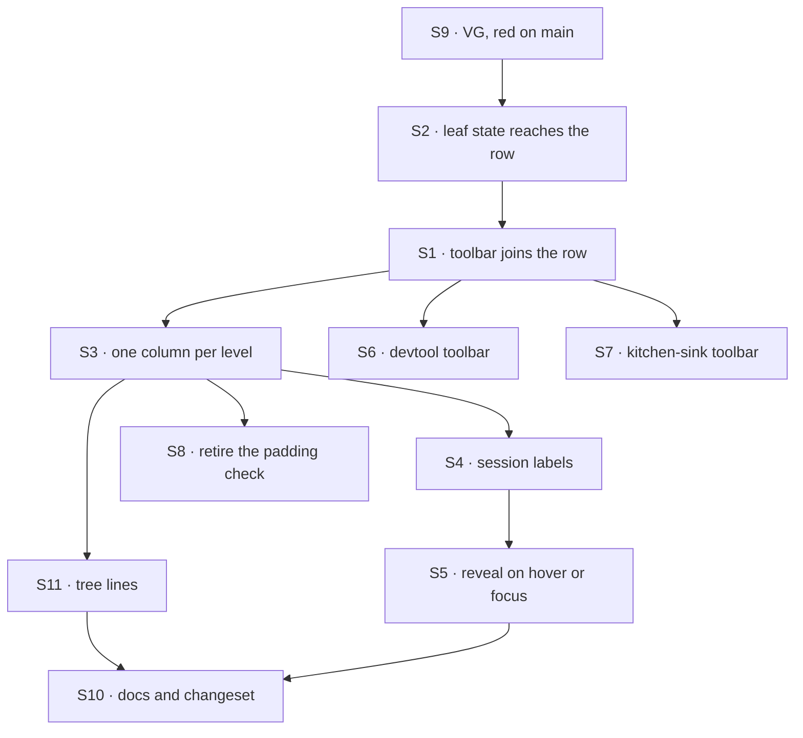

# FIX-1561 · Plan

[Spec](SPEC.md) · [Decisions](DECISIONS.md) · [Rules](BUSINESS-RULES.md) · **Plan** · [Docs](DOCS.md) · [Evolution](EVOLUTION.md)

Written for the implementing agent. IDs cross-reference [BUSINESS-RULES.md](BUSINESS-RULES.md)
(BR-n) and [DECISIONS.md](DECISIONS.md) (D-n). `tdd`. One PR.

## Surfaces

| ID | Package · role | Change | Rules |
|---|---|---|---|
| S1 | `react` · the navigator's row | The trailing area holds the row's own trailing content, then the open leaf's toolbar. **Remove** the toolbar's own list item under the leaf (D1) | BR-1 – BR-3 BR-5 BR-6 |
| S2 | `react` · the open leaf's state | The leaf's read state reaches both its row and its session list. The read still starts when the leaf opens and retires when it closes; the toolbar mounts and unmounts with it; the row's button is never replaced on toggle | BR-7 BR-8 BR-20 BR-21 |
| S3 | `react` · indentation | Every row reserves the twisty column; one level is that column's width. Notes and retry lines start on the label column of the level they stand in for | BR-11 – BR-15 |
| S4 | `react` · session label | Title, else the short engine form, else the id; full id as the row's tooltip | BR-16 – BR-19 |
| S5 | `react` · reveal (R1) | The trailing area is invisible until the row is hovered, focus is inside it, or it is selected; always shown with no hover pointer. Opacity, never removal from the tab order, and the space is kept. Driven by the row's pointer and focus events: no stylesheet or class name (the package publishes none) | BR-10 BR-29 – BR-34 |
| S6 | `devtool` · the rail's affordances | **Remove** the right-aligned strip wrapper. Show a failed create on the row, not as a paragraph under it. Size copy, refresh and new session so their drawings cover one size with one stroke (O1); set the size explicitly, because today the Button's descendant rule silently turns the declared 12px into 16px. Theme `--fsd-nav-guide` | BR-9 BR-22 BR-24 BR-25 |
| S7 | kitchen-sink · the rail | "New session" becomes an icon button with that accessible name and tooltip. Theme `--fsd-nav-guide` from the app's border token | BR-9 BR-24 |
| S8 | tests | **Remove** the unit case's padding comparison ("indents three levels inside exactly one scroll container" keeps its scroll-container half) | — |
| S9 | kitchen-sink e2e | **Replace**, don't add: the existing `workforce-shell.spec.ts` scenario "expanded all the way in the 256px rail…" becomes VG, and visits `/devtool` as well as `/`. The suite stays at nine scenarios | BR-2 BR-4 BR-11 – BR-15 BR-23 – BR-34 |
| S10 | docs + release notes | [DOCS.md](DOCS.md): README (including `--fsd-nav-guide`), the workforce UI page, doc comments; one changeset, `minor` for `react`, `patch` for `devtool` | — |
| S11 | `react` · tree lines | One dashed guide per open parent, on the centre of its twisty column, down its whole child list, a note included. Decorative: hidden from assistive technology and out of layout flow. Colour from `--fsd-nav-guide`, with a neutral fallback that reads on light and dark (O2) | BR-26 – BR-28 |

## Sequence



Write VG first and watch it fail on `main`. That is the red state D2 promises.

## Checks

| ID | Runs after | Passes when |
|---|---|---|
| V1 | S1 S2 | The toolbar renders inside the open leaf's row frame, beside the button, never in it; absent when closed; mount and unmount track open and close; the no-nesting assertion still passes with the toolbar filled |
| V2 | S2 | The row's button is the same node before and after a toggle, and keeps focus; opening a leaf is one read, closing none |
| V3 | S4 | BR-16 – BR-19: a title, an engine id, a channel id, an empty-string title; the tooltip carries the full id |
| V4 | S6 | The developer tool's rail suite passes unchanged, including the open-restore and refresh signals; a failed create shows on the row |
| V6 | S11 | Each open parent renders exactly one guide, hidden from assistive technology; a closed parent renders none; opening or closing a parent moves no row |
| V5 | S5 | A selected row keeps its actions shown; an open leaf alone does not; the row's pointer and focus handlers never re-render another row |
| VG | S3 S4 S5 S6 S7 S11 | **Goal, rendered page**, in the one replaced scenario (S9). It opens `/` and `/devtool` in turn, seeds sessions so each rail has a collection instance with sessions, one with none, a singleton channel, and one instance and one session title too long for the rail, expands every row, and measures. **G1, G5 and G7 measure each action with its row hovered**, so what is measured is what a person sees: **G1** no host action's centre falls outside a row's box · **G2** every label at one level starts within 0.5px of one x · **G3** each level steps right by one equal amount, at least 12px · **G4** each note starts on its level's column · **G5** every row action's drawn glyph (its ink, not its box) and its hit area are one size, ±0.5px · **G6** each open parent has one aria-hidden guide whose x is its twisty's centre ±0.5px, running from its first child line to at least its last · **G7** at 256px the long labels ellipsize, every action keeps its box, and no row or the rail overflows · **G8** with nothing hovered or focused every action is invisible (opacity 0) yet focusable; Tab from a row lands on its first action and shows that row's actions; hovering a row shows its actions and no other row's; on a touch-emulated page with no hover pointer every row's actions show. Screenshots of both rails attach to the run and go in the PR body. **Negative control:** run it on `main` first; the POC's numbers are what it must reproduce ([POC](poc/rail-geometry/README.md)) |

Measure each label's first glyph through a text range, not padding; the POC's
[`measure.mjs`](poc/rail-geometry/measure.mjs) does this and can be lifted.

## Pinned names

| Where | Name | Why pinned |
|---|---|---|
| Slot | `leafToolbar`, same arguments | D1. Published |
| Session label | `<prefix>_…<last 6>` for ids matching `<letters>_<13 digits>_<hex>` | People read it; BR-17 |

The step's pixel value is yours, as long as it equals the twisty column. Everything else is
yours to name.

## Guardrails

| Rule | Because |
|---|---|
| The fix is in the shared component; hosts only resize their own buttons | One navigator (FIX-1455 D8, ER-9). A host-side layout is the second navigator reached by CSS (tenet 5) |
| The toolbar mounts exactly while its leaf is open | The developer tool's open signals ride on it until FIX-1494 |
| One read on open, retired on close | A kind with forty instances costs nothing until one opens |
| Toggling never replaces the row's button | A replaced button drops keyboard focus on every open |
| Assert where text lands, never style values | The two existing checks compared padding and passed on the broken layout (tenet 7) |
| Delete the toolbar's list item and the padding checks in this PR | Old and new side by side is how the next ragged rail ships (tenet 3) |
| No new prop, slot, class name or stylesheet; one new custom property, `--fsd-nav-guide` | Theming already runs through `--fsd-nav-*`, and a host has to be able to colour the lines or set them `transparent` |
| Tree lines never take space | A line that shifts a row by a pixel breaks G2 and the column the owner asked for |
| Hiding an action is opacity, with its space kept; never `display: none`, `visibility: hidden` or a negative tab index | Keyboard users reach actions by Tab, and a reveal that reflows the label moves the row under the pointer |
| Icon sizes are the host's, checked on the drawing | The package ships no icons. Every box is already 16px today and copy still looks bigger, so a box check would pass on the defect |

## Docs

Reconcile and publish [DOCS.md](DOCS.md) after VG passes. No new page.

## Sketch · pseudocode, illustrative, react to the shape

```
leaf row (instance, or a singleton's kind row):
    row frame
        button: [indent][twisty column][label]
        trailing: [host row content][ ← open leaf's toolbar lands here ]
    if open: leaf's session list   ← read starts here, as today

every row: reserve the twisty column, empty if it has no children
level step = twisty column width
note under a leaf: on the column of the rows it stands in for
open parent's child list: one dashed guide at the parent's twisty centre,
    absolutely placed, top to bottom of the list, hidden from AT
```

Two ways to land it: portal the open leaf's toolbar into its row (the sketch does, and the
button never remounts), or lift the read into an always-mounted leaf gated on "open". Your call.

**POC:** [`poc/rail-geometry/`](poc/rail-geometry/README.md) renders the real component with
the owner's tree and the developer tool's own buttons and icons, and measures it. Today fails
G1–G3, G5, G6 and G8; the sketch passes G1–G8 with the read unchanged, and the negative controls for G7 and G8
fail as they should. The premise held.

## At implement time

- Rebase over [#2159](https://github.com/fixpoint-labs/flow-state-dev/pull/2159) (FIX-1500
  PR-B) if it has merged: it touches `apps/kitchen-sink/app/page.tsx`, the `/devtool` page and
  the e2e fixtures.
- If FIX-1494 has landed, keep BR-20 whichever way its event lands.
- If FIX-1544 has set up Storybook for `react`, add the FlowNavigator story from the POC's
  fixture; otherwise leave it there.

## Follow-ups

- FIX-1544: its FlowNavigator story should use the screenshot's tree, since that is the shape
  that exposed this.
