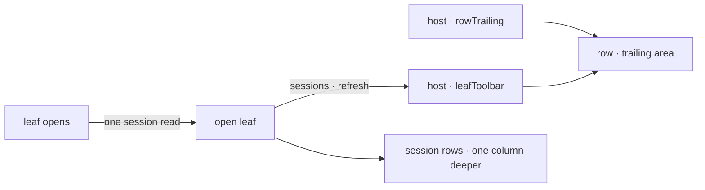

# FIX-1561 · Rail navigator: flatten row actions onto one line and fix tree indentation

**Spec** · [Decisions](DECISIONS.md) · [Rules](BUSINESS-RULES.md) · [Plan](PLAN.md) · [Docs](DOCS.md) · [Evolution](EVOLUTION.md)

Improvement · `react` + `devtool` + kitchen-sink · small · 1 PR · epic [FIX-1455](https://linear.app/fixpoint-labs/issue/FIX-1455)

## Six people, before and after

| Someone who… | Today | After |
|---|---|---|
| **opens instances in the developer tool's rail** | Each open instance, and the `digest` channel kind, gets an extra line holding only refresh and new session: 12 of the tree's 17 icons | Copy, refresh and new session sit on the instance's own row, right-aligned. The photographed tree takes 16 lines, not 22 |
| **scans the tree to see what belongs to what** | A session starts 4px *left* of its instance. `support.noticeboard` starts 16px left of the instances at its level | One column per level, each one 16px step right of its parent. The channel lines up with the instances. Notes sit on their level's column |
| **looks for a session with no title** | Reads a 32-character engine id, clipped by the rail | Reads `sess_…3df102`, with the full id on hover. Titles and channel names show whole |
| **starts a conversation in kitchen-sink** | Opens the Assistant row and clicks a full-width "New session" line under it | Clicks the + on the Assistant row. Same action, still named "New session" for screen readers and in its tooltip |
| **uses the rail from the keyboard** | Tabs through the row, its actions, then a separate action line | The same controls in the same order, on one line. Opening a row keeps focus on it |
| **builds an app on `FlowNavigator`** | Their `leafToolbar` draws as a strip above the open leaf's sessions | It draws on the leaf's own row, so it has to fit one: a few icon buttons. The release note says so |

Found from a screenshot. Two checks already guard the rail's indentation and both pass on it:
they compare padding values, not where the text lands.

## What changes


Today, the photographed rail at twice its horizontal size. The dashed columns show where the
labels actually start: 36, 32 and 20 pixels.


After, same tree and scale: three label columns, actions on their row, three fewer lines. This
is the always-visible layout the spec recommends ([Open](DECISIONS.md#open)).


The row, zoomed. The button and the actions stay siblings, the rule the component already
enforces. The one move is where an open leaf's actions draw: into the row's trailing area.

**What a host writes.** The slot's name and arguments don't change. Kitchen-sink's "New
session" becomes an icon that fits on a row:

```diff
  <Button
    variant="ghost"
-   size="sm"
-   className="h-7 w-full justify-start gap-2 text-xs"
+   size="icon-sm"
+   aria-label="New session"
+   title="New session"
    onClick={() => void onNewSession(leaf)}
  >
    <Plus className="h-3.5 w-3.5" />
-   New session
  </Button>
```

The developer tool drops the right-aligned wrapper around its two icons; the row now does the
aligning.

## How an action reaches the row



The leaf is still read once, when it opens. Its toolbar now lands on the row that opened it.

## What stays as it is

- Which actions exist, what they do, and which host supplies them.
- When sessions are read: once per leaf you open, never for a closed one.
- How deep the tree goes, read from each flow's cardinality ([FIX-1455 D8](../../epics/FIX-1455/DECISIONS.md#d8)).
- The missing leaf open and close event. That is [FIX-1494](https://linear.app/fixpoint-labs/issue/FIX-1494), and the developer tool keeps its workaround.
- Theming through `--fsd-nav-*` custom properties, and no class names published.

## Sign off

1. **[D1](DECISIONS.md#d1) · `leafToolbar` keeps its name and arguments and draws on the open
   leaf's own row, released as a `minor`.** If wrong: an app outside this repo with a wide
   toolbar finds its row labels squeezed after upgrading, told only by the release note.
2. **[D2](DECISIONS.md#d2) · The rail's layout is checked on the rendered page, in CI, for
   both rails.** If wrong: a slow or flaky check nobody trusts, or without it, the next layout
   slip found by eye again.

**Open: one fork.** [Row actions: always visible, or revealed on hover?](DECISIONS.md#open)
I recommend always visible. The reasoning and what lost: [DECISIONS.md](DECISIONS.md). The
cases: [BUSINESS-RULES.md](BUSINESS-RULES.md).
