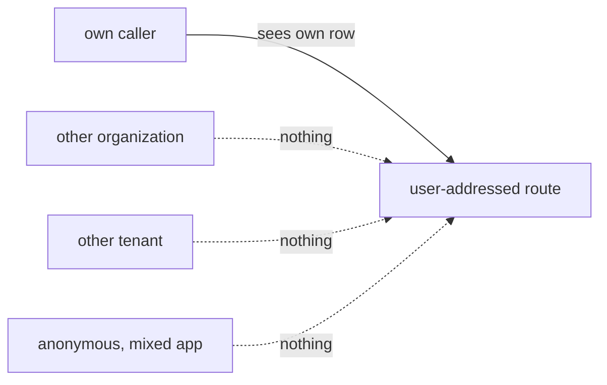

# FIX-1573 · Business rules

[Spec](SPEC.md) · [Decisions](DECISIONS.md) · **Rules** · [Plan](PLAN.md) · [Docs](DOCS.md)

The cases, as rules. Each says what a route author, a caller or the system does and what
happens. *Proved by* is the check in [PLAN.md](PLAN.md).

## Which routes the table covers

| # | When | Then | Proved by |
|---|---|---|---|
| BR-1 | A route is classified user-addressed and has no table entry | The test fails, naming the route | V1 · V3 |
| BR-2 | A route pattern starts `/users/:userId` but is classified as anything else | The test fails, naming the route and its classification | V1 · V5 |
| BR-3 | A table entry names a route that is no longer classified user-addressed | The test fails: a stale entry is not coverage | V1 |
| BR-4 | A user-addressed route isn't built yet | It answers exactly 501 and names no seeded row. When it answers anything else, the test fails until the pin is replaced by a real entry | V1 · V4 |

## What each caller gets, per route

Run through the real router. Each case seeds one row for the path's user that the caller must
not reach, plus the caller's own row.

| # | When | Then | Proved by |
|---|---|---|---|
| BR-5 | A caller acting for organization A names their own user id; the same user has a row in organization B | B's row is neither returned nor changed | V1 · V2 |
| BR-6 | A caller on tenant T1 names their own user id; the same user and organization has a row on T2 | T2's row is neither returned nor changed | V1 · V2 |
| BR-7 | An anonymous caller in a mixed app names a user who has a row under an authenticated flow | That row is neither returned nor changed | V1 · V2 |
| BR-8 | An anonymous caller where a host resolver is configured | 401, before any row is read | V1 |
| BR-9 | The same callers, for their own row (same user, organization and tenant; an open flow for the anonymous case) | The row is returned or changed, as the route does | V1 |

BR-9 is the positive control. Without it, a route that answers nothing to anyone passes BR-5 to
BR-7. "Returned or changed" is judged by the entry: a read route returns the row's id; the sweep
also changes its status.

## What doesn't change

| # | When | Then | Proved by |
|---|---|---|---|
| BR-10 | Any caller uses `check-interrupted` or the user stream | Status codes, bodies and sweep effects are exactly as on `main` | Existing suite, unchanged |

## Failure taxonomy

Test-only. A failure is a red CI run naming the route and the axis, never a runtime error. Nothing
retries, and nothing at runtime depends on the table.

## Acceptance criteria this issue owns

Adding a new `/users/:userId/...` route whose handler filters only by the path's user id fails
the engine suite on the cross-organization, cross-tenant and anonymous cases, with no edit to
any test file needed to make it fail.
