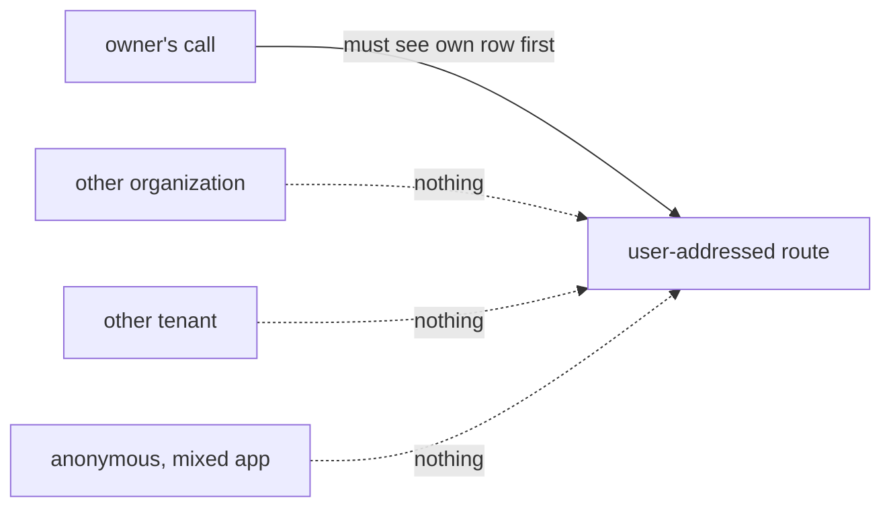

# FIX-1573 · Business rules

[Spec](SPEC.md) · [Decisions](DECISIONS.md) · **Rules** · [Plan](PLAN.md) · [Docs](DOCS.md)

The cases, as rules. Each says what a route author, a caller or the system does and what
happens. *Proved by* is the check in [PLAN.md](PLAN.md).

**The guarantee comes in two stages**, because a new route arrives without an entry, and without
one the harness can't know how to seed, call or observe it:

- **Stage 1, automatic.** A route addressed by a user id with no entry fails the suite. No test
  file needs editing for that to happen (BR-1 to BR-4).
- **Stage 2, once the entry exists.** The entry is run against the cross-organization,
  cross-tenant and anonymous axes, and fails if the handler doesn't scope (BR-5 to BR-9). What
  keeps an entry from passing vacuously is BR-9 and BR-11.

## Stage 1 · which routes need an entry

| # | When | Then | Proved by |
|---|---|---|---|
| BR-1 | A route is classified user-addressed and has no table entry | The test fails, naming the route | V1 · V3 |
| BR-2 | A route pattern starts `/users/:userId` but is classified as anything else | The test fails, naming the route and its classification | V1 · V5 |
| BR-3 | A table entry names a route that is no longer classified user-addressed | The test fails: a stale entry is not coverage | V1 |
| BR-4 | A user-addressed route isn't built yet | Its entry is a pin: the owner's call answers exactly 501 and names no seeded row. When it answers anything else, the test fails until the pin is replaced by a real entry, which then enters stage 2 | V1 · V4 |

## Stage 2 · what each caller gets, per route

Run through the real router. An entry supplies three things: how to seed one row for a given
identity, how to call the route as a given caller, and how to tell from the reply (and the store)
whether that row was seen or changed. The harness chooses the identities and runs the same seed
for each.

| # | When | Then | Proved by |
|---|---|---|---|
| BR-5 | A caller acting for organization A names their own user id; the same user has a row in organization B | B's row is neither returned nor changed | V1 · V2 |
| BR-6 | A caller on tenant T1 names their own user id; the same user and organization has a row on T2 | T2's row is neither returned nor changed | V1 · V2 |
| BR-7 | An anonymous caller in a mixed app names a user who has a row under an authenticated flow | That row is neither returned nor changed | V1 · V2 |
| BR-8 | An anonymous caller where a host resolver is configured | 401, before any row is read | V1 |
| BR-9 | The owner's own call, for a row seeded with the owner's identity (same user, organization and tenant; an open flow for the anonymous case) | The row is seen or changed, as the route does. It runs **before** the three axis probes in every setup, and a failure here fails the entry | V1 · V6 |

## What stops an entry from passing vacuously

| # | When | Then | Proved by |
|---|---|---|---|
| BR-10 | An entry's seed writes nothing, or its observer never reports a row | BR-9 fails: the owner's own row isn't seen, so the axis probes that follow can't pass on an empty route | V6 |
| BR-11 | An entry tries to seed the foreign rows somewhere the route never reads | It can't: the harness, not the entry, supplies the identities, and seeds every row, own and foreign, through the one seed function. The foreign rows differ from the owner's only on the axis under test, so they sit where BR-9 has just shown the route reads | V1 · V7 |

An entry could still observe too narrowly, for example by checking one field of a streamed
reply. That residue is for review, not the harness; the entry is short and sits next to its route.

## What doesn't change

| # | When | Then | Proved by |
|---|---|---|---|
| BR-12 | Any caller uses `check-interrupted` or the user stream | Status codes, bodies and sweep effects are exactly as on `main` | Existing suite, unchanged |

## Failure taxonomy

Test-only. A failure is a red CI run naming the route and the stage or axis, never a runtime
error. Nothing retries, and nothing at runtime depends on the table.

## Acceptance criteria this issue owns

1. Adding a new `/users/:userId/...` route fails the engine suite with no edit to any test file,
   naming the route as missing an entry (stage 1).
2. Once an entry for that route is written, a handler that filters only by the path's user id
   fails the cross-organization, cross-tenant and anonymous cases (stage 2), while the owner's
   own call still passes.
3. An entry that seeds or observes nothing fails, on the owner's call, before any axis runs.
