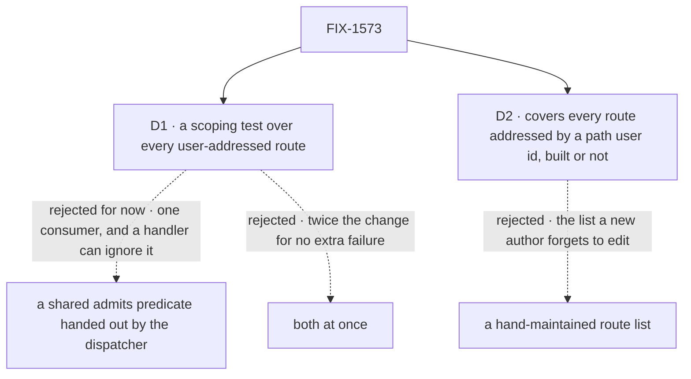

# FIX-1573 · Decisions

[Spec](SPEC.md) · **Decisions** · [Rules](BUSINESS-RULES.md) · [Plan](PLAN.md) · [Docs](DOCS.md)

What was considered, what was chosen, and what each choice locks in. Two decisions are the
sign-off surface.

## The tree

Solid edges are what you're signing. Dashed edges lost, and the label says why.

## D1 · Enforce the scope with a test over every user-addressed route, not a shared predicate, for now

| | |
|---|---|
| **Instead of** | (a) The guard or dispatcher builds one `admits(entry)` predicate (tenant, organization, anonymous allow-list, lifted from the sweep's) and passes it to every user-addressed handler. Or (c), both |
| **Because** | The failure this issue fears is *forgetting*, and only a failing check catches forgetting. A predicate in the handler's signature does not: the handler still receives the stores and can read rows without calling it. Today the predicate would have one consumer, and its right shape for a stream is a guess until the stream exists (tenet 2). The test costs no production change, and the one live route already passes it |
| **Locks in** | The guarantee is a CI property, not a runtime one. It holds as long as the engine suite runs on every PR, which it does, and each table entry exercises its route honestly. The lift to a shared predicate is deferred to the second consumer, not dropped |

**What would change my mind:** a second user-addressed route arriving in the same release. Then
the predicate has two consumers, lifting it is cheap and removes a copy, and (c) wins. The table
stays either way.

## D2 · The guarantee covers every route addressed by a user id in its path, including routes not built yet

| | |
|---|---|
| **Instead of** | Covering only routes that are implemented today, or a hand-listed set |
| **Because** | The route set is read from the guard's own classification over the real route table, so a new route is in scope the moment it is classified. A route that isn't built is pinned: it must answer 501 and serve nothing. Building it breaks the pin, so its author has to write a real entry (tenet 7: the check must reach the code it covers) |
| **Locks in** | Two small module-level exports in the engine (the classification, the route listing), visible to tests and not in the package's public API. Listings and session-addressed routes are outside this guarantee; they keep their own checks |

## Decided, not asked

- **The harness runs through the real router, end to end.** The scope is split: the guard checks
  the user id and answers 401, the handler checks tenant, organization and allow-list. Testing
  either alone can pass while the pair leaks.
- **Every negative case has a positive control.** The caller's own row must be seen or changed,
  or a route that serves nothing passes every negative.
- **A path-shape cross-check.** Any `/users/:userId/...` pattern must be classified
  user-addressed (BR-2), so a misclassified route can't slip past D2.
- **The existing per-axis tests stay.** They cover the no-tenant caller and the row that
  predates organizations, which the table doesn't repeat.
- **No changeset, no site docs.** Nothing a consumer can observe changes. One sentence in
  `docs/architecture/authentication.md` ([DOCS.md](DOCS.md)).

## Considered and dropped

| Alternative | Why not |
|---|---|
| (a) alone: the predicate in the handler signature | Makes the right thing easy, doesn't make the wrong thing fail. One consumer today |
| (c) both | Adds (a)'s cost now for no failure (b) doesn't already produce |
| A tripwire: assert the user-route set equals `{user_stream, check_interrupted_requests}` | The simpler option. Cheaper, but forces a list edit, not a proof of scoping |
| A `Record<UserRouteKind, Fixture>` type in the test file | Engine's `tsconfig` includes `src/` only, so test files aren't typechecked in CI. A runtime totality assertion is needed anyway |
| One predicate shared with the listings | The listings add a per-instance resolver verdict the sweep deliberately skips. Merging them reopens settled listing scope |

## Settled

- **The live route already applies all three scopes, and existing tests catch its removal** —
  **CONFIRMED** on `acc01bbf8`: replacing the sweep's scope predicate with `() => true` failed 5
  tests across three files (cross-tenant ×3 in `tenant-route-isolation.test.ts`, cross-org in
  `org-boundary-routes.test.ts`, anonymous in `management-route-auth.test.ts`); restored, 60/60
  pass. So the table adds coverage for *new* routes; it isn't fixing a gap on the live one.
- **The guard answers before the handler on both user routes** — **CONFIRMED** on `acc01bbf8`
  by a scratch test under a host resolver: an anonymous `check-interrupted` gets 401 and the row
  stays `in_progress`; an anonymous user-stream call gets 401; the owner's call gets 501. So the
  501 pin (D2) is exercised as the own caller, not anonymously.

## How it got here

- **Draft** — framed as "the next user-addressed route has nothing forcing it to scope"; chose a
  derived, table-driven scoping test with a 501 pin over a shared predicate; one PR, tests plus
  two module exports. No retained predecessor design is amended, so there is no `EVOLUTION.md`:
  FIX-1442, FIX-1569 and FIX-1566 set the contract this enforces unchanged.

**Open: none.**
