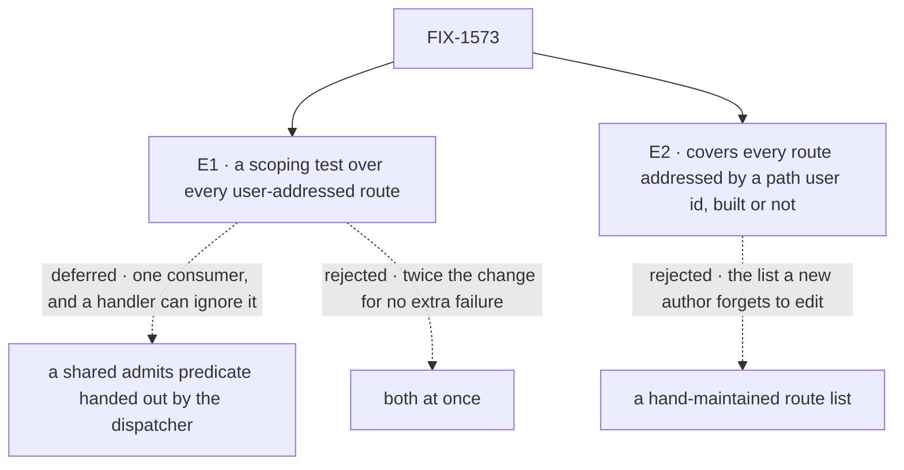

# FIX-1573 · Decisions

[Spec](SPEC.md) · **Decisions** · [Rules](BUSINESS-RULES.md) · [Plan](PLAN.md) · [Docs](DOCS.md)

What was considered, what was chosen, and why. **Nothing here is a product-owner decision.** The
objective is already fixed: no user-addressed route may serve or change another organization's,
another tenant's, or (anonymously) an authenticated flow's rows (FIX-1442 BR-8, FIX-1569). What
follows is how that objective gets enforced, which is the engineer's call. The only ask is
approval of the direction.

## The tree

The engineering calls, and what each rejected. None of them is up for sign-off: each is recorded
here so nobody re-derives it.

## Decided, not asked

### E1 · Enforce the scope with a test over every user-addressed route, not a shared predicate, for now

| | |
|---|---|
| **Instead of** | (a) The guard or dispatcher builds one `admits(entry)` predicate (tenant, organization, anonymous allow-list, lifted from the sweep's) and passes it to every user-addressed handler. Or (c), both |
| **Because** | The failure this issue fears is *forgetting*, and only a failing check catches forgetting. A predicate in the handler's signature does not: the handler still receives the stores and can read rows without calling it. Today the predicate would have one consumer, and its right shape for a stream is a guess until the stream exists (tenet 2). The test costs no production change, and the one live route already passes it |
| **Locks in** | Nothing a customer sees: the isolation promise is the same either way. The guarantee is enforced in CI in two stages (BR-1, then BR-5 to BR-9). The lift to a shared predicate is deferred to the second consumer, not dropped |

Not an ask: both options serve the same fixed objective and differ in none of filter 1's four
tests (`asking-for-decisions.md`). Undoing either costs a test file and two internal exports.

**What would change the call:** a second user-addressed route arriving in the same release. Then
the predicate has two consumers, lifting it is cheap and removes a copy, and (c) wins. The table
stays either way.

### E2 · The table covers every route addressed by a user id in its path, including routes not built yet; listings and session routes stay outside it

| | |
|---|---|
| **Instead of** | Covering only routes implemented today, or a hand-listed set |
| **Because** | The route set is read from the guard's own classification over the real route table, so a new route is in scope the moment it is classified. A route that isn't built is pinned: it must answer 501 and serve nothing, so building it breaks the pin (tenet 7: the check must reach the code it covers). Listings and session routes already carry their own isolation checks (FIX-1566, FIX-1442) |
| **Locks in** | Two small module-level exports in the engine (the classification, the route listing), visible to tests and not in the package's public API |

Not an ask: it bounds a *test*, not the isolation promise. Listings and session routes keep
theirs through their own suites; a misclassified route is caught by BR-2.

### Smaller calls

- **The harness runs through the real router, end to end.** The scope is split: the guard checks
  the user id and answers 401, the handler checks tenant, organization and allow-list. Testing
  either alone can pass while the pair leaks.
- **The harness, not the entry, owns the identities.** An entry supplies one way to seed a row,
  call the route, and observe it. The harness runs that same seed for the own identity and each
  foreign one, and requires the own row to be observed (BR-9, BR-11). An entry can't pass by
  seeding or observing nothing.
- **A path-shape cross-check.** Any `/users/:userId/...` pattern must be classified
  user-addressed (BR-2), so a misclassified route can't slip past E2.
- **The existing per-axis tests stay.** They cover the no-tenant caller and the row that
  predates organizations, which the table doesn't repeat.
- **No changeset, no site docs.** Nothing a consumer can observe changes. One sentence in
  `docs/architecture/authentication.md` ([DOCS.md](DOCS.md)).

## Considered and dropped

| Alternative | Why not |
|---|---|
| A tripwire: assert the user-route set equals `{user_stream, check_interrupted_requests}` | The simpler option. Cheaper, but forces a list edit, not a proof of scoping |
| A generic entry-less probe that calls any user route with no per-route knowledge | Can't know what a new route reads, how to seed it, or how to observe a leak in its response. It would pass vacuously on exactly the route it exists for. Hence the two stages |
| A `Record<UserRouteKind, Fixture>` type in the test file | Engine's `tsconfig` includes `src/` only, so test files aren't typechecked in CI. A runtime totality assertion is needed anyway |
| One predicate shared with the listings | The listings add a per-instance resolver verdict the sweep deliberately skips. Merging them reopens settled listing scope |

## Settled

- **The live route already applies all three scopes, and existing tests catch its removal** —
  **CONFIRMED** on `acc01bbf8`: replacing the sweep's scope predicate with `() => true` failed 5
  tests across three files (cross-tenant ×3 in `tenant-route-isolation.test.ts`, cross-org in
  `org-boundary-routes.test.ts`, anonymous in `management-route-auth.test.ts`); restored, 60/60
  pass. So the table adds coverage for *new* routes; it isn't fixing a gap on the live one.
- **The guard answers before the handler on both user routes** — **CONFIRMED** on `acc01bbf8`
  by a scratch test under a host resolver: an anonymous `check-interrupted` gets 401 and the row
  stays `in_progress`; an anonymous user-stream call gets 401; the owner's call gets 501. So the
  501 pin (E2) is exercised as the own caller, not anonymously.

## How it got here

- **Draft** — framed as "the next user-addressed route has nothing forcing it to scope"; chose a
  derived, table-driven scoping test with a 501 pin over a shared predicate; one PR, tests plus
  two module exports. No retained predecessor design is amended, so there is no `EVOLUTION.md`:
  FIX-1442, FIX-1569 and FIX-1566 set the contract this enforces unchanged.
- **Review round 1** — the test-versus-predicate and coverage-boundary calls moved from sign-off
  to *Decided, not asked*, because neither changes a customer promise
  ([thread](https://github.com/fixpoint-labs/flow-state-dev/pull/2228#discussion_r4099742734)).
  The guarantee restated in two stages: a missing entry fails automatically; a supplied entry
  must exercise the three axes against a positive control
  ([thread](https://github.com/fixpoint-labs/flow-state-dev/pull/2228#discussion_r4099742743)).

**Open: none.**
