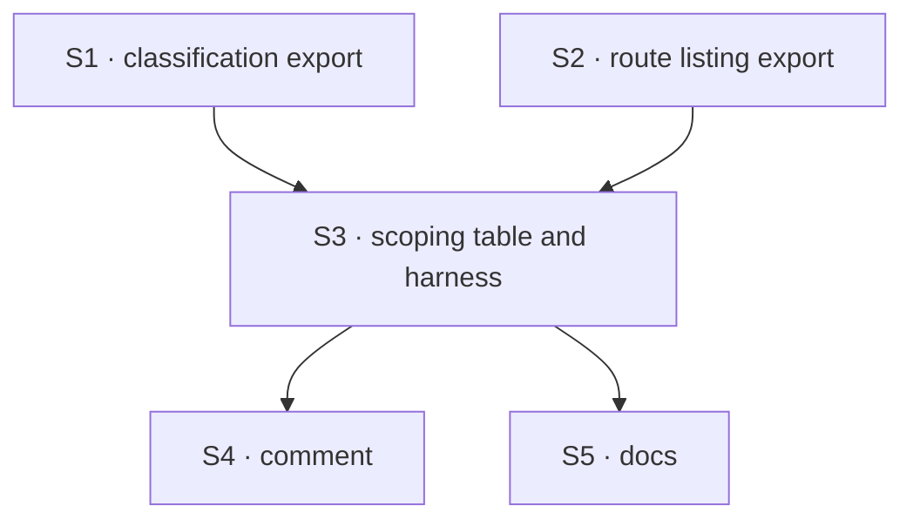

# FIX-1573 · Plan

[Spec](SPEC.md) · [Decisions](DECISIONS.md) · [Rules](BUSINESS-RULES.md) · **Plan** · [Docs](DOCS.md)

Written for the implementing agent. IDs cross-reference [BUSINESS-RULES.md](BUSINESS-RULES.md)
(BR-n) and [DECISIONS.md](DECISIONS.md) (E-n, the engineering calls). `tdd`, with negative controls. One PR.

## Surfaces

| ID | Package · role | Change | Rules |
|---|---|---|---|
| S1 | `engine` · the guard's route classification (`routes/route-auth.ts`) | Make the classification reachable from tests as a module export. Not added to `routes/index.ts`. No behaviour change | BR-1 BR-2 BR-3 |
| S2 | `engine` · the route table (`routes/router.ts`) | Expose each route's kind, method and pattern to tests, the same way. No behaviour change | BR-1 BR-2 |
| S3 | `engine` · a new test: the user-route scoping table and its harness | Stage 1: derive the user-addressed set from S1 over S2 and require one entry per route. Stage 2: each entry supplies seed / call / observe; the harness owns the identities, runs the owner's call first, then the three axes, through `createFlowApiRouter` with in-memory stores | BR-1 to BR-11 |
| S4 | `engine` · the `user` case comment in `route-auth.ts` | One line pointing at S3: a new route here needs a table entry | — |
| S5 | Docs | [DOCS.md](DOCS.md): one sentence in the `user` row of `docs/architecture/authentication.md` | — |

**Removed: nothing.** The three existing per-axis sweep tests stay (DECISIONS → *Smaller calls*).

## Sequence



## Checks

| ID | Runs after | Passes when |
|---|---|---|
| V1 | S3 | The table passes on current `main` behaviour: BR-1 to BR-11 green for `check_interrupted_requests`, BR-4 green for the `user_stream` pin |
| V2 | S3 | **Negative control, stage 2 · the evidence path.** Replace the sweep's scope predicate with `() => true` locally. BR-5, BR-6 and BR-7 fail for `check_interrupted_requests`, and BR-9 still passes. Revert |
| V3 | S3 | **Negative control, stage 1.** Delete the `check_interrupted_requests` entry. BR-1 fails naming it, with no other test edit. Revert |
| V4 | S3 | **Negative control, stage 1.** Make the user stream answer 200 with an empty body. The pin (BR-4) fails. Revert |
| V5 | S3 | **Negative control, stage 1.** Add a scratch `/users/:userId/probe` route classified `host`. BR-2 fails. Revert |
| V6 | S3 | **Negative control, vacuity.** Replace the `check_interrupted_requests` entry's seed with one that writes nothing (then, separately, its observer with one that never reports a row). BR-9 fails on the owner's call before any axis runs (BR-10). Revert |
| V7 | S3 | **Negative control, vacuity.** Make a scratch entry's seed ignore the identity it is given. BR-9 or an axis fails, because the harness seeds own and foreign rows through the same call (BR-11). Revert |
| V8 | S1–S5 | `pnpm --filter @flow-state-dev/engine test` and `typecheck` green; the existing sweep tests unchanged and passing (BR-12) |

Record V2 to V7's red output in the PR. No model runs, so there is no separate goal check: V1
already runs the real HTTP path. V3 is acceptance criterion 1, V2 is criterion 2, V6 is
criterion 3.

## Pinned names

None. Everything is yours to name.

## Guardrails

| Rule | Because |
|---|---|
| The route set under test is derived from S1 over S2, never hand-listed | A hand list is exactly what the next route's author forgets to edit. A check aimed at a list is aimed at a neighbour of the claim (tenet 7) |
| Run each case through `createFlowApiRouter`, not a handler directly | Scope is split between guard and handler; either alone can pass while the pair leaks |
| The harness owns the identities and runs the owner's call before the axes, in every setup | Otherwise an entry that seeds or observes nothing passes every axis (BR-10, BR-11) |
| Say "two stages" wherever the guarantee is stated | A new route can only fail automatically on its missing entry; the axes run once the entry exists. Promising more overstates the check (tenet 7) |
| Seed rows the route actually reads; an entry may add its own seeds | A foreign row in a store the route never reads proves nothing |
| No production behaviour change | The live route is already correct (DECISIONS → Settled). Latent, Low |
| Don't lift the sweep's predicate, and don't touch the listings | E1 defers the lift to a second consumer. The listings' scope is settled (FIX-1566) and has a per-instance verdict the sweep skips |
| Don't fold into FIX-1571's clamp work or the verified-identity epic | Architect fence on the issue |

## Docs

Publish [DOCS.md](DOCS.md) after V1 to V7 pass. No site page, no README, no changeset.

## Sketch · pseudocode, illustrative, react to the shape

```
stage 1:
userRoutes ← for each route in the route table:
               parse a sample path through the real router, classify it with the guard
               keep it if classified user-addressed
assert userRoutes == keys(table)                       (BR-1, BR-3)  ← a new route fails here
assert every "/users/:userId…" pattern ∈ userRoutes    (BR-2)

stage 2, per entry (entry = { seed(identity), call(caller), saw(reply, row) }):
  if entry is the 501 pin: owner's call → expect 501, no seeded id in body            (BR-4)
  else for each axis in [other org, other tenant, anonymous in a mixed app]:
         identities ← harness picks owner and foreign, differing only on this axis
         own ← entry.seed(owner); foreign ← entry.seed(foreign identity)             (BR-11)
         expect entry.saw(call as owner, own)          ← positive control first       (BR-9, BR-10)
         expect not entry.saw(call as axis caller, foreign), foreign row unchanged    (BR-5..7)
```

**POC:** none built. The premise that the live route already scopes on all three axes was
checked by a red-state run (DECISIONS → Settled). The spec's one counted fact, two user-addressed
routes (`route-auth.ts` `routeSubject`, the `user_stream` / `check_interrupted_requests` case),
is re-derived by S3 itself, so no separate checker.

## At implement time

- Open FIX-1549 PR-B (#2222) changes one line of `routes/instance-caller.ts`; nothing here
  touches it. Re-read `route-auth.ts`, `router.ts` and `recovery-routes.ts` on fresh `main`.
- If the user stream has been built since this was written, its entry is a real one, not the pin.
- Reuse the existing sweep tests' fixtures (seeded stale entries, header resolver) rather than
  building new ones.

## Follow-ups

- When the user stream is built, lift the sweep's scope predicate into one user-route predicate
  both routes use (E1's deferred half). The table stays.
- NOTE: three hand-written scope predicates live side by side (the sweep, the active-request
  listing, the session listing). They differ on purpose today; worth an
  `improve-codebase-architecture` pass, not this issue.
