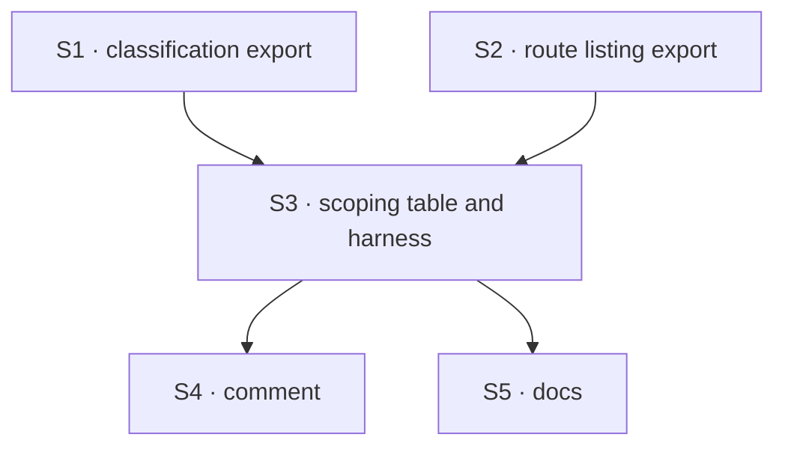

# FIX-1573 · Plan

[Spec](SPEC.md) · [Decisions](DECISIONS.md) · [Rules](BUSINESS-RULES.md) · **Plan** · [Docs](DOCS.md)

Written for the implementing agent. IDs cross-reference [BUSINESS-RULES.md](BUSINESS-RULES.md)
(BR-n) and [DECISIONS.md](DECISIONS.md) (D-n). `tdd`, with negative controls. One PR.

## Surfaces

| ID | Package · role | Change | Rules |
|---|---|---|---|
| S1 | `engine` · the guard's route classification (`routes/route-auth.ts`) | Make the classification reachable from tests as a module export. Not added to `routes/index.ts`. No behaviour change | BR-1 BR-2 BR-3 |
| S2 | `engine` · the route table (`routes/router.ts`) | Expose each route's kind, method and pattern to tests, the same way. No behaviour change | BR-1 BR-2 |
| S3 | `engine` · a new test: the user-route scoping table and its harness | Derive the user-addressed set from S1 over S2; one entry per route; run BR-4 to BR-9 through `createFlowApiRouter` with in-memory stores | BR-1 to BR-9 |
| S4 | `engine` · the `user` case comment in `route-auth.ts` | One line pointing at S3: a new route here needs a table entry | — |
| S5 | Docs | [DOCS.md](DOCS.md): one sentence in the `user` row of `docs/architecture/authentication.md` | — |

**Removed: nothing.** The three existing per-axis sweep tests stay (D1, *Decided, not asked*).

## Sequence



## Checks

| ID | Runs after | Passes when |
|---|---|---|
| V1 | S3 | The table passes on current `main` behaviour: BR-1 to BR-9 green for `check_interrupted_requests`, BR-4 green for `user_stream` |
| V2 | S3 | **Negative control, the evidence path.** Replace the sweep's scope predicate with `() => true` locally. BR-5, BR-6 and BR-7 fail for `check_interrupted_requests`, and BR-9 still passes. Revert |
| V3 | S3 | **Negative control.** Delete the `check_interrupted_requests` entry. BR-1 fails naming it. Revert |
| V4 | S3 | **Negative control.** Make the user stream answer 200 with an empty body. BR-4 fails. Revert |
| V5 | S3 | **Negative control.** Add a scratch `/users/:userId/probe` route classified `host`. BR-2 fails. Revert |
| V6 | S1–S5 | `pnpm --filter @flow-state-dev/engine test` and `typecheck` green; the existing sweep tests unchanged and passing (BR-10) |

Record V2 to V5's red output in the PR. No model runs, so there is no separate goal check: V1
already runs the real HTTP path.

## Pinned names

None. Everything is yours to name.

## Guardrails

| Rule | Because |
|---|---|
| The route set under test is derived from S1 over S2, never hand-listed | A hand list is exactly what the next route's author forgets to edit. A check aimed at a list is aimed at a neighbour of the claim (tenet 7) |
| Run each case through `createFlowApiRouter`, not a handler directly | Scope is split between guard and handler; either alone can pass while the pair leaks |
| Every negative case has its positive control in the same run | A route that serves nothing passes every negative |
| Seed rows the route actually reads; an entry may add its own seeds | A foreign row in a store the route never reads proves nothing |
| No production behaviour change | The live route is already correct (DECISIONS → Settled). Latent, Low |
| Don't lift the sweep's predicate, and don't touch the listings | D1 defers the lift to a second consumer. The listings' scope is settled (FIX-1566) and has a per-instance verdict the sweep skips |
| Don't fold into FIX-1571's clamp work or the verified-identity epic | Architect fence on the issue |

## Docs

Publish [DOCS.md](DOCS.md) after V1 to V5 pass. No site page, no README, no changeset.

## Sketch · pseudocode, illustrative, react to the shape

```
userRoutes ← for each route in the route table:
               parse a sample path through the real router, classify it with the guard
               keep it if classified user-addressed
assert userRoutes == keys(table)                       (BR-1, BR-3)
assert every "/users/:userId…" pattern ∈ userRoutes    (BR-2)

for each route in userRoutes:
  entry ← table[route]
  if entry is "not built yet": call as own caller → expect 501, no seeded id in body   (BR-4)
  else for each (app setup, caller, foreign row) in the three axes:
         seed own row and foreign row; call the route as the caller through the router
         expect own row seen or changed; foreign row neither                          (BR-5..9)
```

**POC:** none built. The premise that the live route already scopes on all three axes was
checked by a red-state run (DECISIONS → Settled). The spec's one counted fact, two user-addressed
routes (`route-auth.ts` `routeSubject`, the `user_stream` / `check_interrupted_requests` case),
is re-derived by S3 itself, so no separate checker.

## At implement time

- Open FIX-1549 PR-B (#2222) changes one line of `routes/instance-caller.ts`; nothing here
  touches it. Re-read `route-auth.ts`, `router.ts` and `recovery-routes.ts` on fresh `main`.
- If the user stream has been built since this was written, its entry is a real one, not the pin.
- Reuse the existing sweep tests' fixtures (seeded stale entries, header resolver) rather than
  building new ones.

## Follow-ups

- When the user stream is built, lift the sweep's scope predicate into one user-route predicate
  both routes use (D1's deferred half). The table stays.
- NOTE: three hand-written scope predicates live side by side (the sweep, the active-request
  listing, the session listing). They differ on purpose today; worth an
  `improve-codebase-architecture` pass, not this issue.
