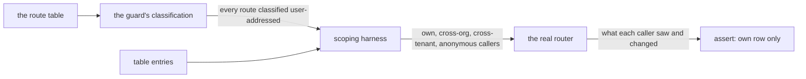

# FIX-1573 · User-addressed routes rely on each handler for org/tenant scoping — make it structural

**Spec** · [Decisions](DECISIONS.md) · [Rules](BUSINESS-RULES.md) · [Plan](PLAN.md) · [Docs](DOCS.md)

Improvement · `engine` (tests plus two module-level exports) · small · 1 PR · no epic

## Five people, before and after

| Someone who… | Today | After |
|---|---|---|
| **builds the user stream, or any new `/users/:userId/...` route** | Nothing tells them the route must also filter by organization, tenant and the anonymous allow-list. A handler that filters by the path's user id alone passes every existing test | Two stages in CI. With no scoping-table entry, the suite fails at once, naming the route. Once they add the entry, it runs callers from another organization, another tenant and anonymous callers against the route, and fails if any of them sees or changes a row the owner's own call can see |
| **belongs to two organizations** | Safe on the one live route (`check-interrupted`). On the next route, safety depends on whoever writes it | Every user-addressed route is shown not to cross organizations, including the ones not yet built |
| **runs one host for several tenants** | Same: the live route checks the tenant; the next route might not | Same guarantee, on the tenant axis |
| **runs a mixed app: one flow authenticates, the rest are open** | An anonymous caller can't touch the authenticated flow's runs through the sweep. The next route has to reproduce that by hand | Proved for every user-addressed route, anonymous caller included |
| **calls `check-interrupted` today** | Current behaviour | Byte-for-byte the same. No production code path changes |

This is latent. The one live route already applies all three scopes. The second route is 501 and
has no rows. The risk is the route after this one, whose author has nothing to remind them.

## What changes


Same route, twice. The guard and the handler are identical in both lanes. What moves is the
fence: after this change, a user-addressed route reaches merge only with a table entry, and only if that entry's foreign callers see nothing.

**What a route author meets.** Illustrative: the table's shape is the implementer's.

```diff
  // one entry per user-addressed route, derived from the guard's own classification
  check_interrupted_requests: { call: POST /users/:userId/check-interrupted, saw: row ids in the reply },
- user_stream: notBuiltYet,            // pinned: must answer 501 and serve nothing
+ user_stream: { call: GET /users/:userId/stream, saw: row ids read from the stream },
```

Building the user stream breaks the 501 pin on purpose. The author has to swap the pin for a real
entry, and the real entry runs the same three foreign callers as every other route.

## How the table is enforced



The set of routes under test comes from the guard's own classification over the real route table,
not from a hand list. A new route fails the suite the moment it is classified, because it has no
entry. The entry its author then writes is what lets the harness seed, call and observe it; the
harness runs the owner's call first, so an entry that seeds or observes nothing fails too.

## What stays as it is

- The guard, the dispatcher and every handler. No production behaviour changes.
- The three existing per-axis tests for `check-interrupted`. They cover cases the table doesn't
  (a caller with no tenant, a row that predates organizations).
- The listings (`list_sessions`, `active_requests`). They are cross-flow routes with their own
  per-instance resolver check, and are out of scope.

## Sign off

**Approve the direction.** That is the only ask: the isolation objective is already fixed
(FIX-1442, FIX-1569), and how it is enforced is an engineering call. Two such calls are recorded
in [DECISIONS.md → Decided, not asked](DECISIONS.md#decided-not-asked), so you can see them
without being asked to adjudicate them:

- [E1](DECISIONS.md#e1) · a test over every user-addressed route now; the shared predicate waits
  for its second consumer.
- [E2](DECISIONS.md#e2) · the test covers every route addressed by a user id in its path, built or
  not; listings and session routes keep their own checks.

**Open: none.** The cases the code must satisfy are in [BUSINESS-RULES.md](BUSINESS-RULES.md).
