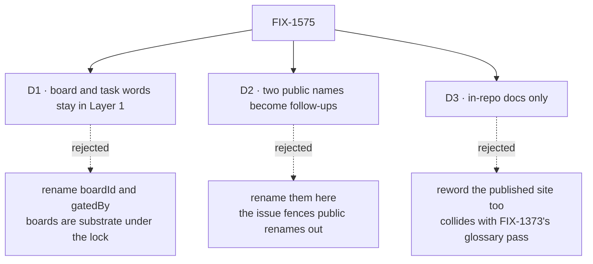

# FIX-1575 · Decisions

[Spec](SPEC.md) · **Decisions** · [Rules](BUSINESS-RULES.md) · [Plan](PLAN.md) · [Docs](DOCS.md) · [Evolution](EVOLUTION.md)

What was considered, what was chosen, and what each choice locks in. Three decisions are the
sign-off surface; the rest is context for them.

## The tree

Solid edges are what you're signing. Dashed edges lost, and the label says why.

## D1 · Board and task words are Layer 1 and stay; only Workforce words about them change

| | |
|---|---|
| **Instead of** | Treating `gatedBy.boardId` and Core's task types as the leak, as FIX-1549's follow-up line framed it |
| **Because** | The locked guidance on the issue says Layer 1 already owns task, board and parked, and forbids "generalizing" by removing them. The leak is the word *seat* (a hired instance, Layer 2) used where Layer 1 means *assignee* (the board's claim key). Tenet 2: realign the words, don't shrink the substrate |
| **Locks in** | Core and Engine keep speaking of boards, tasks and ledgers. The runAction gate is reworded, not renamed. The issue's first named starting point closes as "not a finding" |

**What would change my mind:** a ruling that task boards themselves are Orchestration-only and
should leave Core. That is a different issue, and it would reopen `TaskEntry`.

## D2 · Two public names carrying seat words become follow-up issues, not renamed here

| | |
|---|---|
| **Instead of** | Renaming them in this PR, or leaving them unrecorded |
| **Because** | The issue puts public renames out of scope and says it doesn't pre-decide new names. Both have real migration cost. The envelope's `seat` field is persisted in queued task dispatches and composes the `"per-worker"` child-session key, so a rename needs a dual-read (BP-030). The discovery domains are model-facing strings in a closed list; generalizing them is a design question (a closed list Layer 1 owns, or domains a higher layer registers), not a word swap |
| **Locks in** | Until the follow-ups land, Layer 1 still exports `TaskDispatchInput.seat` and `MANIFEST_DOMAINS = ["seats", "channels", …]`. The prose around them is reworded now, with the field name kept in code spans, so the docs stop teaching *seat* as the concept |

The two follow-ups, with working titles (filed by the implementation PR, [PLAN → Follow-ups](PLAN.md#follow-ups)):
`FIX-XXX · rename the task envelope's seat field to assignee` and
`FIX-XXX · discovery domains name Workforce concepts in Layer 1`.

## D3 · In-repo docs only; the published site follows FIX-1373

| | |
|---|---|
| **Instead of** | Also rewording `apps/docs` pages about Core and Engine (background work, scheduled actions, persistence, flows: about 38 lines) |
| **Because** | Those pages link into the published Orchestration pages ("Seats that hand off"), which FIX-1373 owns. Rewording one side first leaves the site inconsistent with itself, and the locked guidance keeps the two issues separate |
| **Locks in** | For a while the site says "seat" where READMEs and architecture docs say "assignee". A follow-up publishes the site pages on FIX-1373's schedule |

## Decided, not asked

- **Audit baseline is `main` plus #2236's head** (`a64132b`). #2236 already rewords
  `scope-keys.ts`, the owner-pinned cell and Engine's README; the inventory fails on plain
  `main` for exactly those lines. Implementation waits for #2236 to merge.
- **Scope is `packages/{core,engine,contracts}/src`, their READMEs, `docs/architecture/*`
  (except Workforce's own `workforce-*.md`), the two docs the issue named, and
  `docs/contributing/architecture-reference.md`, the architecture docs' quick reference.** `contracts` is
  in because Core re-exports all of it.
- **Tests are out.** They exercise the mechanism, many on purpose through Workforce (the #2236
  guard among them), and no app reads them.
- **Naming Workforce as a consumer stays.** "Workforce pins each hired seat this way" points
  the right direction; #2236's guard lists that exact line as not-coupling.
- **Replacement words:** *assignee* for a board's claim key, *owner-pinned instance* for an
  instance registered with a pin (#2236's term). Never *worker* for either (the lock).
- **"worker" is not audited here.** `"per-worker"` and a board's `workers` map are
  Orchestration's own vocabulary; "agent vs worker vs board-worker" is FIX-1373's question.
  Engine's queue "worker" is ordinary infrastructure English.
- **No word-ban test.** FIX-1549 decided its guard checks coupling, not words, so prose never
  becomes a CI failure. Review and the retained inventory cover prose.
- **The `Agent` seam is reworded only.** One comment in `types/agent.ts`; the type is not
  grown, demoted or deleted (the lock).

## Considered and dropped

| Alternative | Why not |
|---|---|
| A word-ban CI guard over Core and Engine | Catches ordinary English and turns prose into CI failures. FIX-1549 rejected the same idea |
| Rename `seat` → `assignee` here with a dual-read | The simplest end state, and it lost only on scope: the issue fences public renames into their own spec |
| Leave the prose until the renames land | The docs would keep teaching *seat* for months; the prose is free to fix now |

## Settled

- **The inventory is total over its scope** — every hit line on `main` + #2236 is classified
  exactly once; the six planted defects each fail it, and the code-span allowance (retained
  public names only, BR-3) and the clean tree pass.
  ([`check.mjs --self-test`](poc/vocabulary-inventory/check.mjs); see [PLAN → POC](PLAN.md#poc))

## How it got here

- **Draft** — framed as a counted audit against `main` + #2236; board words kept per the lock,
  82 wording-only lines fixed in one PR, two public names routed to follow-ups, published site
  left to FIX-1373.

**Open: none.**
