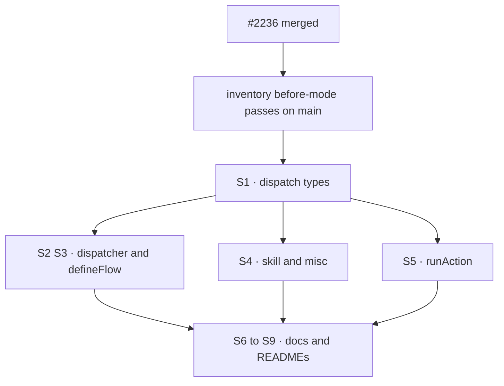

# FIX-1575 · Plan

[Spec](SPEC.md) · [Decisions](DECISIONS.md) · [Rules](BUSINESS-RULES.md) · **Plan** · [Docs](DOCS.md) · [Evolution](EVOLUTION.md)

Written for the implementing agent. IDs cross-reference [BUSINESS-RULES.md](BUSINESS-RULES.md)
(BR-n) and [DECISIONS.md](DECISIONS.md) (Dn). `tdd`, in its plain form for a wording change:
the red state is the inventory's `--after` mode, which fails today on 81 lines; green is when
it passes. One PR. **Do not start until [#2236](https://github.com/fixpoint-labs/flow-state-dev/pull/2236) has merged.**

The line-by-line list is [`poc/vocabulary-inventory/ledger.mjs`](poc/vocabulary-inventory/ledger.mjs):
every `F` entry is a line to reword. The table below groups them; the ledger is the checklist.

## Surfaces

| ID | Package · file | Change | F lines | Rules |
|---|---|---|---|---|
| S1 | `core` · `types/dispatch.ts` | Seat → assignee in the module header, `TaskSessionPolicy`, `DispatchAddress`, `taskDispatchInputSchema`'s doc and the `seat` field's doc, `TaskBinding`. "so the roster shows statically which seats hand off" → the board can list which of its assignees hand off. Field and key code untouched | 11 | BR-1 BR-2 BR-3 |
| S2 | `core` · `blocks/dispatcher.ts`, `types/block.ts`, `types/flow.ts`, `helpers/block-graph.ts` | "A task dispatcher is a seat on a task board" → it sits in a board's `workers` under an assignee. Includes the `dispatcher()` error string | 12 | BR-1 BR-10 |
| S3 | `core` · `flow/defineFlow.ts` | Comments, and three refusal sentences ("A task dispatcher is a seat", "each row this seat hands off", "Add a `dispatcher(…)` seat to a board"). "a roster with a typo'd knob" → a config bag loaded from a file | 9 | BR-1 BR-10 |
| S4 | `core` · `types/skill.ts`, `capability/types.ts`, `manifest/registry.ts`, `types/agent.ts` | Skill delegation: "tool seats" / "agent seats" → tool / agent assignees; keep `resolveToolSeats` and `toolSeatFence` as named code (Orchestration's). "roster blurb" → a one-line summary for the coordinator. Drop "the workforce agent-level `contextMode`" to "a higher layer's `contextMode`". "a workforce with no channels" → a scope with no channels source. `Agent` seam: one comment only | 11 | BR-1 BR-3 BR-4 |
| S5 | `engine` · `execution/runAction.ts` | The `assertDispatchersRoutable` header and its refusal: "the seat is held by board X" → "the dispatcher is held by board X" (D1: `boardId` stays) | 2 | BR-7 BR-10 |
| S6 | `docs/architecture/` · `dispatched-work.md`, `action-forms.md`, `overview.md`, `inbound-transports.md`, `state-and-scopes.md` (one line) | Task seat / dispatcher seat → the board's dispatcher, or the assignee it serves. The code-path table rows at the end of `dispatched-work.md` too; not the cited Orchestration README heading (KP) | 18 | BR-1 BR-3 |
| S7 | `docs/architecture/authentication.md` | The pinned-instance paragraph: hired instance / hire row / pinned seat / seat instance → owner-pinned instance. One sentence keeps Workforce as the consumer, including `registerHiredSeat`'s refusal of a pinless hire | 1 (one long line) | BR-1 BR-4 |
| S8 | `docs/architecture/capabilities.md` | Line 54, and the "worker-colocated tool" paragraph (75–81): cut to one consumer sentence. A higher layer that registers blocks per instance (Workforce's colocated `blocks/` folder) still has the instance name each block in `tools:`; registration grants nothing | 8 | BR-1 BR-4 |
| S9 | READMEs · `packages/core/README.md`, `packages/scheduled/README.md`; `docs/contributing/best-practices/resources.md` | Core: dispatch tables and the `flow-not-found` row ("a seat hired at runtime" → an owner-pinned instance the sender may not open; the link to Workforce's durable-hire page stays). Scheduled and BP-027's FIX-1538 exception: "hired seat" → owner-pinned instance | 9 | BR-1 BR-4 |

Nothing is removed. No exported name, type, literal or key changes (BR-9).

## Sequence

S1 first because its wording is the vocabulary everything else echoes.

## Checks

| ID | Runs after | Passes when |
|---|---|---|
| V0 | start | `node specs/issues/FIX-1575/poc/vocabulary-inventory/check.mjs` passes on fresh `main` (before-mode). If a ledger line drifted, fix the ledger's `has` first, in the implementation PR, and say so |
| V1 | S1–S5 | `pnpm --filter @flow-state-dev/core typecheck test`, same for `engine` and `contracts`. Any assertion on an old refusal sentence is updated (BR-10) |
| V2 | S1–S9 | `check.mjs --after` passes: every F line gone, every R and K line intact (BR-1…BR-6, D1, D2). A rewritten line that still names Workforce as a consumer (the drafts in DOCS.md do, twice) gets a `KC` ledger entry in the same PR; nothing else is added to the ledger |
| V3 | S1–S9 | `git diff main -- packages/*/src` shows only comment lines and error-string lines (BR-9). Read it, don't infer it |
| V4 | S9 | `grep -n worker` over the diff: no *worker* introduced for a seat or assignee (BR-8) |
| V5 | S1–S9 | `check.mjs --self-test` still passes, so V2's green is not a broken checker |

No goal check applies: nothing runs differently. The second path (BP-035) is the refusal
sentences, which V1 exercises through the existing suites.

## Pinned names

| Where | Word | Why pinned |
|---|---|---|
| A board's claim key | *assignee* | The lock on the issue: Seat is Layer 2, Assignee is the board axis |
| An instance registered with `register(flow, { pin })` | *owner-pinned instance* | #2236's term; the prose must match Engine's README and state-and-scopes |

Every other word is yours.

## Guardrails

| Rule | Because |
|---|---|
| Never introduce *worker* for a seat or an assignee | The lock kills it, and FIX-1373 owns the worker vocabulary |
| Never rename or delete a board, task or parked primitive while rewording | The lock: boards are substrate, and "generalizing" by removal is an invent-kill (D1) |
| A kept public name stays in a code span, never paraphrased away | The reader still types `seat`; hiding it makes the docs wrong about the API (BR-3) |
| Keep every line that names Workforce as a consumer | Pointing up the layers is correct; #2236's guard uses one as its not-coupling sample |
| Don't touch `packages/engine/test/workforce-coupling-guard.test.ts` | #2236's design; its sample line quotes runAction's old comment on purpose, as a literal |
| Don't edit `apps/docs` | D3; FIX-1373's timing |

## Docs

This change *is* documentation: S6–S9 are the in-repo docs. [DOCS.md](DOCS.md) drafts the
reader-facing paragraphs that change most (authentication, capabilities, the Core README
dispatch tables); reconcile them against the final code comments and land them in the same PR.
No changeset: no published API or behaviour changes (BP-022).

## POC

[`poc/vocabulary-inventory/`](poc/vocabulary-inventory/check.mjs) is the audit itself as a
check. `scan.mjs` fixes the scope and the vocabulary; `ledger.mjs` classifies every hit line;
`check.mjs` asserts totality (every hit claimed exactly once, every entry claims exactly its
count) and, with `--after`, the end state. `--self-test` runs seven controls: five planted defects (an unclassified hit, a hit inside
the kept trace store, a dropped hit, a lingering F line, a renamed public field) each fail it,
and the code-span allowance and the clean tree pass. Run on `main` + `a64132b`: 142
hit lines, all classified. Run on plain `main`: 64 lines it cannot classify, every one in a file #2236
rewords, which is why implementation waits for it. Throwaway once V2 passes; nothing imports it.

## At implement time

- Rebase on `main` after #2236; run V0. A drifted `has` is a ledger fix, not a new finding.
- FIX-1578 (generator tool-block resource registration) is in flight in Core's generator
  area. None of its files are in the ledger; if it lands first and adds a *seat* line, V0 names it.
- Recheck FIX-1373's state; if its glossary has landed, align the two words above with it.

## Follow-ups

File these from the implementation PR, related to FIX-1575:

- **`FIX-XXX · rename the task envelope's seat field to assignee`** (D2). `TaskDispatchInput.seat`
  in Core and Orchestration's `HandOffOptions.seat`; the `per-worker` child-session key reads it.
  Persisted in queued dispatches, so dual-read the old key (BP-030). Ledger class R1.
- **`FIX-XXX · discovery domains name Workforce concepts in Layer 1`** (D2). `MANIFEST_DOMAINS`
  pins `"seats"` and `"channels"` in Contracts; the `discover` tool's description names them to
  the model. The question is whether Layer 1 owns a closed list at all. Ledger class R2.
- **Published Core/Engine pages** (D3): `server/background-work.md`, `server/scheduled.md`,
  `server/schedule-index.md`, `server/authentication.md`, `persistence/overview.md`,
  `fundamentals/flows.md`, `devtool/debug-vs-client-state.md`. Add to FIX-1373 or file beside it.
- **Orchestration's own source** calls the board's worker entries *seats* (`task-board/index.ts`,
  `hand-off.ts`). The same lock applies; not Core or Engine, so not here.
- **Test names** in `packages/engine/test/` (`seat-cell*.test.ts`, `hire-plane-fence.test.ts`)
  describe the pin in Workforce words. Low value; flag only.
