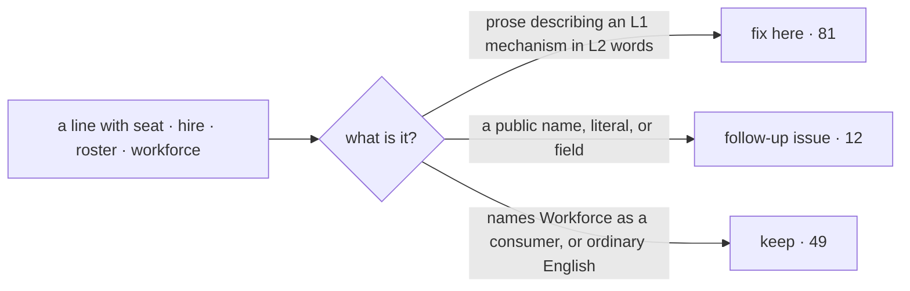

# FIX-1575 · Layer 1 (Core, Engine) still names Workforce/Orchestration concepts: audit and generalize the vocabulary

**Spec** · [Decisions](DECISIONS.md) · [Rules](BUSINESS-RULES.md) · [Plan](PLAN.md) · [Docs](DOCS.md) · [Evolution](EVOLUTION.md)

Improvement · `core` + `engine` + `contracts` (comments and in-repo docs only) · small · 1 PR · no epic (follows [FIX-1549](https://linear.app/fixpoint-labs/issue/FIX-1549); **starts after [#2236](https://github.com/fixpoint-labs/flow-state-dev/pull/2236) merges**)

## Five people, before and after

| Someone who… | Today | After |
|---|---|---|
| **reads Core's dispatcher docs to hand board rows to another session, without Workforce** | Told a task dispatcher "is a seat on a task board", and that the envelope names "the dispatcher's seat on the roster" | Told it sits in a board's `workers` under an assignee, and the envelope names the assignee the row was routed to |
| **reads Engine's architecture docs to pin a flow instance to an owner** | Reads about "hired instances", "the hire row" and "opening a pinned seat" | Reads about an owner-pinned instance, with one line saying Workforce is a consumer |
| **wires a scheduled-action resolver on a pinned instance** | The README frames it as "on a hired seat" | Frames it as "on an owner-pinned instance" |
| **hits the "wrong board" error when a hand-off crosses boards** | "…but the seat is held by board X" | The same refusal, worded around the dispatcher and the board |
| **builds on Workforce** | Unchanged | Unchanged. No name, type, key or behaviour moves ([D2](DECISIONS.md#d2)) |

The audit is counted, not argued: [`poc/vocabulary-inventory`](poc/vocabulary-inventory/check.mjs)
classifies every one of the 142 lines in scope that carries a Workforce word. **81 are
wording-only and get fixed here** (21 files). **12 belong to two public names**, which become
follow-up issues. **49 stay**: they name Workforce as a consumer, or use the word in its
ordinary sense (the trace store's request roster, "an operator's seat").

## What changes


Read the bottom half. The words change; the boards, the tasks and every public name stay put.
The two dashed boxes are the only Workforce words left in Layer 1, and each has its own issue.

```diff
 // packages/core/src/types/dispatch.ts
-  /** The board seat the row is assigned to — the dispatcher's seat on the roster. */
+  /** The assignee the board routed the row to. */
   seat: z.string().min(1),          // name unchanged here; its rename is a follow-up (D2)

 // packages/engine/src/execution/runAction.ts
-  `"${gatedBy?.boardId ?? "<none>"}", but the seat is held by ` +
+  `"${gatedBy?.boardId ?? "<none>"}", but the dispatcher is held by ` +
```

## How a finding is sorted



The middle edge is the scope fence the issue set: a public rename is its own spec.

## What stays as it is

- **Boards and tasks.** `boardId`, `gatedBy`, task entries and the claim gate are Layer 1
  substrate ([D1](DECISIONS.md#d1)). The issue named `gatedBy.boardId` as a starting point; it
  is not a finding.
- **Every exported name and literal**, including `TaskDispatchInput.seat`, `"per-worker"` and
  the discovery domains. Nothing a program reads changes.
- **What #2236 already fixed**: `scope-keys.ts`, the owner-pinned cell, Engine's README.
- **The published site** (`apps/docs`) ([D3](DECISIONS.md#d3)), tests, and the thin `Agent` seam.

## Sign off

1. **[D1](DECISIONS.md#d1) · Board and task words are Layer 1 and stay; only Workforce words
   about them change.** If wrong: a second pass renames board fields across Core, Engine and
   Orchestration.
2. **[D2](DECISIONS.md#d2) · Two public names carrying seat words become follow-up issues, not
   renamed here:** the task envelope's `seat` field, and the discovery tool's pinned `"seats"` /
   `"channels"` domains. If wrong: both ship in more releases, and each release adds callers
   that a rename then breaks.
3. **[D3](DECISIONS.md#d3) · In-repo docs only; the published site follows FIX-1373.** If wrong:
   for a while the site says "seat" where the README says "assignee".

**Open: none.** Number 2 is the one to weigh: it decides how long Layer 1 keeps two
Workforce-worded public names. Reasoning and what lost: [DECISIONS.md](DECISIONS.md). The
cases: [BUSINESS-RULES.md](BUSINESS-RULES.md).
