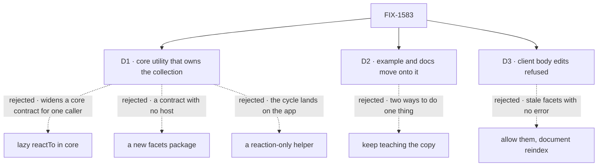

# FIX-1583 · Decisions

[Spec](SPEC.md) · **Decisions** · [Rules](BUSINESS-RULES.md) · [Plan](PLAN.md) · [Docs](DOCS.md) · [Evolution](EVOLUTION.md)

Decided input, not re-argued here: the owner's reversal of FIX-1557's D1 on
[#2234](https://github.com/fixpoint-labs/flow-state-dev/pull/2234#issuecomment-5831771033) (a
provided utility, peer of `cascadingRouter`, not a new block kind and not a change to
`evaluator`); FIX-1557's [D2](../FIX-1557/DECISIONS.md#d2) and [D3](../FIX-1557/DECISIONS.md#d3),
which this utility carries over unchanged; and the epic's
[D3](../../epics/FIX-1553/DECISIONS.md#d3) with ER-3, ER-9 and ER-11 (the app owns its questions
and its model; nothing retries; confidence gates only where asked). The three cards are what that
leaves open: where it lives and how it breaks the cycle, what happens to the recipe, and one
refusal.

## The tree

Solid edges are what you're signing. Dashed edges lost, and the label says why.

## D1 · Core's `utility` namespace, as a factory that owns the collection definition. No lazy `reactTo`, no new package

| | |
|---|---|
| **Instead of** | (a) A lazy `reactTo` in core (`reactTo: () => ({ … })`) plus a reaction-only helper the app wires into its own collection · (b) a reaction-only helper with no core change, leaving the app to break the cycle · (c) a new `@flow-state-dev/facets` package · (d) `@flow-state-dev/tools` or `@flow-state-dev/memory` |
| **Because** | **Why a factory:** it gives apps one taught path with the facet fields merged into their schema, refuses the miswirings at build (BR-3 to BR-6, [D3](#d3)), and hides the definition order from them. A reaction-only export would work at runtime, as the recipe does, but would give up all three. **The cycle is about declaration order, not about runtime.** A reaction block reads the collection through `ctx.resources`, and that map is the flow's registry keyed by accessor, whatever the block declares (`createExecutionContext`'s flat registry). The recipe already works by reading it undeclared. A lazy `reactTo` would let the block *declare* the collection, which buys a type and changes nothing at runtime, and would still leave the accessor name to agree on. It would also move `validateReactTo`'s refusal from definition time to first dispatch for every resource definer. Tenet 5: fix it at the layer that owns it, and the only caller that meets the cycle is the one that defines both halves. A factory that defines the collection builds the reaction first, then the collection, then the blocks that declare it, so the app never sees the ordering. **Placement:** `cascadingRouter`, its named peer, lives in `utility` ([FIX-1558](../FIX-1558/DECISIONS.md)); so does `upsertResource`, a resource utility that already reads `ctx.resources[collectionKey]`. Everything the factory uses ships in core, and core is isomorphic, so the token uses `crypto.randomUUID()` as core's edge helpers do. A new package is tenet 3's contract without a host. `tools` holds tool blocks, and a reaction isn't one. `memory` is a different domain. None of these adds a dependency, which is ER-11's fence for consumer packages |
| **Locks in** | One export, `utility.facetedCollection`, returning `{ collection, search, reindex, resources }`. The app picks the accessor (`name`) and registers `resources` on the flow; the utility's blocks read and declare the collection under that name. What the factory can't express stays on hand-wiring: projected collections (they have their own `filter` query), a second `contentUpdated` reaction on the same collection, and questions computed per call. Each is refused by name at build ([BUSINESS-RULES](BUSINESS-RULES.md#building)) |

**What would change my mind:** a second consumer that needs a collection and its reaction to
refer to each other, from outside core. Then the lazy form earns its contract.

## D2 · The example and the docs move onto the utility. The hand-wired reaction stops being taught as code to copy. Stored field names don't change

| | |
|---|---|
| **Instead of** | Keeping the recipe as the documented path, with the utility beside it as an option · or renaming the stored fields to something the utility owns |
| **Because** | Two taught ways to write the same three rules drift, and the copy is the one that drifts: the recipe's own first version let stale answers back in, and only a review caught it (#2210). The runnable example is also leg (e)'s proof: pointing it at the utility makes the goal prove what ships, not a copy of it. Keeping `facets` and `indexedAs` means an app that copied the recipe swaps one definition and keeps every stored facet (BP-030): no migration, no reindex |
| **Locks in** | `examples/guides/index-time-facets/` uses the utility, and its copied reaction, search and matcher are deleted. The searching page teaches the utility; the three rules become a short "what it does for you" list, and the hand-wired form survives as one link to the utility's source for shapes the factory refuses. The Linear lock "don't replace FIX-1557's recipe PR" holds: that PR merged, and this one moves the example forward rather than rewriting its history |

**What would change my mind:** an app that needs a shape D1 refuses, asking for the walkthrough
back. Then the hand-wired form returns as a docs section, not as the default.

## D3 · A faceted collection refuses client-side body edits when it is defined

| | |
|---|---|
| **Instead of** | Allowing `client.content.create` and `client.content.update` and documenting "reindex after client edits", as the recipe's docs do today |
| **Because** | A client body edit runs outside any flow turn, so no reaction fires ([reactive blocks docs](../../../apps/docs/docs/resources/reactive-blocks.md)). The document keeps answers about text it no longer has, and a facet search returns it: the one wrong result a deterministic search can't detect, and the failure FIX-1557's D2 exists to prevent. The recipe could only ask; a utility can refuse. Projected collections already refuse the same grants at build time, so the error has a precedent. Client *reads* and deletes stay allowed |
| **Locks in** | An app with a browser editor writes the body through a flow action instead, which indexes. The refusal lifts, additively, when client edits fire reactions |

**What would change my mind:** client edits running reactions. Then this refusal is removed, not
kept as policy.

## Decided, not asked

- **The evaluator's own questions are the facets.** The app passes only the evaluator block; the
  utility reads its static question set, types the stored facets and the search options from
  it, and refuses an evaluator whose questions are computed per call. Passing the questions a
  second time was dropped: a mismatch would surface only as failed stores. The evaluator receives
  the body as its input (epic D3, ER-11).
- **Search filters choice questions.** Boolean and score answers are stored and readable on each
  row; the search offers no option for them in v1. A floor on them would be a number the utility
  chose (ER-3).
- **`minConfidence` applies to the values the query names**, and an answer without confidence
  fails it (FIX-1557 BR-10, ER-4's rule at a gate). A query naming no values matches every
  classified row, as the recipe does.
- **Search lists and filters in memory.** Store-backed collections have no query filter today
  (`list(prefix)` only); a source-side filter is a follow-up (BP-033).
- **A wrong accessor fails loudly.** If the collection isn't registered under `name`, the first
  body write fails with an error naming `resources`. That is a wiring bug, not a model failure,
  so it doesn't get D2's quiet path.
- **Registration goes through `defineFlow({ resources })`**, so a search offered only as an agent
  tool still works whether or not
  [FIX-1578](https://linear.app/fixpoint-labs/issue/FIX-1578) ([#2241](https://github.com/fixpoint-labs/flow-state-dev/pull/2241))
  has merged.
- **Changeset: `minor` on `@flow-state-dev/core`**, a new export (BP-022).

## Considered and dropped

| Alternative | Why not |
|---|---|
| A capability (`uses: [facets]`) | A capability contributes resources, tools and context to a block; it can't own a collection's `reactTo`, which is the whole job |
| A lazy `resources` thunk on blocks | Same as the lazy `reactTo`: it fixes a declaration the runtime doesn't read |
| Auto-reindex when the questions change | The owner's flagged follow-up on #2234. Not here |
| A facet filter on FIX-1482's work-query tool | Owned there |

## Open / Settled

**Open: none.**

**Settled.**

- **Reaction blocks see the flow's whole resource registry, not only what they declare.**
  CONFIRMED from `main`: `ctx.resources` is one flat registry keyed by accessor
  (`packages/engine/src/context/createExecutionContext.ts`), and the dispatcher runs the bound
  block with that context (`reactive-dispatch.ts`). The recipe's reaction reads
  `ctx.resources.tickets` undeclared, and its 20 tests pass on `main` at `287e7c28e` (13 in `facets.test.ts`, including the V5 and V9 races).
- **Reactive blocks' own declarations don't register anything.** CONFIRMED: `defineFlow` collects
  resources from action blocks and the flow's `resources` map (`collectBlockResources`,
  `mergeFlowResourceMap`); nothing walks `reactTo`.
- **The evaluator block keeps its config.** CONFIRMED: `buildBlock` carries the config onto the
  definition, so a core utility can read static questions without a public field.

## How it got here

- **Draft** — framed as the recipe's three rules living in every app's copy; a core utility that
  owns the collection, so the definition-order cycle stays inside it and core's `reactTo` doesn't
  change; the example, docs and leg (e) move onto it with the stored fields unchanged; one PR.
