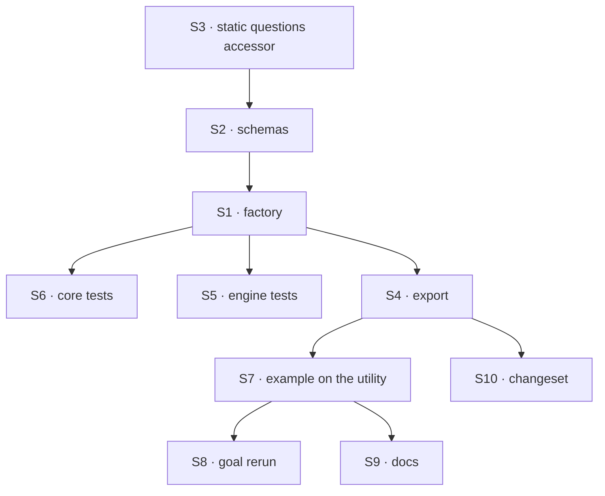

# FIX-1583 · Plan

[Spec](SPEC.md) · [Decisions](DECISIONS.md) · [Rules](BUSINESS-RULES.md) · **Plan** · [Docs](DOCS.md) · [Evolution](EVOLUTION.md)

Written for the implementing agent. IDs cross-reference [BUSINESS-RULES.md](BUSINESS-RULES.md)
(BR-n), [DECISIONS.md](DECISIONS.md) (D-n) and the epic's rules (ER-n). `tdd`. **One PR**. No
blockers: FIX-1554 (evaluator) and FIX-1557 (the recipe, #2234) are merged; FIX-1578 (#2241)
is not needed (registration goes through the flow's `resources`).

**The source to port is on `main`:** `examples/guides/index-time-facets/src/` (`facets.ts`,
`index-facets.ts`, `flow.ts`) and its `test/facets.test.ts`. The utility is that code
generalised over the app's questions, not a new design. Read it before writing anything.

## Surfaces

| ID | Where · role | Change | Rules |
|---|---|---|---|
| S1 | `packages/core/src/utility/faceted-collection.ts` · the factory | New. `facetedCollection(config)` → `{ collection, search, reindex, resources }`. Builds, in order: the stamped-change schema, the blocking clear-and-stamp handler and the store-if-current handler (both read `ctx.resources[name]`, undeclared: they exist before the collection), the reaction sequencer (`.step(clear)` then `.sideChainIf(non-empty body, classify → store)`), then the collection with `reactTo: { ...app bindings, contentUpdated: reaction }`, then `search` and `reindex`, which declare `resources: { [name]: collection }`. Build-time refusals BR-1 to BR-6 | BR-1 to BR-22 |
| S2 | the same file · schemas from questions | From the evaluator's static questions: the stored facets schema (choice → enum of option keys; score and boolean → their answer shape; `confidence` and `probabilities` optional) and the search input (one optional enum per choice question, plus `minConfidence` 0–1). The app's `stateSchema` is extended with `facets: …nullable().default(null)` and `indexedAs: z.string().nullable().default(null)` (BP-023) | BR-5 BR-8 BR-19 BR-20 |
| S3 | `packages/core/src/blocks/evaluator.ts` · internal accessor | A core-internal helper, beside `assertEvaluatorBlock`, returning an evaluator block's static questions or `undefined` when they are computed per call. Not exported from the package root | BR-1 BR-2 |
| S4 | `packages/core/src/utility/index.ts` | Export `facetedCollection` and its config and result types | — |
| S5 | `packages/engine/test/faceted-collection.test.ts` | Behaviour on real in-memory stores and `runAction`, ported from the example's `facets.test.ts` (V1 to V7, V9) plus V10 to V12. Mock evaluation model; no key. Where `cascadingRouter`'s runtime tests already live | all writing / searching / reindexing |
| S6 | `packages/core/test/faceted-collection.test.ts` + `.test-d.ts` | Build-time refusals (VB); typed search options and facets from the questions (VT) | BR-1 to BR-6 BR-19 |
| S7 | `examples/guides/index-time-facets/` | `src/flow.ts` builds its collection with the utility; `ticketsFlow(triage)` keeps its signature and its three actions. Delete `src/index-facets.ts`; `src/facets.ts` keeps the questions and whatever types the goal imports. Its `facets.test.ts` shrinks to a flow-level smoke (write then search) — the mechanism's tests moved to S5. `fence.test.ts` and `excerpts.test.ts` stay, pointed at the new source | D2 |
| S8 | `goals/index-time-facets/found-without-a-model-call/run.mts` | Behaviour unchanged. Only the type imports from the example follow S7 | ER-15 (e) |
| S9 | Docs | Publish [DOCS.md](DOCS.md): searching page, utility-blocks page, core README, example README | BR-4 D2 |
| S10 | `.changeset/*.md` | `@flow-state-dev/core` minor: new `utility.facetedCollection` | — |

**Removed:** `examples/guides/index-time-facets/src/index-facets.ts`, the example's copied search
and matcher, and the searching page's "copy it rather than rewriting it" walkthrough. Nothing
shipped in a package is removed.

## Sequence



Grow S5 alongside S1, one behaviour per red-green slice: V1 first, then V3, V5, V9.

## Checks

| ID | Runs after | Passes when |
|---|---|---|
| V1 | S1 | BR-8, BR-13, BR-20: a body write makes one mock call with the body as input; `facets` deep-equals the mock's answers, `confidence` present exactly where the mock set it, a boolean answer stored as given. No body, or an empty one: zero calls |
| V2 | S1 | BR-15, BR-16, BR-19: two rows with different answers; search returns only the match; the mock counter doesn't move and the search turn's trace has no evaluator or generator row; an unclassified row never matches; the tool form returns the same |
| V3 | S1 | BR-9, BR-10: classify, then rewrite with a throwing mock. The turn succeeds, `facets` is null, the old match is gone. **Control:** a reaction built without the clear step fails it |
| V4 | S1 | BR-17, BR-18: one choice stored with confidence 0.9, 0.3 and none. No minimum: three. 0.5: one |
| V5 | S1 | BR-11: hold the first classification open, land a second write, release. Stored facets are the second body's. **Control:** store without the token condition fails |
| V9 | S1 | BR-11, the interleaving V5 can't reach, ported as-is: park the first side chain's facet write at the store after it classified, land body B whose classification throws, release. `facets` is null. **Control:** a body check followed by `patchState` brings A's answers back |
| V6 | S1 | BR-12: one write, one call, still one after facets are stored |
| V7 | S1 | BR-16, BR-21, BR-22: reindex classifies only rows without facets, including a raw legacy row with no `facets` key; `force` reclassifies all |
| V10 | S1 | BR-3: an app `stateUpdated` binding still fires beside the utility's reaction |
| V11 | S1 | BR-14: collection registered under a different accessor → the first body write fails and the message names `resources`. **Control:** registered under `name`, it succeeds |
| V12 | S1 | BR-23: rows written by the recipe's reaction (seed the store with its exact stored shape) are found by the utility's search with no evaluator call |
| VB | S6 | BR-1 to BR-6: each misconfiguration throws when built, with its named reason; a valid config builds and calls nothing |
| VT | S6 | BR-19, BR-20: search options are the choice questions' option keys, typed; a boolean question has no option; facets are `EvaluatorAnswers<questions>` |
| V8 | S1 · S7 | BR-7, BR-24, BR-25: the utility's file imports core modules only; `defineResourceCollection`'s `reactTo` type and `validateReactTo` are unchanged (`git diff origin/main -- packages/core/src/types/resource-change.ts` empty); the example imports no lab or kitchen-sink. **Negative control:** a planted lab import fails the fence |
| VX | S7 | The example's tests pass; `excerpts.test.ts` finds every checked docs excerpt in the new source |
| VG | S8 | **Goal, real model, leg (e)** (ER-13): `pnpm tsx goals/index-time-facets/found-without-a-model-call/run.mts`, Jev via the gateway else OpenAI's evaluation model. Passes as on #2234, now through the utility. **Control:** `GOAL_CONTROL=classify-at-query` still fails |

One check per decision: D1 is V8 and V11, D2 is V12 and VX, D3 is VB. BP-035's second paths:
failure (V3), concurrency (V5, V9), legacy rows (V7, V12), wiring (V11).

## Pinned names

| Where | Name | Why pinned |
|---|---|---|
| Export | `utility.facetedCollection` | The docs and README teach it |
| Result | `collection`, `search`, `reindex`, `resources` | The docs use each |
| Config | `name`, `evaluator`; the collection's own fields pass through | The docs show them |
| Stored fields | `facets`, `indexedAs` | Identical to the recipe, so a recipe app moves without a reindex ([D2](DECISIONS.md#d2)) |
| Search | input `{ <choice question id>?, minConfidence? }` → `{ keys }` | The example's action and the goal call it |
| Reindex | input `{ force? }` → `{ reindexed }` | Same |

Block names, internal schema names and error wording are yours.

## Guardrails

| Rule | Because |
|---|---|
| Clear and stamp in one blocking write; read the body after it; classify on a side chain; store only through `updateState` conditioned on the token | [FIX-1557 D2](../FIX-1557/DECISIONS.md#d2). Each rule alone lets stale answers through, and V9 is the race a check-then-`patchState` loses |
| The token comes from `crypto.randomUUID()`, never `node:crypto` | Core is isomorphic; `graph/resource-edges.ts` does the same |
| No change to `reactTo`, its types or `validateReactTo` | [D1](DECISIONS.md#d1). Needing one means the factory's build order is wrong |
| Nothing names, resolves or builds a model; nothing retries | Epic D3, ER-9, ER-11 |
| No confidence floor at write; confidence read only at search | FIX-1557 D3, ER-3 |
| The search runs no block but its own handler | ER-6. The goal's control exists because a search that "just checks" with the evaluator passes every other test |
| Refusals happen when built, never at first write, except the accessor check | Tenet 5: a misconfiguration found at build is found by every app, not by the first customer to save |
| Docs snippets are cut from tested source | The example's `excerpts.test.ts` enforces it; keep it pointed at the new files |

## Docs

Reconcile and publish [DOCS.md](DOCS.md) after V1 to V5 pass, cutting each snippet from S7.

## Sketch · pseudocode, illustrative, react to the shape

```
facetedCollection({ name, evaluator, stateSchema, reactTo, client, ...rest }):
  refuse BR-1..BR-6
  questions ← static questions of evaluator
  facets    ← answers schema from questions
  clear     ← handler: ref = ctx.resources[name] or throw BR-14
                       token = randomUUID(); patch { facets: null, indexedAs: token }
                       body = readContent after the patch
  store     ← handler: ref.updateState(s → s.indexedAs == token ? {...s, facets} : s)
  reaction  ← sequencer(clear).sideChainIf(body non-empty, evaluator on body → store)
  collection ← defineResourceCollection({ ...rest, client,
                 stateSchema: stateSchema + { facets, indexedAs },
                 reactTo: { ...reactTo, contentUpdated: reaction } })
  search    ← handler(resources { [name]: collection }): list → keep matching → keys
  reindex   ← sequencer(select rows: force or facets == null) .forEach(reaction)
  return { collection, search, reindex, resources: { [name]: collection } }
```

**POC:** none. Every premise the design rests on is either shipped and tested on `main` (the
recipe's 20 tests, including both races) or confirmed from code ([Settled](DECISIONS.md#open--settled)).
No counted facts, so no checker applies.

## At implement time

- Re-check #2241 (FIX-1578). If merged, a search offered only as a tool also registers the
  collection; the docs can say so, and nothing else changes.
- Re-check whether client body edits now fire reactions. If they do, drop BR-4 and D3's refusal
  and say so on the PR.

## Follow-ups

- Search filtered at the source rather than list-then-filter, once collections take a query
  filter (BP-033). Flag only.
- Automatic reindex when the questions change. Flag only, the owner's follow-up from #2234.
- An optional facet filter on FIX-1482's work-query tool. Flag only, owned there.

## Notes from review

None yet.
