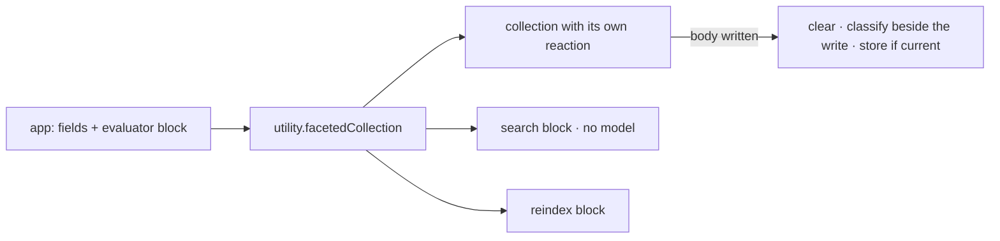

# FIX-1583 · Ready-to-use index-time facets utility

**Spec** · [Decisions](DECISIONS.md) · [Rules](BUSINESS-RULES.md) · [Plan](PLAN.md) · [Docs](DOCS.md) · [Evolution](EVOLUTION.md)

Feature · `core` (one utility) + the example and docs moved onto it · medium · 1 PR · epic
[FIX-1553](../../epics/FIX-1553/SPEC.md) · follows [FIX-1557](../FIX-1557/SPEC.md) (merged,
[#2234](https://github.com/fixpoint-labs/flow-state-dev/pull/2234)) and supersedes its
[D1](../FIX-1557/DECISIONS.md#d1)

## Six people, before and after

| Someone who… | Today | After |
|---|---|---|
| **wants facets on their own collection** | Copies about 140 lines of code from the example (answer schema, the reaction, search, reindex) and keeps all three of its rules intact by hand | Makes one call with their collection and their evaluator. The rules live in core and are tested once ([D1](DECISIONS.md#d1)) |
| **already copied the recipe** | Owns that code | Swaps their collection for the utility. The stored fields have the same names, so existing facets carry over and nothing reindexes ([D2](DECISIONS.md#d2)) |
| **offers facet search to an agent** | Writes a search handler and its typed options | Gets one from the utility, its options typed from the questions. It still makes no model call |
| **edits a document's body from the browser** | The recipe asks you not to; nothing stops you, and facets go stale | Is refused when the collection is defined, with the reason. Stale facets are no longer possible silently ([D3](DECISIONS.md#d3)) |
| **saves a document while the evaluation model is down** | The save succeeds and the document has no facets until reindex | Same, now guaranteed by the utility rather than by each copy |
| **picks a model** | Names it once, at the app edge | Same. The utility takes the evaluator block and never names, resolves or builds a model |

## What changes


Look at where the three rules sit: in every app's copy today, in one tested place after.

**What an app writes** (the example's flow, before and after):

```diff
- import { indexFacets } from "./index-facets";             // the copied reaction
- import { ticketStateSchema, facetQuerySchema, matchesFacets } from "./facets";
+ import { utility } from "@flow-state-dev/core";

- const tickets = defineResourceCollection({
-   pattern: "tickets/*",
-   scope: "user",
-   stateSchema: ticketStateSchema,                          // title + facets + indexedAs
-   reactTo: { contentUpdated: indexFacets(triage) },
- });
- const search = handler({ /* list, matchesFacets, keys */ });
- const reindex = sequencer({ /* pick unfaceted, run indexFacets on each */ });
+ const tickets = utility.facetedCollection({
+   name: "tickets",                                         // the accessor it registers under
+   pattern: "tickets/*",
+   scope: "user",
+   stateSchema: z.object({ title: z.string() }),            // your fields; facets are added
+   evaluator: triage,                                       // your block, your model
+ });

  defineFlow({
    kind: "index-time-facets",
+   resources: tickets.resources,
    actions: {
      write: { block: write },                               // unchanged: a body write indexes
-     search: { block: search },
-     reindex: { block: reindex },
+     search: { block: tickets.search },                     // { topic?, status?, minConfidence? } → { keys }
+     reindex: { block: tickets.reindex },                   // { force? } → { reindexed }
    },
  });
```

## How it fits together



The utility defines the collection itself, so the collection and its reaction are built in the
right order inside core, and the app never meets the definition-order cycle the recipe works
around.

## What stays as it is

- **The mechanism.** The three rules, the answer shape, the optional `minConfidence`, the
  explicit reindex and "missing means null" all carry over from
  [FIX-1557](../FIX-1557/DECISIONS.md) unchanged. See [EVOLUTION.md](EVOLUTION.md).
- **`reactTo` in core.** No lazy form. The cycle stays inside the utility
  ([D1](DECISIONS.md#d1)).
- **The evaluator block**, lexical search, and query-time classify as a named escape hatch only.
- **The goal for the epic's leg (e)**: same command, now proving the shipped utility.

## Sign off

1. **[D1](DECISIONS.md#d1) · Ships in core's `utility` namespace, beside `cascadingRouter`, as a
   factory that owns the collection. No lazy `reactTo`, no new package.** If wrong: collections
   the factory can't express (projected, a second body reaction) stay on hand-wiring until it
   grows.
2. **[D2](DECISIONS.md#d2) · The example and docs move onto the utility. The hand-wired reaction
   stops being taught as code to copy; stored field names stay the same.** If wrong: someone who
   needs a custom shape has the utility's source, not a docs walkthrough.
3. **[D3](DECISIONS.md#d3) · A faceted collection refuses client-side body edits when it is
   defined.** If wrong: an app with a browser editor can't adopt the utility until client edits
   fire reactions.

**Open: none.** Number 1 is the one to weigh. Reasoning and what lost:
[DECISIONS.md](DECISIONS.md). The cases: [BUSINESS-RULES.md](BUSINESS-RULES.md).
