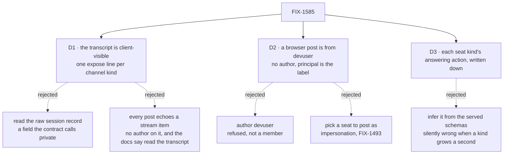

# FIX-1585 · Decisions

[Spec](SPEC.md) · **Decisions** · [Rules](BUSINESS-RULES.md) · [Plan](PLAN.md) · [Docs](DOCS.md) · [Evolution](EVOLUTION.md)

What was considered, what was chosen, why, and what each choice locks in. Three decisions are
the sign-off surface. Everything else here is context for them.

## The tree

Solid edges are what you're signing. Dashed edges lost, and the label says why.

## D1 · The channel's transcript becomes client-visible — one `expose` line on the framework's channel kind and one on the app's `digest` kind — and the channel panel renders it

| | |
|---|---|
| **Instead of** | (a) Reading `state.transcript` off the session record the page already loads, with no package change. (b) Making every `post` also emit a user message into the channel's stream |
| **Because** | A post leaves nothing a client can render in the stream ([poc P3](poc/talk-premises/README.md)), and a browser never receives `read`'s output. The framework's way to put state on the client is a `client` declaration; [FIX-1477](../FIX-1477/PLAN.md) made the boards readable the same way. (a) works only because the session read returns the whole stored record, while [`flows-and-actions.md`](../../../docs/architecture/flows-and-actions.md) says scope state is private by default. (b) shows every seat's post as an authorless "user" turn, and the [channel docs](../../../apps/docs/docs/workforce/channels.md) already say the transcript is what a person reads |
| **Locks in** | Anyone who can read a channel's session can read its transcript: each line's body, principal, author claim and time. In kitchen-sink that is the same one user who can already post to it. Members and the charter stay private ([poc P8](poc/talk-premises/README.md)). It is a published change to `@flow-state-dev/workforce` with a changeset. A channel kind written by hand shows in a UI only if it declares the same line, which the docs say |

The issue said *no package changes*, and the architect's fence allowed one only if a client
surface was proved missing. P3 and the absent output path are that proof.

**What would change my mind:** a decision that the transcript should stay server-only for every
client, not just browsers. Then (a) is the wrong fix too, the panel waits for a projection the
package chooses, and this issue shrinks to the seat half.

## D2 · A browser post is from `devuser`: sent with no `author`, and the line's server-set `principal` is its label

| | |
|---|---|
| **Instead of** | `author: "devuser"`, or a picker letting the page post as a seat |
| **Because** | `devuser` is not a member, so naming it as author is refused and nothing is written ([poc P4](poc/talk-premises/README.md)). The principal is the one identity the server sets, never the caller ([BP-031](../../../docs/contributing/best-practices.md)), and it is already `devuser` on every line ([P2](poc/talk-premises/README.md)). A picker would let anyone at the page post as a seat, and telling people apart is [FIX-1493](https://linear.app/fixpoint-labs/issue/FIX-1493)'s job, not a UI's |
| **Locks in** | Every person using a deployed copy reads as `devuser` until real sign-in ([FIX-1503](https://linear.app/fixpoint-labs/issue/FIX-1503)). A browser post names no author, so every member is notified (FIX-1476 BR-16a). That is "everyone except the poster", because the poster is not a member. A line with no author and no principal, which the `digest` kind stores, reads as unattributed rather than as a guess |

## D3 · A seat's composer calls the one action its kind is written down as answering with; a kind with none gets no composer

| | |
|---|---|
| **Instead of** | Building a form from whatever the flow list serves, or picking "the action with one string field" at run time |
| **Because** | The shell already writes its kinds down, because a browser cannot read `workforce/`, and a test holds the list to the tree. One more column there is the smallest honest mapping. The served schemas carry today's input fields ([poc P6](poc/talk-premises/README.md) logs them; it asserts only that each kind is listed), but a rule inferred from shape picks silently when a kind grows a second one-string action. A mapping written down fails a test instead |
| **Locks in** | `desk-clerk` → `answer { note }`, `agent` → `run { message }`, `followup-runner` → none. A new kind needs one line before its seats take messages, and the drift test fails until it has one or says "none". A seat on a kind with none (`support.wren`) stays read-only, with the reason on the page |

## Decided, not asked

- **The composer is on the open panel, not an assistant tool.** Assistant tools would be a
  second route to the same actions. The fences rule it out, and nothing here needs it.
- **A seat row gets "New conversation"**, like the assistant's row. A declared seat has no
  conversation at boot, so without it most seats could not be talked to at all. Channels get
  no such button: they are opened by the app's boot, and creating one is FIX-1415.
- **No optimistic question on a seat.** No seat kind echoes its input into the stream, so an
  optimistic bubble would vanish when the reply lands. `desk-clerk`'s reply quotes the note. An
  `agent` seat keeps only its replies. That is a gap in the package's agent kind, flagged below.
- **`digest` exposes its whole transcript.** Its `read` still returns the tail to callers. A
  person scrolls.

## Considered and dropped

| Alternative | Why not |
|---|---|
| Kitchen-sink reads `detail.state.transcript` (no package change) | The simpler approach, and it works today. It teaches a reference app to read the whole private record, and it breaks when the session read stops returning it. Flagged as its own finding |
| Call `read` on open and after each post | A browser cannot receive the output, and each call would store the whole transcript again as a request on a shared channel |
| Assistant tools that post or ask | A second path to the same two actions, and the issue wants the panel itself to talk |
| Live refresh of others' posts | A session subscription for requests this page did not start. Not asked for; the transcript is re-read on open and after each own post |

## Settled

- **What a post, an ask and D1's line actually do** — **CONFIRMED** on the real kitchen-sink
  wiring, P1–P8, with a negative control on each probe:
  [`poc/talk-premises/`](poc/talk-premises/README.md).

## How it got here

- **Draft** — framed as "the rail's two Workforce panels are read-only"; composers wired to each
  flow's own declared action; the POC showed a post leaves nothing to render, so the channel
  panel shows the transcript, made client-visible by one declaration on the channel kind.

**Open: none.**
