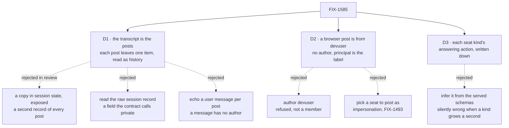

# FIX-1585 · Decisions

[Spec](SPEC.md) · **Decisions** · [Rules](BUSINESS-RULES.md) · [Plan](PLAN.md) · [Docs](DOCS.md) · [Evolution](EVOLUTION.md)

What was considered, what was chosen, why, and what each choice locks in. Three decisions are
the sign-off surface. Everything else here is context for them.

## The tree

Solid edges are what you're signing. Dashed edges lost, and the label says why.

## D1 · The transcript is the posts: each `post` leaves one durable `channel-post` item in its own request, and nothing is copied into session state

| | |
|---|---|
| **Instead of** | (A) Round 1's D1: keep appending each line to `state.transcript` and expose that array as client data. (a) Reading `state.transcript` off the raw session record, with no package change. (b) Declaring a `userMessage` on `post`, so each post echoes a user message |
| **Because** | A post is already a request that stores its body, author claim and caller. The line was a copy of that (figures below). Emitting the line as one item on the request that wrote it leaves one record per post, and the page reads it the way it reads any conversation: the session's items, filtered to `channel-post` ([poc P9](poc/talk-premises/README.md)). A refused post leaves nothing ([P10](poc/talk-premises/README.md)). (A) keeps a second record in state that every request on the channel loads. (a) reads a field the framework calls private. (b) has nowhere to put `author`: a message item carries no author |
| **Locks in** | A channel's lines live in its request log. The page gets all of them. **`read` gets only the lines inside the session's history window**: 50 requests by default, and on a channel with notify each post costs two (the post and its fan-out). In the POC, `read` returned 22 of 30 lines ([P12](poc/talk-premises/README.md)). A channel opened before this change keeps its old `state.transcript` lines, and `read` returns them first (BP-030, [P11](poc/talk-premises/README.md)). A channel kind that sets session retention now trims old posts with it; the built-in sets none. It is a published change to `@flow-state-dev/workforce`, with a `minor` changeset because `read`'s result narrows |

The issue said *no package changes*, and the architect's fence allowed one only if a client
surface was proved missing. A post leaving nothing renderable
([poc P3](poc/talk-premises/README.md)) is that proof.

**What would change my mind:** a model that needs a channel's whole history through `read`.
Then the window, not the storage, is what to change, and it is a follow-up on the channel kind.

### Why the posts, and not a copy

The request flow as it runs on `main`, before this change. A post and an ask are each one
request, on different sessions. Nothing carries a seat's reply into the channel.

Every field of a line on `main` is copied from its request or is a constant. The one new thing is
its id, and that id does not point back to the request.

The transcript is this log, filtered to completed `post` requests. A seat's reply would be one
more post carrying its author.

C is D1. It keeps one record per post and reads like the assistant's conversation. The price
is `read`'s window.

## D2 · A browser post is from `devuser`: sent with no `author`, and the line's server-set `principal` is its label

| | |
|---|---|
| **Instead of** | `author: "devuser"`, or a picker letting the page post as a seat |
| **Because** | `devuser` is not a member, so naming it as author is refused and nothing is written ([poc P4](poc/talk-premises/README.md)). The principal is the one identity the server sets, never the caller ([BP-031](../../../docs/contributing/best-practices.md)), and it is already `devuser` on every line ([P2](poc/talk-premises/README.md)). A picker would let anyone at the page post as a seat, and telling people apart is [FIX-1493](https://linear.app/fixpoint-labs/issue/FIX-1493)'s job, not a UI's |
| **Locks in** | Every person using a deployed copy reads as `devuser` until real sign-in ([FIX-1503](https://linear.app/fixpoint-labs/issue/FIX-1503)). A browser post names no author, so every member is notified (FIX-1476 BR-16a). That is "everyone except the poster", because the poster is not a member. A line with no author and no principal, which the `digest` kind stores, reads as unattributed rather than as a guess |

## D3 · A seat's composer calls the one action its kind is written down as answering with; a kind with none gets no composer

| | |
|---|---|
| **Instead of** | Building a form from whatever the flow list serves, or picking "the action with one string field" at run time |
| **Because** | The shell already writes its kinds down, because a browser cannot read `workforce/`, and a test holds the list to the tree. One more column there is the smallest honest mapping. The served schemas would support inference today: each kind has exactly one one-string action ([poc P6](poc/talk-premises/README.md) asserts it). But a rule inferred from shape picks silently when a kind grows a second one-string action. A mapping written down fails a test instead |
| **Locks in** | `desk-clerk` → `answer { note }`, `agent` → `run { message }`, `followup-runner` → none. A new kind needs one line before its seats take messages, and the drift test fails until it has one or says "none". A seat on a kind with none (`support.wren`) stays read-only, with the reason on the page |

## Decided, not asked

- **The composer is on the open panel, not an assistant tool.** Assistant tools would be a
  second route to the same actions. The fences rule it out, and nothing here needs it.
- **A seat row gets "New conversation"**, like the assistant's row. A declared seat has no
  conversation at boot, so without it most seats could not be talked to at all. Channels get
  no such button: they are opened by the app's boot, and creating one is FIX-1415.
- **An agent seat keeps the person's message.** A seat is a direct conversation, so both sides
  stay. One `userMessage` on the agent kind's `run` (epic ER-1), after FIX-1459 lands.
  `desk-clerk` echoes nothing, so its composer shows no optimistic bubble; its reply quotes the
  note until FIX-1589 replaces it.
- **`digest` does the same as the built-in kind.** Its `post` emits a `channel-post` item and
  its `read` returns the tail from those items. Five lines sit well inside the window. A person
  scrolls the page.
- **The window stays at the default.** Raising it on the channel kind loads more history on
  every post, to serve a model that has not asked for it. `read`'s description says it returns
  the recent lines.

## Considered and dropped

| Alternative | Why not |
|---|---|
| (A) A copy in `state.transcript`, exposed as client data (round 1) | A second record of every post, loaded on every request to the channel and never trimmed. Rejected by the owner in review once the figures showed the copy |
| The page lists the session's requests and reads each post's `input` | The input is the caller's raw payload, untyped on the client, and carries no server-set principal. The item is the line the server wrote |
| Kitchen-sink reads `detail.state.transcript` (no package change) | It teaches a reference app to read the whole private record, and it breaks when the session read stops returning it. Flagged as its own finding |
| Call `read` on open and after each post | A browser cannot receive the output, and each call is one more request against the window |
| Keep fan-out requests off the channel's window | The hand-off must run on the channel's own session to read its members. Moving it is a change to the dispatch shape, for a window no one has hit |
| Assistant tools that post or ask | A second path to the same two actions, and the issue wants the panel itself to talk |
| Live refresh of others' posts | A session subscription for requests this page did not start. Not asked for; the transcript is re-read on open and after each own post |

## Settled

- **What a post, an ask and round 1's expose line do** — **CONFIRMED** on the real kitchen-sink
  wiring, P1–P8, with a negative control on each probe.
- **What the item-backed transcript does** — P9–P11 **CONFIRMED**, each red on `main`; P12
  measured the window: 30 posts, 22 returned by `read`, all 30 on the page's read.
  [`poc/talk-premises/`](poc/talk-premises/README.md).

## How it got here

- **Draft** — framed as "the rail's two Workforce panels are read-only"; composers wired to each
  flow's own declared action; the POC showed a post leaves nothing to render, so the channel
  panel shows the transcript, made client-visible by one declaration on the channel kind.
- **Round 2** — the owner asked whether the transcript is just the post requests. Traced in
  code, it is. The owner chose to drop the copy: each post leaves its own item, and the
  measured cost is `read`'s window.

**Open: none.**
