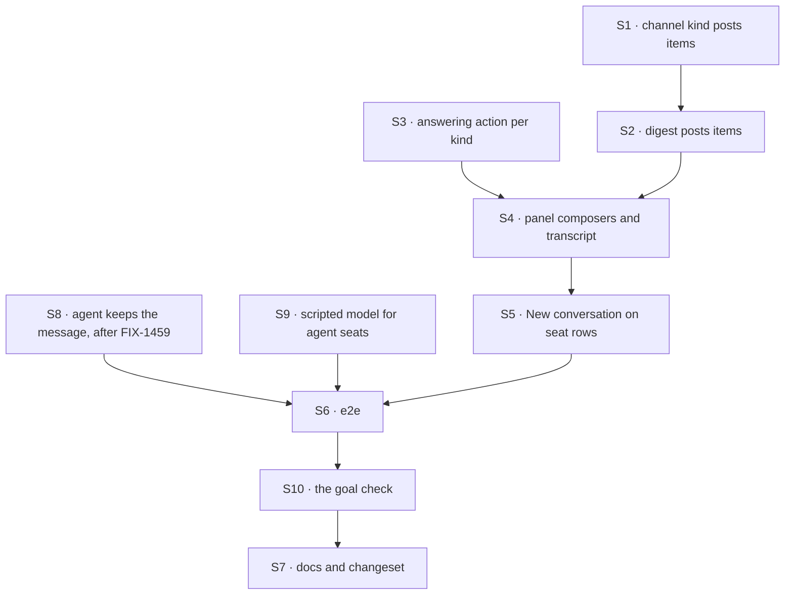

# FIX-1585 · Plan

[Spec](SPEC.md) · [Decisions](DECISIONS.md) · [Rules](BUSINESS-RULES.md) · **Plan** · [Docs](DOCS.md) · [Evolution](EVOLUTION.md)

Written for the implementing agent. IDs cross-reference [BUSINESS-RULES.md](BUSINESS-RULES.md)
(BR-n) and [DECISIONS.md](DECISIONS.md) (D-n). `tdd`. One PR.

## Surfaces

| ID | Package · role | Change | Rules |
|---|---|---|---|
| S1 | `workforce` · the built-in channel kind (`defineChannelFlow`) | `post` emits the line as one `channel-post` component item and stops writing `state.transcript` (D1). `read` rebuilds the transcript from the session's items, after any legacy state lines, each id once; its description says it returns the recent lines. `transcript` stays in the state schema, read-only. The post contract and the notify slot do not move | BR-10 BR-11 BR-22 BR-23 |
| S2 | kitchen-sink · the `digest` channel kind | The same change (D1): `post` emits a `channel-post` item, `read` returns the tail from items after any legacy lines | BR-7 BR-10 |
| S3 | kitchen-sink · the shell's names module (`lib/workforce-shell.ts`) | Each seat kind's answering action and its one input field, or an explicit "none" (D3). Stays import-free: it is a browser leaf (BP-019) | BR-12 BR-14 BR-15 BR-21 |
| S4 | kitchen-sink · the picked-session panel (`app/page.tsx`) | A channel: render the session's `channel-post` items (label per BR-8) in place of the item stream, plus a composer calling `post` with `{ body }` only (D2). A seat: keep the stream, add a composer calling S3's action with `{ [field]: text }`; no optimistic question. A kind with "none": no composer, the reason instead. **Remove** the "Read only… go to the assistant" note | BR-1 BR-2 BR-4 BR-5 BR-8 BR-9 BR-12–BR-15 BR-17 |
| S5 | kitchen-sink · the rail's seat rows | "New conversation" in the leaf toolbar slot, as the assistant row has: create a session on the seat's address, open it | BR-16 BR-17 |
| S6 | kitchen-sink · e2e | A new spec file for the talk scenarios. `workforce-shell.spec.ts` is untouched and its header claim ("nothing here writes to a channel") stays true | BR-1 BR-2 BR-12 BR-13 BR-15 BR-16 BR-20 |
| S8 | `workforce` · the built-in `agent` kind (`agent-worker-flow.ts`) | A `userMessage` on `run`, so the person's message is kept as their turn (epic ER-1). One line. **Waits for FIX-1459 to land** | BR-12 BR-13 |
| S9 | kitchen-sink · the test resolver (`test/mock-flowstate.ts`) | Map the agent kind's generators (`agent-answer`, `agent-answer-with-activate-tool`) to the scripted model, and add this issue's scenario to `lib/e2e-mock-script.ts`, keyed on its own marker (epic ER-7, D3) | BR-12 BR-13 |
| S10 | `goals/kitchen-sink-talk/keeps-both-sides-across-a-reload/` | The goal check: `goal.md` from [SPEC.md's goal](SPEC.md#the-goal-and-how-well-know-its-met) and `run.mts` driving a real browser against the production build, running V6's and V7's legs. Two controls: `GOAL_CONTROL=drop-user-message` (S8 off) and `GOAL_CONTROL=no-post-item` (S1 posts no item) | BR-1 BR-2 BR-12 BR-13 |
| S7 | Docs and release note | [DOCS.md](DOCS.md)'s operations; one `minor` changeset for `@flow-state-dev/workforce` (`read` now returns the recent lines, new posts no longer land in `state.transcript`, and an agent seat keeps the person's message). kitchen-sink is private: no changeset | — |

## Sequence



## Checks

| ID | Runs after | Passes when |
|---|---|---|
| V1 | S1 | Workforce tests (P9–P12 as tests): a post leaves one `channel-post` item with its line and leaves `state.transcript` as it was; a refused post leaves none; `read` returns seeded legacy lines first, then item lines, each once; past the window, `read` returns the recent lines in order. Red states: put `pushState` back; read from state only. A hand-written kind that emits no item still posts (BR-11) |
| V2 | S3 | The drift test in `test/workforce-shell.test.ts`: every seat kind has an entry; each named action exists on that kind and its input is exactly one required string field named as written; "none" only where the kind has no such action. Red states: drop `followup-runner`'s entry; misname `note` |
| V3 | S1 S2 | kitchen-sink flow test through the real config: a post with no author lands with principal `devuser` on `support.desk` and not on `support.ada-wren` (BR-3); the app's notify block is called once per `desk` member (BR-6); a `digest` post lands with no `principal`, no notify call, and `read` still returns the tail (BR-7) |
| V4 | S2 | A `digest` post leaves one `channel-post` item and `read` returns the last five from items (BR-7, BR-10) |
| V5 | S4 S5 | Component tests on the panel: label order (BR-8); whitespace disables send (BR-4); a refused post shows its reason and keeps the text (BR-5, BR-17); an `agent` seat sends `{ message }` to `run` (BR-12); a `desk-clerk` seat sends `{ note }` to `answer` (BR-14); a transcript re-read after an own post picks up a line written meanwhile (BR-9); a failed "New conversation" shows the error in the seat's row, opens nothing, and leaves the button usable (BR-17) |
| V6 | S6 S10 | **Goal check's desk leg, real page, production build:** open `support.desk` from the rail, send a unique line, see it labelled `devuser` in that panel; reload, still there. Asserts on its own unique text, because other tests share the channel. Must FAIL under `GOAL_CONTROL=no-post-item` |
| V7 | S6 S8 S9 S10 | **Goal check's otto leg, keyless:** create (via S5) a `support.otto` conversation, send a unique message, see it as the person's turn and the scripted reply under it; reload, both still there. Open `support.wren`: no composer, the reason shown. Must FAIL under `GOAL_CONTROL=drop-user-message`: the message is gone after the reload |
| V8 | all | The existing workforce-shell VGs and the rest of the kitchen-sink e2e suite, unchanged and green (BR-19, BR-20) |

Second paths (BP-035): the refused post and the failed new conversation (V5), the reload
(V6, V7), the kind with no action (V7), the hand-written kind that emits no item and the legacy state lines (V1).

## Pinned names

| Where | Name | Why pinned |
|---|---|---|
| Item | component `channel-post`, `data` = the transcript line | Public: a client filters on it, and the docs name it |
| The post input | `{ body }`, no `author` | D2. Sending `author: "devuser"` is refused (P4) |

Everything else is yours to name, including the shape of S3's entries.

## Guardrails

| Rule | Because |
|---|---|
| Every composer calls an action the flow already declares, on the picked session's own address. No route, block or action is added for the page | The fences' invent-kill, and tenet 2: a second messaging path is exactly what makes the reference teach the wrong thing |
| The page reads items, never state. Nothing about a channel is added to client data | Members and the charter are read on a refusal path and carry no reason to reach a browser. One record per post: the item is it |
| The page never sends `author` and never reads identity off anything it sends | BP-031. The only identity on a line is the one the server set |
| In `agent-worker-flow.ts`, only S8's one line, and only after FIX-1459 lands. In `packages/workforce/README.md`, only the Channels sections | FIX-1459 is editing both on another branch ([At implement time](#at-implement-time)); epic ER-11 |
| No Workforce vocabulary (seat, roster, channel) enters `core`, `engine`, `client` or `react` | The layer rule. Every change here is `workforce` or the app |

## Docs

Reconcile and publish [DOCS.md](DOCS.md) after the goal check passes and both controls fail. Its three operations own the
prose; this plan only sequences them.

## Sketch · pseudocode, illustrative, react to the shape

```
picked panel:
  if picked kind is a channel kind:
      lines ← the picked session's items where component = "channel-post"
      render lines, label = author ?? principal ?? "unattributed"
      composer → picked session: send "post" with { body }
  else (a seat kind):
      ask ← the shell's answering action for picked kind
      render the session's items as today
      if ask is none: say why; no composer
      else composer → picked session: send ask.action with { [ask.field]: text }
```

**POC:** [`poc/talk-premises/`](poc/talk-premises/README.md), on the real kitchen-sink wiring. It
showed a post leaves nothing renderable in the stream (P3), which is what moved the design to
D1; that `author: "devuser"` is refused (P4, D2); that the served schemas would support
inference today, one one-string action per kind, which D3 declines on purpose (P6);
and that round 1's expose line was sufficient (P7–P8, since replaced). P9–P11 prove D1's item-backed
transcript, each red on `main`, and P12 measured `read`'s window: 22 of 30 lines with notify on.
Every other premise held.

## At implement time

- **FIX-1459** (`fix/fix-1459-pr-a`) edits `packages/workforce/README.md` and
  `agent-worker-flow.ts`. This issue's README edit is in the Channels sections, which its hunks
  do not touch. Rebase onto whichever lands first; expect no conflict.
- **FIX-1415** (channel admin) is in development. Whatever it lands, add no create button here.
- Nothing here reads the raw session state, so FIX-1588 closing that leak changes nothing.
- Inside a block, `ctx.session.items.all()` wraps each item under `payload`, so `read` checks
  `payload.component`. Over HTTP the same item has `component` and `data` at the top level.
- Re-run `poc/talk-premises/probe.mts` and `items-probe.mts` against current `main` before starting. A P-row that
  flips is a spec finding, not an implementation choice.

## Notes from review

- "V1, V3, V4, V5, V6, and V7 all exercise “post/ask landed, labels, reload, client shape” from different layers. That is thorough but heavy. **Consider before implement:** one workforce test for `clientData.session` shape (V1+V4), keep V3 for notify + cross-channel + digest `read` tail, V2 for drift, V6–V7 as browser acceptance, V8 regression—trim V5 to panel-only cases e2e cannot cover (whitespace BR-4, refused post BR-5/BR-17) unless you want redundant safety nets." — cursor ([thread](https://github.com/fixpoint-labs/flow-state-dev/pull/2258#discussion_r4107110162))

These are inputs, not instructions. Adopt, adapt, or discard; you owe no justification for
discarding one.

## Follow-ups

- **The session read returns the whole stored session state**, which the architecture says is
  private by default (`handleGetSession` spreads the record). Not in scope, and D1 does not
  depend on it. Filed as [FIX-1588](https://linear.app/fixpoint-labs/issue/FIX-1588).
- **Assistant tools that post or ask.** Convenience over the same two actions; out of scope.
