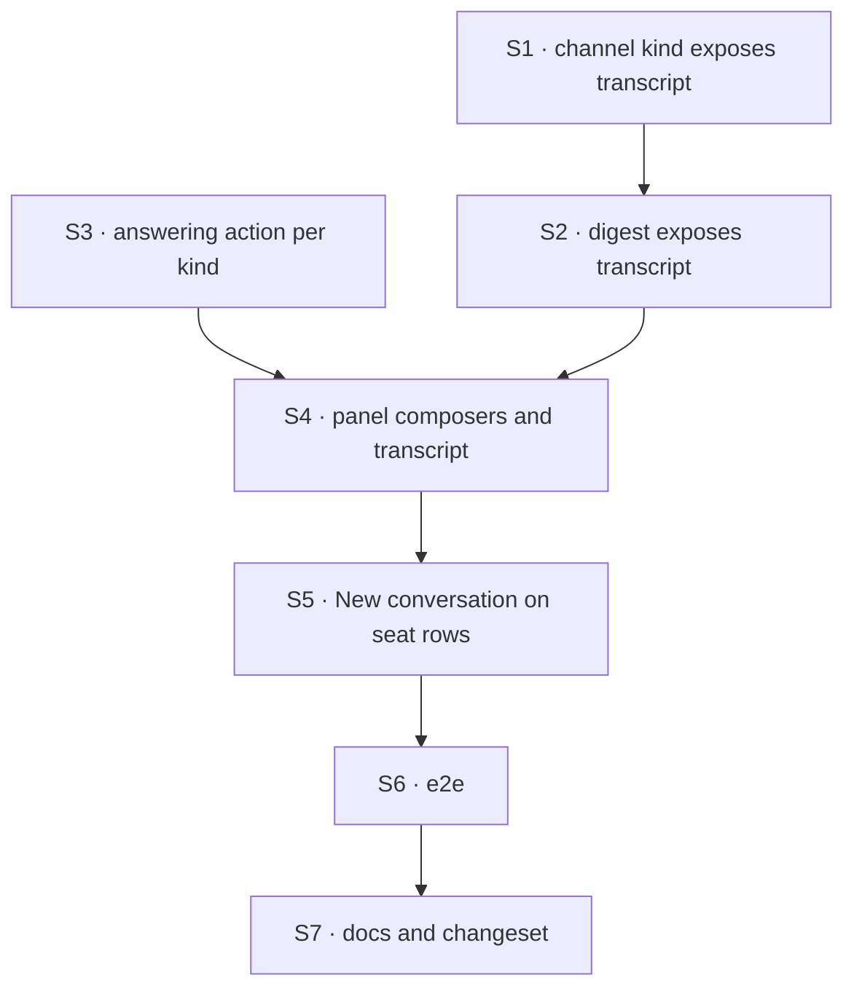

# FIX-1585 · Plan

[Spec](SPEC.md) · [Decisions](DECISIONS.md) · [Rules](BUSINESS-RULES.md) · **Plan** · [Docs](DOCS.md) · [Evolution](EVOLUTION.md)

Written for the implementing agent. IDs cross-reference [BUSINESS-RULES.md](BUSINESS-RULES.md)
(BR-n) and [DECISIONS.md](DECISIONS.md) (D-n). `tdd`. One PR.

## Surfaces

| ID | Package · role | Change | Rules |
|---|---|---|---|
| S1 | `workforce` · the built-in channel kind (`defineChannelFlow`) | Session `client: { expose: ["transcript"] }` (D1). Nothing else on the kind moves: not the post contract, not the notify slot, not `read` | BR-10 BR-11 |
| S2 | kitchen-sink · the `digest` channel kind | The same `expose` on its session config (D1). Its `read` keeps returning the tail | BR-7 BR-10 |
| S3 | kitchen-sink · the shell's names module (`lib/workforce-shell.ts`) | Each seat kind's answering action and its one input field, or an explicit "none" (D3). Stays import-free: it is a browser leaf (BP-019) | BR-12 BR-14 BR-15 BR-21 |
| S4 | kitchen-sink · the picked-session panel (`app/page.tsx`) | A channel: render `clientData.session.transcript` (label per BR-8) in place of the item stream, plus a composer calling `post` with `{ body }` only (D2). A seat: keep the stream, add a composer calling S3's action with `{ [field]: text }`; no optimistic question. A kind with "none": no composer, the reason instead. **Remove** the "Read only… go to the assistant" note | BR-1 BR-2 BR-4 BR-5 BR-8 BR-9 BR-12–BR-15 BR-17 |
| S5 | kitchen-sink · the rail's seat rows | "New conversation" in the leaf toolbar slot, as the assistant row has: create a session on the seat's address, open it | BR-16 BR-17 |
| S6 | kitchen-sink · e2e | A new spec file for the talk scenarios. `workforce-shell.spec.ts` is untouched and its header claim ("nothing here writes to a channel") stays true | BR-1 BR-2 BR-12 BR-13 BR-15 BR-16 BR-20 |
| S7 | Docs and release note | [DOCS.md](DOCS.md)'s operations; one `patch` changeset for `@flow-state-dev/workforce` (additive: a client now receives new data, and no existing code can trip over it). kitchen-sink is private: no changeset | — |

## Sequence



## Checks

| ID | Runs after | Passes when |
|---|---|---|
| V1 | S1 | Workforce test: after a post, the session snapshot's `clientData.session` is exactly `{ transcript }` with the line (P7–P8 as a test). Red state: drop the `expose`. A hand-written kind with no `expose` still posts (BR-11) |
| V2 | S3 | The drift test in `test/workforce-shell.test.ts`: every seat kind has an entry; each named action exists on that kind and its input is exactly one required string field named as written; "none" only where the kind has no such action. Red states: drop `followup-runner`'s entry; misname `note` |
| V3 | S1 S2 | kitchen-sink flow test through the real config: a post with no author lands with principal `devuser` on `support.desk` and not on `support.ada-wren` (BR-3); the app's notify block is called once per `desk` member (BR-6); a `digest` post lands with no `principal`, no notify call, and `read` still returns the tail (BR-7) |
| V4 | S2 | `digest`'s client data is exactly `{ transcript }` (BR-10) |
| V5 | S4 S5 | Component tests on the panel: label order (BR-8); whitespace disables send (BR-4); a refused post shows its reason and keeps the text (BR-5, BR-17); an `agent` seat sends `{ message }` to `run` (BR-14); a transcript re-read after an own post picks up a line written meanwhile (BR-9); a failed "New conversation" shows the error in the seat's row, opens nothing, and leaves the button usable (BR-17) |
| V6 | S6 | **Goal check, real page, production build:** open `support.desk` from the rail, send a unique line, see it labelled `devuser` in that panel; reload, still there. Asserts on its own unique text, because other tests share the channel |
| V7 | S6 | **Goal check:** seed or create (via S5) a `support.ada` conversation, ask a unique note, see `[front desk] <note>`; reload, still there. Open `support.wren`: no composer, the reason shown |
| V8 | all | The existing workforce-shell VGs and the rest of the kitchen-sink e2e suite, unchanged and green (BR-19, BR-20) |

Second paths (BP-035): the refused post and the failed new conversation (V5), the reload
(V6, V7), the kind with no action (V7), the hand-written kind with no `expose` (V1).

## Pinned names

| Where | Name | Why pinned |
|---|---|---|
| Client data key | `clientData.session.transcript` | Public: a client types it, and the docs name it |
| The post input | `{ body }`, no `author` | D2. Sending `author: "devuser"` is refused (P4) |

Everything else is yours to name, including the shape of S3's entries.

## Guardrails

| Rule | Because |
|---|---|
| Every composer calls an action the flow already declares, on the picked session's own address. No route, block or action is added for the page | The fences' invent-kill, and tenet 2: a second messaging path is exactly what makes the reference teach the wrong thing |
| Expose `transcript` only, never the whole state | Members and the charter are read on a refusal path and carry no reason to reach a browser. FIX-1477's rule for the boards: declare a projection, never bare |
| The page never sends `author` and never reads identity off anything it sends | BP-031. The only identity on a line is the one the server set |
| Nothing in `packages/workforce/src/agent-worker-flow.ts` or `packages/workforce/README.md` outside the Channels sections | FIX-1459 is editing both on another branch ([At implement time](#at-implement-time)) |
| No Workforce vocabulary (seat, roster, channel) enters `core`, `engine`, `client` or `react` | The layer rule. Every change here is `workforce` or the app |

## Docs

Reconcile and publish [DOCS.md](DOCS.md) after V6 and V7 pass. Its three operations own the
prose; this plan only sequences them.

## Sketch · pseudocode, illustrative, react to the shape

```
picked panel:
  if picked kind is a channel kind:
      lines ← client data of the picked session, "transcript"
      render lines, label = author ?? principal ?? "unattributed"
      composer → picked session: send "post" with { body }
  else (a seat kind):
      ask ← the shell's answering action for picked kind
      render the session's items as today
      if ask is none: say why; no composer
      else composer → picked session: send ask.action with { [ask.field]: text }
```

**POC:** [`poc/talk-premises/`](poc/talk-premises/README.md), on the real kitchen-sink wiring. It
showed a post leaves nothing renderable in the stream (P3), which is what moved the design to
D1; that `author: "devuser"` is refused (P4, D2); that the served schemas would support
inference today, one one-string action per kind, which D3 declines on purpose (P6);
and that D1's one line is sufficient and exposes nothing else (P7–P8, red on `main`). Every other premise held.

## At implement time

- **FIX-1459** (`fix/fix-1459-pr-a`) edits `packages/workforce/README.md` and
  `agent-worker-flow.ts`. This issue's README edit is in the Channels sections, which its hunks
  do not touch. Rebase onto whichever lands first; expect no conflict.
- **FIX-1415** (channel admin) is in development. Whatever it lands, add no create button here.
- Re-check that the session read still returns the raw state. If it no longer does, nothing
  here changes, because the page reads client data (D1).
- Re-run `poc/talk-premises/probe.mts` against current `main` before starting. A P-row that
  flips is a spec finding, not an implementation choice.

## Notes from review

- "V1, V3, V4, V5, V6, and V7 all exercise “post/ask landed, labels, reload, client shape” from different layers. That is thorough but heavy. **Consider before implement:** one workforce test for `clientData.session` shape (V1+V4), keep V3 for notify + cross-channel + digest `read` tail, V2 for drift, V6–V7 as browser acceptance, V8 regression—trim V5 to panel-only cases e2e cannot cover (whitespace BR-4, refused post BR-5/BR-17) unless you want redundant safety nets." — cursor ([thread](https://github.com/fixpoint-labs/flow-state-dev/pull/2258#discussion_r4107110162))

These are inputs, not instructions. Adopt, adapt, or discard; you owe no justification for
discarding one.

## Follow-ups

- **The session read returns the whole stored session state**, which the architecture says is
  private by default (`handleGetSession` spreads the record). Not in scope, and D1 does not
  depend on it. Filed as [FIX-1588](https://linear.app/fixpoint-labs/issue/FIX-1588).
- **The built-in `agent` kind echoes no question**, so an `agent` seat's conversation keeps
  replies only (BR-14). A `userMessage` on its `run` is the likely fix, in the file FIX-1459 is
  editing. Flagged, not filed here.
- **Assistant tools that post or ask.** Convenience over the same two actions; out of scope.
