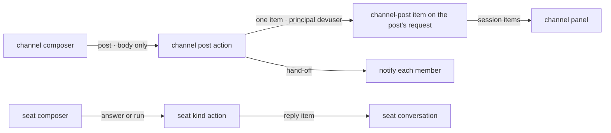

# FIX-1585 · Kitchen-sink: talk to channels and seats from the page

**Spec** · [Decisions](DECISIONS.md) · [Rules](BUSINESS-RULES.md) · [Plan](PLAN.md) · [Docs](DOCS.md) · [Evolution](EVOLUTION.md)

Feature · kitchen-sink + the channel kind's `post` and `read` in `workforce` · medium · 1 PR · no epic (follow-on to
[FIX-1500](https://linear.app/fixpoint-labs/issue/FIX-1500))

## Six people, before and after

| Someone who… | Today | After |
|---|---|---|
| **opens `support.desk` in the rail** | Reads "This channel session has no turns yet", even after seats have posted there. The transcript is nowhere on the page, and a note says messages go to the assistant | Reads the channel's transcript, each line labelled with who wrote it, and a composer under it |
| **posts to a channel from the page** | Can't. Drops to `fsdev run` or a raw `POST …/channel/actions/post` | Types and sends. The line appears in that channel's transcript as `devuser`, is still there after a reload, and every member is notified. None of them is the poster. On `support.noticeboard` (the app's own `digest` kind) the line reads as unattributed and wakes no one, because that kind stores no principal and has no notify step |
| **asks a seat, say `support.ada`** | Can't. Drops to `fsdev run support.ada answer` | Types a note. The seat's reply appears in that seat's own conversation and survives a reload. A seat with no conversation yet gets one from its row |
| **opens a seat whose kind takes no messages** (`support.wren`, which runs board rows) | The same read-only note as every other seat | Still read-only, and the note says why: this seat runs rows from a board and has nothing to answer with |
| **builds a channel UI on the framework** | Channel state is private, and the one action that returns the transcript hands its result to nobody a browser can reach | Reads the channel's `channel-post` items from its session, the way it reads any conversation. Members and the charter stay private |
| **runs the workforce-shell checks** | Green | Green, unchanged. The new scenarios live in a file of their own, because they write to a shared channel |

The reference app shows a team you can't talk to. Everything else on the page accepts input;
the two things Workforce is *about* are the only read-only ones. That is the hole this closes,
and closing it turned up a second one: a channel's panel has never shown the channel.

## What changes


Read the blue composer lines on the right: each names an action the flow already declares.
Nothing on the right is a new messaging path. The only new thing on the framework side is that
each post leaves its line as an item a client can read, instead of a copy in state
([D1](DECISIONS.md#d1)).

**The framework side, all of it:**

```diff
  // @flow-state-dev/workforce · the built-in channel kind
  // post: the line is emitted on the post's own request, not copied into state
- await ctx.session.pushState("transcript", line);
+ ctx.emit.component("channel-post", line);
  // read: rebuilt from those items, after any lines an older channel kept in state
- transcript: channel.transcript
+ transcript: [...channel.transcript, ...postedLines(ctx.session.items)]
```

**The page side, as the composer calls it:**

```diff
- <p>Read only. Messages from this page go to the assistant, so pick one of its conversations to reply.</p>
+ // a channel: the channel's own action, no author (devuser is not a member)
+ await picked.sendAction("post", { body })
+ // a seat: the action its kind is written down as answering with
+ //   desk-clerk → answer { note }    agent → run { message }    followup-runner → none
+ await picked.sendAction(ask.action, { [ask.field]: text })
```

## How a post travels



Both composers call actions that already exist and already answer the CLI. The only new edge is
the post's own item reaching the page, which is how the assistant's conversation reaches it
too.

## How we prove it


Only the two blue checks close the goal: a person at the real page, and the same result after a
reload. Everything under them explains a failure, and none of it counts as acceptance on its own.

## What stays as it is

- The assistant, its composer and its sessions. No assistant tool posts to a channel or asks a
  seat; that would be a second path to the same actions.
- The post contract: `{ body, author? }`, `author` unverified and checked against members. The
  notify rule: a post naming no author reaches every member (FIX-1476 BR-16a).
- Channel creation, deletion and invites ([FIX-1415](https://linear.app/fixpoint-labs/issue/FIX-1415)).
  Verified per-member identity ([FIX-1493](https://linear.app/fixpoint-labs/issue/FIX-1493)).
- Live updates of other people's posts. A line a seat posts shows the next time the panel reads.

## Sign off

1. **[D1](DECISIONS.md#d1) · The transcript is the posts: each post leaves one item on its own
   request, and nothing is copied into state.** Chosen by you in review. If wrong: `read` returns
   only the recent lines (22 of 30 in the POC, with notify on), and a model that needs the
   whole history has to wait for a window change.
2. **[D2](DECISIONS.md#d2) · A browser post is from `devuser`: no author, and the line's
   server-set principal is the label.** If wrong: every person using the page reads as
   `devuser` until real sign-in exists, and every member is woken by a browser post.
3. **[D3](DECISIONS.md#d3) · A seat's composer calls the one action its kind is written down as
   answering with. A kind with none gets no composer.** If wrong: a new talkable kind needs one
   line added before its seats accept messages, and a test fails until it is.

**Open: none.** Number 1 is the one to weigh: it changes what `read` returns on a published package.
Reasoning and what lost: [DECISIONS.md](DECISIONS.md). The cases: [BUSINESS-RULES.md](BUSINESS-RULES.md).
