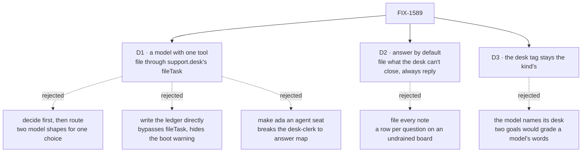

# FIX-1589 · Decisions

[Spec](SPEC.md) · **Decisions** · [Rules](BUSINESS-RULES.md) · [Plan](PLAN.md) · [Docs](DOCS.md) · [Evolution](EVOLUTION.md)

What was considered, what was chosen, why, and what each choice locks in. Three decisions are
the sign-off surface. Everything else here is context for them.

## The tree

Solid edges are what you're signing. Dashed edges lost, and the label says why.

## D1 · The clerk's `answer` is one model call with one tool; the tool files through `support.desk`'s own `fileTask`, authored as the seat

| | |
|---|---|
| **Instead of** | (a) A model that returns `{ answer or file, board, reply }`, then a conditional step that files. (b) Giving the clerk the board's task tools, which write the ledger directly. (c) Moving `support.ada` onto the agent kind |
| **Because** | Answer-or-file is a judgement, and a tool is how a model already makes one: the reply and the filing come from one call, and the script can drive either path ([poc Q1, Q2](poc/clerk-premises/README.md)). The channel already has the door, and the channels guide already shows the dispatcher that reaches it; a dispatcher is a block, so it is a tool as it stands. (a) is two shapes for one choice. (b) writes around `fileTask` and, because the kind would declare the board, silences the boot warning FIX-1591 owns ([poc Q4](poc/clerk-premises/README.md)). (c) breaks FIX-1585 D3's `desk-clerk` → `answer { note }` and the Architect's fence |
| **Locks in** | Filing is fire-and-forget: the tool returns the dispatch, not the row, so the reply can say "filed" before the row exists, and a refused filing leaves only a failed request on the channel. The clerk names `support.desk` in code, the way `followup-runner` names its board, so a clerk seat that isn't a member of `support.desk` is refused (`author-not-a-member`) and files nothing |

**What would change my mind:** a clerk that must know the row landed before it replies. Then
filing needs a call that waits for its answer, which the framework does not offer today, and
that is a Kill line question ([epic ER-15](../../epics/FIX-1592/BUSINESS-RULES.md#how-the-set-is-run)), not a local fix.

## D2 · Answer by default; file only what the desk can't close from a note, and always reply

| | |
|---|---|
| **Instead of** | File every note · never file · file without a reply |
| **Because** | The issue's own open wall: "prefer the smallest thing that stops the parrot". A clerk that files everything puts a row on `escalations` per question, and nobody drains it until FIX-1591. A clerk that files silently looks like the parrot's opposite: nothing came back. So the prompt says: answer when you can; when the note needs a person, file it on `escalations`; when it needs work a seat can run later, file it on `followups`; either way, say where it went |
| **Locks in** | Rows the clerk files on `escalations` wait, visibly, and the boot warning keeps saying so. A `followups` row is filed for the `followup-runner` worker, so `support.wren`'s existing drain can run it when someone calls it. How often it files is prompt tone: one file to change, and no check asserts on it |

## D3 · The reply keeps its desk tag, set by the kind from the seat's own file; the words after it are the model's

| | |
|---|---|
| **Instead of** | Dropping the tag and letting the model say which desk it is |
| **Because** | Two goals prove a seat's settings come from its own file by reading the desk in the reply: `code-comes-from-files-alone` (ada says `front`, grace `back`) and `durable-hire-survives-redeploy` (a hired seat's reply carries a token set as its desk). A tag the kind writes keeps that a fact, not something a model may phrase. Both goals ran with no model, because the answer was a handler |
| **Locks in** | The reply now needs a model, so those two goals run on kitchen-sink's scripted model (`KITCHEN_SINK_TEST_MODE=1`) and log a new verdict. Their gradings don't change. The reply shows when the model finishes, not word by word |

## Decided, not asked

- **The person's note is kept** as their turn in the seat's conversation, one `userMessage` on
  `answer`. A seat is a conversation (epic ER-1 says so for the agent kind; the clerk is a seat too).
- **The generator is named `desk-clerk-answer`** and gets its own entry in kitchen-sink's test
  resolver, with its scenarios in `lib/e2e-mock-script.ts` (epic ER-7).
- **The model is an intent, `intent/chat`**, the agent kind's default. The app's resolver picks
  the model.
- **The prompt is the seat's team and own instructions, then the desk's rule** (D2). `WORKER.md`
  bodies for ada and grace stay as they are.
- **The author on a filed row is the seat's id, set by the kind.** The model chooses only the
  board and the goal.
- **The clerk kind declares no board.** Declaring one would silence the boot warning (epic ER-13).
- **`desk-note` stays** as `support.otto`'s tool. Its header stops saying the clerk runs it.

## Considered and dropped

| Alternative | Why not |
|---|---|
| A real-model check of answer-or-file judgement (epic D3 allows one, not a wrap condition) | It grades the prompt's tone, which D2 leaves adjustable. Worth adding if the tone becomes a promise |
| A deterministic rule that picks the board from keywords | The parrot problem again: a rule that looks like it thinks. The issue asks for a model |
| Waking the clerk from a channel post | FIX-1590's, and the epic keeps clerks off the wake (epic D1) |
| Replying in `support.desk` when filing | Posting is FIX-1594's, for agent seats only |

## Settled

- **The shape works on kitchen-sink's real wiring, keyless** — **CONFIRMED**. A scripted tool
  call from ada's `answer` put a row on `support.desk.escalations` through `fileTask`, authored
  `support.ada`; the reply carried its marker under `[front desk]`, not the note; the note was
  kept; the boot warning still fired. Today's `main` failed every leg but the warning.
  [`poc/clerk-premises/`](poc/clerk-premises/README.md), [`evidence.txt`](poc/clerk-premises/evidence.txt).

## How it got here

- **Draft** — framed as "the clerk parrots the moment FIX-1585 makes it reachable"; one model
  call with a filing tool into the channel's own `fileTask`; the POC confirmed it keyless, and
  found two existing goals that grade the echo's desk tag, which D3 keeps.

**Open: none.**
