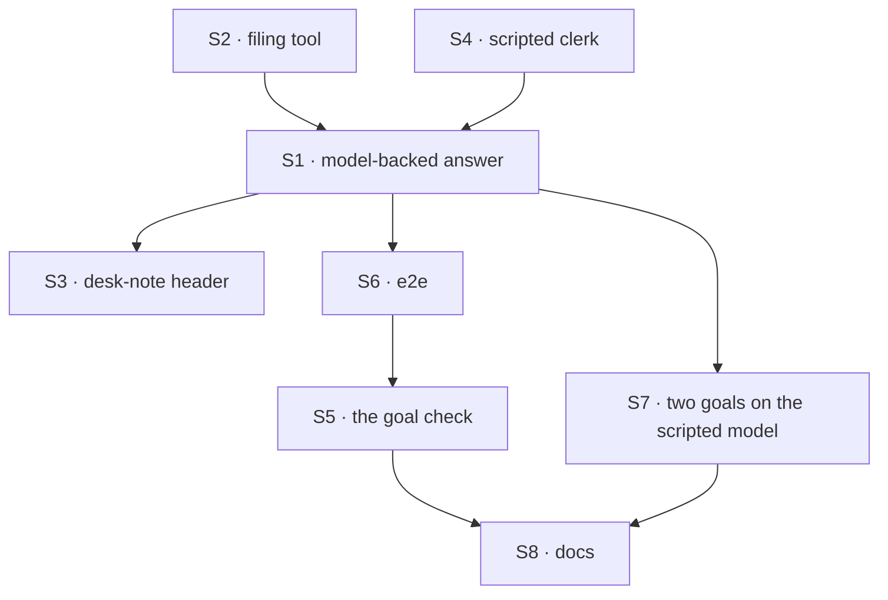

# FIX-1589 · Plan

[Spec](SPEC.md) · [Decisions](DECISIONS.md) · [Rules](BUSINESS-RULES.md) · **Plan** · [Docs](DOCS.md) · [Evolution](EVOLUTION.md)

Written for the implementing agent. IDs cross-reference [BUSINESS-RULES.md](BUSINESS-RULES.md)
(BR-n) and [DECISIONS.md](DECISIONS.md) (D-n). `tdd`. One PR. **Starts when FIX-1585's
implementation merges** (epic ER-14): it needs the seat composer and its test resolver entries.
Does not touch `agent-worker-flow.ts`.

## Surfaces

| ID | Package · role | Change | Rules |
|---|---|---|---|
| S1 | kitchen-sink · the clerk kind (`workforce/flows/workers/desk-clerk.ts`) | `answer` becomes: a generator `desk-clerk-answer` (prompt: team instructions, seat instructions, D2's desk rule; user turn: the note; model `intent/chat`; one tool, S2) then the existing tap that emits `[<desk> desk] <text>`. `userMessage` on `answer`. **Remove** the `deskNote` step and its import of the block. Header rewritten | BR-1–BR-6 BR-14 |
| S2 | kitchen-sink · the filing tool, beside S1 | A dispatcher: `flowKind` the channel kind, `action: "fileTask"`, `session: { id: "support.desk" }`. Input `{ board: "escalations" \| "followups", goal }`. Payload adds `author` = the seat's id, and `assignee: "followup-runner"` for `followups` only (D2). No board declared on the kind | BR-7–BR-10 BR-12 BR-13 BR-15 |
| S3 | kitchen-sink · `workforce/blocks/desk-note.ts` | Header only: the clerk no longer runs it; it is `support.otto`'s tool. Its input schema stays exported for S1 | BR-17 |
| S4 | kitchen-sink · the test resolver and script (`test/mock-flowstate.ts`, `lib/e2e-mock-script.ts`) | Map `desk-clerk-answer`. Scenarios `[scenario:clerk-answer]` (text with `[clerk:answered]`) and `[scenario:clerk-file]` (a tool-call step with no text, then text with `[clerk:filed]`), goal text carrying the note's token. Unmatched: a fixed test-mode line. Built on FIX-1585's S9 in the same files | BR-1 BR-7 |
| S5 | `goals/kitchen-sink-talk/answers-a-clerk-note-or-files-it/` | `goal.md` from [SPEC.md's goal](SPEC.md#the-goal-and-how-well-know-its-met); `run.mts` drives a real browser against the production build under `KITCHEN_SINK_TEST_MODE=1`, both legs. `GOAL_CONTROL=echo` makes `answer` run today's echo; honoured only in test mode | BR-1 BR-2 BR-7 BR-11 |
| S6 | kitchen-sink · e2e | The two legs as Playwright scenarios, in FIX-1585's talk spec file or one beside it. `workforce-shell.spec.ts` untouched | BR-1 BR-2 BR-11 |
| S7 | `goals/workforce-conventions/code-comes-from-files-alone/`, `…/durable-hire-survives-redeploy/` | Start the server with `KITCHEN_SINK_TEST_MODE=1`; **Model** reads "scripted; the goal grades the desk tag, not the model". Gradings unchanged. Append a verdict row each (D3) | BR-3 BR-19 |
| S8 | Docs | [DOCS.md](DOCS.md)'s operations. kitchen-sink is private: no changeset | — |

## Sequence



## Checks

| ID | Runs after | Passes when |
|---|---|---|
| V1 | S2 | The dispatcher's payload: `author` is the flow's id whatever the model sent; `followups` carries the runner assignee, `escalations` none; a third board fails input validation (BR-9, BR-10). Red state: take `author` from the args |
| V2 | S1 S4 | kitchen-sink flow test through the real config in test mode: ada's reply is `[front desk]` plus the scripted text and never contains the note; grace's is `[back desk]`; the note is a user turn; the no-op model gives the tag alone (BR-1, BR-3, BR-4). With no resolver entry and no key, the run fails and emits no echo (BR-5). Red state: put `deskNote` back |
| V3 | S1 S2 S4 | Same harness: the file scenario leaves one `escalations` row with the token, authored `support.ada`, via a `fileTask` request on `support.desk`; the followups variant leaves a row assigned to `followup-runner`; a non-member clerk leaves a failed `fileTask` and no row (BR-7, BR-8, BR-12, BR-13, BR-14). Port `poc/clerk-premises/probe.mts` Q2–Q5 |
| V4 | S2 | The boot still prints the `escalations` warning (BR-15). Red state: declare the board on the kind |
| V5 | S7 | Both workforce-conventions goals PASS in test mode on the implementation branch, and still grade the desk values (BR-19) |
| VG | S5 | [The goal](SPEC.md#the-goal-and-how-well-know-its-met): `goals/kitchen-sink-talk/answers-a-clerk-note-or-files-it/run.mts` PASSES both legs after it FAILED both under `GOAL_CONTROL=echo`. Keyless |
| V6 | all | Existing kitchen-sink tests and e2e, the workforce-shell VGs and `a-channel-holds-the-work-a-seat-drains` stay green (epic ER-18) |

Second paths (BP-035): the reload (VG), the non-member and refused filing (V3), the no-op model
and no-key paths (V2), the control (VG), the warning's off state (V4).

## Pinned names

| Where | Name | Why pinned |
|---|---|---|
| Generator | `desk-clerk-answer` | The test resolver maps generators by name (epic ER-7) |
| Script markers | `[scenario:clerk-answer]`, `[scenario:clerk-file]`, `[clerk:answered]`, `[clerk:filed]` | The goal check and the epic's wrap assert on them |
| Control | `GOAL_CONTROL=echo` | Named in the goal and the epic |

Everything else is yours to name.

## Guardrails

| Rule | Because |
|---|---|
| File only through the channel's `fileTask`, by dispatch. Never declare a board on the clerk kind, never touch a ledger | The Architect's fence, and a declared board silences the boot warning FIX-1591 owns (epic ER-13) |
| The model supplies only the board and the goal; the kind sets author, assignee and channel | The row's author is a claim the channel checks against its roster. Letting a model write it moves that claim to model output (BP-031's spirit, epic ER-4's parity) |
| Nothing in the clerk path falls back to the echo | A silent echo on error is the parrot again, and it hides a missing key |
| `GOAL_CONTROL` is read only under `KITCHEN_SINK_TEST_MODE=1` | A control must not reach a deployed build |
| No edit to `channel-notify.ts`, `agent-worker-flow.ts` or anything under `packages/` | FIX-1590 owns the notify slot; the layer rule (epic ER-8, ER-11) |

## Docs

Reconcile and publish [DOCS.md](DOCS.md) after VG passes and its control fails. Its
operations own the prose.

## Sketch · pseudocode, illustrative, react to the shape

```
file tool (a dispatcher):
    args from the model: board ∈ {escalations, followups}, goal
    send "fileTask" to the channel flow, session support.desk,
        with { board, goal, author: this seat's id, assignee: runner if followups }

answer (a sequencer, input { note }):
    model step: prompt = team text, seat text, desk rule · user = note · tools = [file tool]
    tap: emit "[<desk> desk] <model text>"
    action keeps the note as the user's turn
```

**POC:** [`poc/clerk-premises/`](poc/clerk-premises/README.md), on kitchen-sink's real config in
test mode, keyless. With its patch, all seven premises held; on today's `main` five failed and
the boot warning held on both. The premise held; nothing changed.

## At implement time

- Rebase on FIX-1585's implementation. S4 extends the resolver and script it adds; re-read its
  scenario dispatcher before adding the clerk's.
- Both workforce-conventions runners read the *last* `message` item. With the note kept, confirm
  that is still the reply, not the user turn.
- `hired-seat-auth.test.ts` runs `answer` on the `allow` no-op model. BR-4 keeps it `completed`.
- Re-run `poc/clerk-premises/probe.mts` with its patch against current `main` first. A Q-row
  that flips is a spec finding.

## Follow-ups

- A real-model check of the clerk's answer-or-file judgement, if D2's tone becomes a promise.
- The reply can claim a filing that the channel refused (D1). A waiting call would close it; not
  offered by the framework today.
