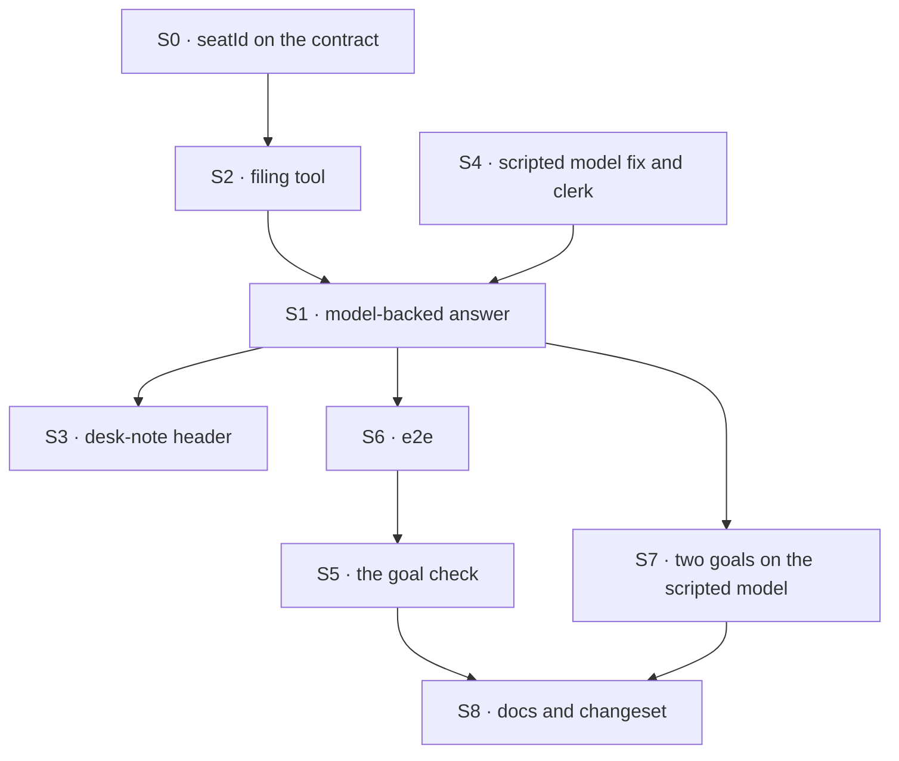

# FIX-1589 · Plan

[Spec](SPEC.md) · [Decisions](DECISIONS.md) · [Rules](BUSINESS-RULES.md) · **Plan** · [Docs](DOCS.md) · [Evolution](EVOLUTION.md)

Written for the implementing agent. IDs cross-reference [BUSINESS-RULES.md](BUSINESS-RULES.md)
(BR-n) and [DECISIONS.md](DECISIONS.md) (D-n). `tdd`. One PR. **Starts when FIX-1585's
implementation merges** (epic ER-14): it needs the seat composer and its test resolver entries.
Does not touch `agent-worker-flow.ts`. FIX-1594 consumes S0 and does not build it.

## Surfaces

| ID | Package · role | Change | Rules |
|---|---|---|---|
| S0 | `workforce` · the worker contract (`worker-config.ts`), its key constants and refusal wording (`manifest.ts`), the hire step (`hire.ts`) | Declare `seatId` on `workerConfigSchema()`. The one hire step imposes it on every record from the record's id, and refuses a record that authors it, with a shared refusal constant like `seatSkills`'s. Header prose and key counts updated. `docs/architecture/workforce-default-worker-kind.md`: the admission-contract table and the imposed/never-authored paragraph gain the key (D3) | BR-21–BR-23 |
| S1 | kitchen-sink · the clerk kind (`workforce/flows/workers/desk-clerk.ts`) | `answer` becomes: a generator `desk-clerk-answer` (prompt: team instructions, seat instructions, D2's desk rule; user turn: the note; model `intent/chat`; one tool, S2), then the existing tap that emits `[<desk> desk] <text>`. The sequencer is renamed `desk-clerk-reply`. `userMessage` on `answer`. **Remove** the `deskNote` step and its import of the block. Header rewritten | BR-1–BR-6 BR-14 |
| S2 | kitchen-sink · the filing tool, **in the same module as S1** (no second file) | A dispatcher named `desk-clerk-file`: `flowKind` the channel kind, `action: "fileTask"`, `session: { id: "support.desk" }`. Input `{ board: "escalations" \| "followups", goal }`. Payload adds `author: ctx.flow.config.seatId`, and `assignee: "followup-runner"` for `followups` only (D2). An `external-dispatcher` refusal is rescued into a result saying filing is unavailable here. No board declared on the kind | BR-7–BR-10 BR-12 BR-13 BR-15 BR-20 |
| S3 | kitchen-sink · `workforce/blocks/desk-note.ts` | Header only: the clerk no longer runs it; it is `support.otto`'s tool. Its input schema stays exported for S1 | BR-17 |
| S4 | kitchen-sink · the scripted model (`test/mock-flowstate.ts`, `lib/e2e-mock-script.ts`) | **The shared dispatcher fix, owned here:** a scenario is picked by a marker in the **latest user turn only**, and each request keeps its own cursor (key it on the request; if the mock sees none, on the latest user turn, which each run makes unique). Today it matches the whole history against one global clamped cursor, so a second run of a scenario starts mid-script. FIX-1590 and FIX-1594 reuse it. Then: map `desk-clerk-answer`; scenarios `[scenario:clerk-answer]` (text with `[clerk:answered]`) and `[scenario:clerk-file]` (a `desk-clerk-file` tool-call step with no text, then text with `[clerk:filed]`), goal text carrying the note's token. Unmatched: a fixed test-mode line. Built on FIX-1585's S9 in the same files | BR-1 BR-7 |
| S5 | `goals/kitchen-sink-talk/answers-a-clerk-note-or-files-it/` | `goal.md` from [SPEC.md's goal](SPEC.md#the-goal-and-how-well-know-its-met); `run.mts` drives a real browser against the production build under `KITCHEN_SINK_TEST_MODE=1`, both legs. `GOAL_CONTROL=echo` makes `answer` run today's echo; honoured only in test mode | BR-1 BR-2 BR-7 BR-11 |
| S6 | kitchen-sink · e2e | **Required, as the CI guard.** One Playwright scenario per leg, keyless, in FIX-1585's talk spec file. Goals never run in CI, so this is what catches a regression; S5 is the acceptance run and may share its page helpers. No third browser suite. `workforce-shell.spec.ts` untouched | BR-1 BR-2 BR-11 |
| S7 | `goals/workforce-conventions/code-comes-from-files-alone/`, `…/durable-hire-survives-redeploy/` | Both: start the server with `KITCHEN_SINK_TEST_MODE=1`; **Model** reads "scripted; the goal grades the desk tag, not the model". Files-alone only: narrow leg (c)'s scan to registration routes, excluding the shell's names module (`lib/workforce-shell.ts`) and the `test/` and `e2e/` trees, and amend its anti-game to say so. Record leg (c)'s pre-existing FAIL on `main` before the new PASS | BR-3 BR-19 |
| S8 | Docs and release note | [DOCS.md](DOCS.md)'s operations. One `minor` changeset for `@flow-state-dev/workforce` (the `seatId` contract key). kitchen-sink is private: nothing for it | — |

## Sequence



## Checks

| ID | Runs after | Passes when |
|---|---|---|
| V0 | S0 | Workforce tests: a seat minted by `hireWorkforce`, by the runtime `hire` tool and by the boot reload each carries `seatId` equal to its record id (BR-21); an authored `seatId` is refused by name at each door (BR-22); a hand-written schema without the key refuses at boot naming it (BR-23). Red first: no `seatId` on today's bag |
| V1 | S2 | The dispatcher's payload: `author` is `seatId` whatever the model sent; `followups` carries the runner assignee, `escalations` none; a third board fails input validation (BR-9, BR-10). Red state: take `author` from the args |
| V2 | S1 S4 | kitchen-sink flow test through the real config in test mode: ada's reply is `[front desk]` plus the scripted text and never contains the note; grace's is `[back desk]`; the note is a user turn; the no-op model gives the tag alone (BR-1, BR-3, BR-4). With no resolver entry and no key, the run fails and emits no echo (BR-5). Two runs of one scenario in one process both start at step 0 (S4; red on today's dispatcher). Red state: put `deskNote` back |
| V3 | S1 S2 S4 | **One extended kitchen-sink flow test**, same harness: the file scenario leaves one `escalations` row with the token, authored `support.ada`, via a `fileTask` request on `support.desk`; the followups variant leaves a row assigned to `followup-runner`; a non-member clerk leaves a failed `fileTask` and no row; with dispatch forced external, the tool reports filing unavailable and no row appears (BR-7, BR-8, BR-12–BR-14, BR-20). The POC probe's cases are this test's cases; there is no separate port |
| V4 | S2 | The boot still prints the `escalations` warning (BR-15). Red state: declare the board on the kind |
| V5 | S7 | Files-alone: leg (c) is **red on `main` today** (the literal is in the names module, tests and e2e since FIX-1500); record that FAIL, narrow the scan, then PASS all legs; a planted hand registration outside the excluded paths still fails leg (c). Durable-hire: PASS in test mode. Both still grade the desk values (BR-19) |
| VG | S5 | [The goal](SPEC.md#the-goal-and-how-well-know-its-met): `goals/kitchen-sink-talk/answers-a-clerk-note-or-files-it/run.mts` PASSES both legs after it FAILED both under `GOAL_CONTROL=echo`. Keyless |
| V6 | all | Existing workforce and kitchen-sink tests and e2e, the workforce-shell VGs and `a-channel-holds-the-work-a-seat-drains` stay green (epic ER-18). Every worker kind in the repo, lab kinds under `goals/` included, still boots with `seatId` |

Second paths (BP-035): every mint path (V0), the reload (VG), the non-member, refused and
external-dispatcher filings (V3), the no-op model and no-key paths (V2), the control (VG), the
warning's off state (V4).

## Pinned names

| Where | Name | Why pinned |
|---|---|---|
| Contract key | `seatId` | Public, imposed, refused when authored. FIX-1594 reads it |
| Generator | `desk-clerk-answer` | The test resolver maps generators by name (epic ER-7) |
| The clerk's sequencer | `desk-clerk-reply` | Renamed from `desk-clerk-answer`, which the generator now takes |
| Tool | `desk-clerk-file` | The script's tool call, the traces and the docs example name it |
| Script markers | `[scenario:clerk-answer]`, `[scenario:clerk-file]`, `[clerk:answered]`, `[clerk:filed]` | The goal check and the epic's wrap assert on them |
| Control | `GOAL_CONTROL=echo` | Named in the goal and the epic |

Everything else is yours to name.

## Guardrails

| Rule | Because |
|---|---|
| File only through the channel's `fileTask`, by dispatch. Never declare a board on the clerk kind, never touch a ledger | The Architect's fence, and a declared board silences the boot warning FIX-1591 owns (epic ER-13) |
| `seatId` is written by the one hire step and nowhere else; every mint path goes through it (tenet 5) | A seat hired at runtime without it would file, and in FIX-1594 post, unattributed |
| The model supplies only the board and the goal; the author comes from `seatId` | A model-written author is a signature anyone on the roster can forge (BP-031, epic ER-4) |
| Nothing in the clerk path falls back to the echo | A silent echo on error is the parrot again, and it hides a missing key |
| `GOAL_CONTROL` is read only under `KITCHEN_SINK_TEST_MODE=1` | A control must not reach a deployed build |
| In `packages/`, only S0's contract key. No edit to `channel-notify.ts` or `agent-worker-flow.ts`, nothing in core or engine | FIX-1590 owns the notify slot; the layer rule (epic ER-8, ER-11) |

## Docs

Reconcile and publish [DOCS.md](DOCS.md) after VG passes and its control fails. Its
operations own the prose.

## Sketch · pseudocode, illustrative, react to the shape

```
hire step, for every record:
    refuse if the record's settings author seatId
    settings.seatId ← record.id

desk-clerk-file (a dispatcher, beside answer):
    args from the model: board ∈ {escalations, followups}, goal
    send "fileTask" to the channel flow, session support.desk,
        with { board, goal, author: settings.seatId, assignee: runner if followups }
    on external-dispatcher refusal: return "filing is unavailable here"

answer (sequencer desk-clerk-reply, input { note }):
    model step desk-clerk-answer: team text, seat text, desk rule · user = note · tools = [file]
    tap: emit "[<desk> desk] <model text>"
    action keeps the note as the user's turn
```

**POC:** [`poc/clerk-premises/`](poc/clerk-premises/README.md), on kitchen-sink's real config in
test mode, keyless. With its patch, all seven premises held; on today's `main` six failed and
the boot warning held on both. It read the author through the cast D3 replaces, so it proves
the dispatch, the row and the roster check, not the author's source.

## At implement time

- Rebase on FIX-1585's implementation. S4 extends the resolver and script it adds.
- FIX-1459 PR-B added `seatPackages` to the contract; S0 is the sixth key. Re-read the
  refusal lists in `manifest.ts`, the README and `workers-on-disk.md` from `main`.
- Hand-written worker kinds under `goals/` (e.g. lab `probe` and `planner` kinds) must admit
  `seatId`; a composed one gets it free.
- Both workforce-conventions runners read the *last* `message` item. With the note kept, confirm
  that is still the reply, not the user turn.
- `hired-seat-auth.test.ts` runs `answer` on the `allow` no-op model. BR-4 keeps it `completed`.
- Re-run `poc/clerk-premises/probe.mts` with its patch against current `main` first. A Q-row
  that flips is a spec finding.

## Notes from review

- "Name collision: `desk-clerk.ts` already registers a sequencer named `desk-clerk-answer`." — cursor ([thread](https://github.com/fixpoint-labs/flow-state-dev/pull/2278#discussion_r4109135312)). Adopted in Pinned names.
- "Pin one tool name for docs and the POC." — cursor ([thread](https://github.com/fixpoint-labs/flow-state-dev/pull/2278#discussion_r4109135331)). Adopted: `desk-clerk-file`.

## Follow-ups

- Filing that survives an external dispatcher: a queue-safe way into an existing session. Not
  designed here (BR-20 reports it).
- A real-model check of the clerk's answer-or-file judgement, if D2's tone becomes a promise.
- The reply can claim a filing that the channel refused (D1). A waiting call would close it; not
  offered by the framework today.
