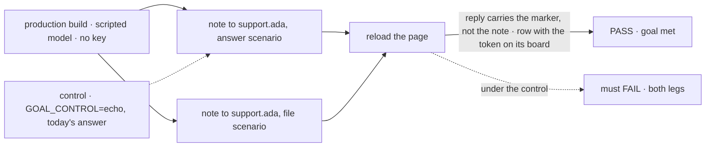
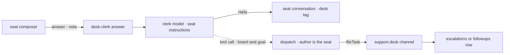

# FIX-1589 · Kitchen-sink desk-clerk: model-backed answer + board-file decision (not echo)

**Spec** · [Decisions](DECISIONS.md) · [Rules](BUSINESS-RULES.md) · [Plan](PLAN.md) · [Docs](DOCS.md) · [Evolution](EVOLUTION.md)

Feature · kitchen-sink only, no package change · small · 1 PR · epic [FIX-1592](https://linear.app/fixpoint-labs/issue/FIX-1592), after [FIX-1585](https://linear.app/fixpoint-labs/issue/FIX-1585)

## Four people, before and after

| Someone who… | Today | After |
|---|---|---|
| **asks `support.ada` something from the page** | Gets their own note back, word for word | Gets a reply a model wrote, under `[front desk]`. Their note stays above it, across a reload |
| **asks for something the desk can't close** | Gets the note back. Nothing is filed | Gets a reply saying where it went, and a row on `escalations` or `followups` in the team panel |
| **opens the team panel after the clerk files** | An empty `escalations`, and the boot warning | The row, waiting. The warning stays: filing is not draining |
| **runs the two goals that prove a seat's settings come from its file** | Pass on the echo, no model | Pass on the scripted model, graded on the same desk tag |

The day FIX-1585 ships, `support.ada` is the first seat a person reaches, and it parrots them.

## The goal, and how we'll know it's met

**A person who asks the desk clerk something from the kitchen-sink page gets an answer a model
wrote, or sees their note filed onto the board that fits it, and never gets their own words back.**

| Is it the right goal? | |
|---|---|
| **The real need** | The epic's [leg a](../../epics/FIX-1592/SPEC.md#the-goal-and-how-well-know-its-met), *"talking to a seat is a conversation with that agent"*, on `support.ada`: its reply is not the note and carries its scenario marker ([ER-20](../../epics/FIX-1592/BUSINESS-RULES.md#what-a-person-gets)). The issue: a parrot is *"worse than unreachable, because it looks like it works"* |
| **Smaller, and rejected** | "The reply is not the note." A fixed string meets it with no model. The reply must come from a model call, and a filing must put a row where a person sees it |
| **Bigger, and not this issue's** | Draining `escalations` and the boot warning's fate (FIX-1591, held) · a post waking the clerk (FIX-1590 keeps it off) · judging whether it files the *right* notes |
| **Not done if** | The browser check never ran on a production build · the reply is gone after a reload · the row skipped `fileTask` · the boot warning vanished · a check needed a key |



The check reads the page after a reload, so only what the server kept can pass. Under the echo
control the reply is the note and no row appears.

| How we verify | |
|---|---|
| **Goal check** | `goals/kitchen-sink-talk/answers-a-clerk-note-or-files-it/`: a real browser on the production build, through FIX-1585's seat composer. The epic's leg a for `support.ada`; reruns with the other three on one `main` commit at wrap ([ER-17](../../epics/FIX-1592/BUSINESS-RULES.md#the-proof)). The implementer runs it at completion (`fsd-qa` over the mailbox only if no browser runs here); verdict in the implementation PR |
| **Model** | Scripted, keyless ([epic D3](../../epics/FIX-1592/DECISIONS.md#d3)): the goal is which path ran and what was kept |
| **Signal** | After a reload. **Answer:** the note is the person's turn; the reply carries `[clerk:answered]`, not the note's token. **File:** a row with the token on `escalations` in the team panel; the reply carries `[clerk:filed]` |
| **Input** | A note with a fresh token per run and a scenario marker. A different note, or the file scenario aimed at `followups`, must pass too |
| **Anti-game** | No assertion on the reply's words past its marker: the script wrote them. Read the row off the panel, not the ledger. Only this run's token counts |
| **Control that must fail** | `GOAL_CONTROL=echo` (today's answer) must FAIL both legs, as today's `main` does. The PR shows the FAIL first |

## What changes


The only new path out of the seat is one dispatch into an action the channel already declares.
The desk tag stays the seat's; the words after it become the model's.

**The kind's file, all of it that changes:**

```diff
  // apps/kitchen-sink/workforce/flows/workers/desk-clerk.ts
- .step(deskNote)                               // hands the note back
+ .step(clerkModel)                             // a generator: the seat's instructions, the note
+                                               // as the user turn, one tool: file onto a board
  .tap((said, ctx) => ctx.emit.message(`[${desk} desk] ${said}`))
  actions: {
-   answer: { inputSchema: deskNoteInput, block: answer },
+   answer: { inputSchema: deskNoteInput, block: answer, userMessage: (i) => i.note },
  }
```

The action's name and input stay, so FIX-1585's map and the CLI call hold.

## How a note travels



The dashed edge is the model's choice. After it, the channel's own action, authored by the kind.

## What stays as it is

- **Nobody drains `escalations`**; the boot warning stays.
- **A post to `support.desk` doesn't run the clerk** (FIX-1590).
- **`desk-note` stays** as `support.otto`'s tool.
- **Core, engine and the `workforce` package.**

## Sign off

**[The goal](#the-goal-and-how-well-know-its-met), at that size:** a model answers, or the note
is filed where a person sees it, proved in a browser with no key. If wrong: a reply nobody can
tell from a canned one, or this held open for FIX-1591's drain.

1. **[D1](DECISIONS.md#d1) · The model decides, with one tool: file through `support.desk`'s own
   `fileTask`.** If wrong: the reply can say "filed" before the row lands, and a clerk hired
   later that isn't on the channel is refused with nothing on the board.
2. **[D2](DECISIONS.md#d2) · Answer by default; file only what the desk can't close, and always
   reply.** If wrong: rows pile up on a board nobody drains, or the desk never escalates.
3. **[D3](DECISIONS.md#d3) · The desk tag stays the kind's, so two existing goals move to the
   scripted model.** If wrong: those two goals lose their no-test-seam property, or grade a
   model's wording.

**Open: none.** Number 1 is the one to weigh. Reasoning: [DECISIONS.md](DECISIONS.md).
