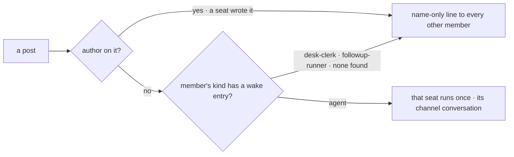

# FIX-1590 · Business rules

[Spec](SPEC.md) · [Decisions](DECISIONS.md) · **Rules** · [Plan](PLAN.md) · [Docs](DOCS.md) · [Evolution](EVOLUTION.md)

The cases, written as rules. Each says what a person or the system does and what happens. The
*proved by* column is the check the plan runs. The epic rules this issue owns are
[ER-2 and ER-3](../../epics/FIX-1592/BUSINESS-RULES.md#what-a-person-gets); it consumes ER-6
and ER-7.

## Who a post runs

| # | When | Then | Proved by |
|---|---|---|---|
| BR-1 | A person posts to `support.desk` (no `author`) | `support.iris` and `support.otto` each run once on it, through the agent kind's `onChannelPost`. ER-2 | Goal check · V3 |
| BR-2 | The same post reaches `support.ada`, `support.grace` or `support.wren` | Each gets today's name-only line, and nothing runs. Their kinds have no wake entry in the map | Goal check · V3 |
| BR-3 | A post carries an `author` (a seat wrote it) | No seat runs. Every other member gets the name-only line; the writer gets nothing. ER-3 | V3 · FIX-1594's browser check |
| BR-4 | A person posts to a channel with no agent member (`support.ada-wren`) | Nobody runs; the lines are as today | V3 |
| BR-5 | A person posts to `support.noticeboard` (the app's `digest` kind) | Nothing changes. That kind has no notify slot | V4 |
| BR-6 | A member's seat failed to load at boot, or is a runtime hire | No dispatcher exists for it, so it gets the name-only line. Never an error | V3 |

## What the seat hears, and where

| # | When | Then | Proved by |
|---|---|---|---|
| BR-7 | An agent seat is woken | It runs its ordinary answer: its own instructions, tools and skills, exactly as `run` would. The receiver adds only the heard turn | V1 |
| BR-8 | The seat's conversation is opened in the rail | The post shows as the seat's turn, `<writer> in <channel>: <body>`, with the reply under it. Both survive a reload | Goal check |
| BR-9 | A second post reaches the same seat in the same channel | It lands in the same conversation, after the first. One conversation per seat per channel ([D2](DECISIONS.md#d2)) | Goal check · V3 |
| BR-10 | Two posts reach one seat at once | Both run, one after the other, in post order | V3 |
| BR-11 | The same seat is a member of two channels | Two conversations, one per channel. Neither sees the other's posts | V3 |

## What stays safe

| # | When | Then | Proved by |
|---|---|---|---|
| BR-12 | One agent member's wake is refused or throws | The refusal is recorded in the fan-out's own request; the other members still run; the post stays written | V3 |
| BR-13 | A caller names `onChannelPost` on the public action route | Refused (`no-entry`). An internal entry is never caller-addressed | V1 |
| BR-14 | A post is made | It returns before any seat runs. The wake runs in the channel's hand-off request, as today | V3 |
| BR-15 | A seat kind is added with no wake entry in the map | The drift test fails until the entry names that kind's receiver or says none | V2 |
| BR-16 | The map names a receiver the kind does not declare | The drift test fails | V2 |

Two questions per member, in that order. The first is the epic's no-ping-pong rule; the second is
the map.

## Failure taxonomy

Nothing here is fatal to a post. A wake that is refused or fails degrades to "that seat did not
hear it", recorded in the fan-out request, with the rest still attempted. A seat that fails
mid-answer fails its own run only. Nothing retries: a dispatch keyed on the channel is adopted on
a retry of the fan-out, so a replay would not start a second conversation.

## Acceptance criteria this issue owns

[The goal](SPEC.md#the-goal-and-how-well-know-its-met): one post from the page runs `support.iris`
and `support.otto` once each and no other seat, read from their conversations after a reload, on
a production build with the scripted model, and the same run fails under
`GOAL_CONTROL=name-only-notify`. The workforce-shell checks, the
`a-channel-holds-the-work-a-seat-drains` goal and leg V14 stay green (epic ER-18).
