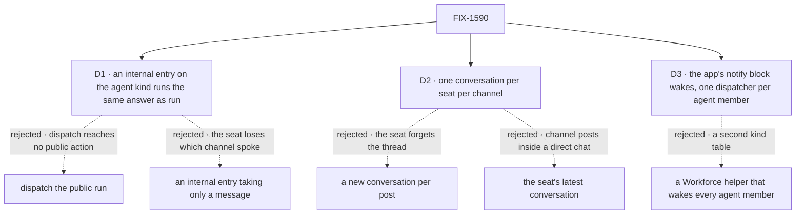

# FIX-1590 · Decisions

[Spec](SPEC.md) · **Decisions** · [Rules](BUSINESS-RULES.md) · [Plan](PLAN.md) · [Docs](DOCS.md) · [Evolution](EVOLUTION.md)

What was considered, what was chosen, and what each choice locks in. The epic already decided
who is woken ([epic D1](../../epics/FIX-1592/DECISIONS.md#d1): agent seats only) and what stops a
loop ([epic D2](../../epics/FIX-1592/DECISIONS.md#d2)). These three cards are how.

## The tree

Solid edges are what you're signing. Dashed edges lost, and the label says why.

## D1 · The agent kind hears a post through a new internal entry, `onChannelPost`, which runs the same answer as `run` with the post as the seat's turn

| | |
|---|---|
| **Instead of** | Dispatching to the public `run` · or an internal entry that takes only `{ message }`, with the app writing the text |
| **Because** | A dispatch resolves only `flow.internal.actions`, one map with no fallback ([`action-forms.md`](../../../docs/architecture/action-forms.md#dispatched-internal-and-task-entries)), and the kind declares only a public `run`. Reusing `run`'s sequence keeps one answer path, so a seat answers a post exactly as it answers a person. Taking the notify contract (`channelId`, `postId`, `body`, `principal`, `author?`) lets the kind write the heard turn itself and keeps the channel on the run, which FIX-1594 needs to post back |
| **Locks in** | A published entry on `@flow-state-dev/workforce`'s agent kind (a `minor` changeset). Every app on the agent kind can wake its seats. The kind now reads the channel's delivery shape, so a change to `channelNotifyInputSchema` is a change to the agent kind too |

**What would change my mind:** a second, non-channel caller that wants to wake a seat. Then the
entry should take `{ message }` and each caller writes its own turn.

## D2 · A seat keeps one conversation per channel, and every post it hears there lands in it

| | |
|---|---|
| **Instead of** | A new conversation per post · or the seat's most recent conversation with a person |
| **Because** | A seat is an agent with its own memory (the owner, 2026-09-25). A conversation per post forgets the thread the moment the next post arrives. The latest person conversation puts channel posts inside someone's direct chat, and changes meaning whenever that person starts a new one. A dispatch keyed on the channel lands in the same conversation every time, and the framework adopts it on retry. [POC W4](poc/wake-premises/README.md) showed a second post landing there |
| **Locks in** | The conversation grows with every post the seat hears, so a busy channel eventually pushes its early posts past the seat's history window. It lists as a run the channel started, not as a conversation the person opened. FIX-1594 answers from inside it |

## D3 · The wake is the app's notify block: one declared dispatcher per agent member, the member's kind looked up in FIX-1585's map

| | |
|---|---|
| **Instead of** | A Workforce helper that builds the wake for every agent member of a roster |
| **Because** | The notify slot's contract is that the framework carries the policy and the app supplies the addresses, and a dispatch refuses a target read out of stored data. The channels guide already teaches this router-over-dispatchers recipe. A package helper would need its own table of which kind wakes through which entry, a second map beside FIX-1585's ([ER-6, ER-10](../../epics/FIX-1592/BUSINESS-RULES.md#what-no-child-may-do)). The one lookup the wake needs, kind to receiver, becomes a column in that map |
| **Locks in** | Every app writes its own wake, about twenty lines, from the guide. Kitchen-sink's reaches the seats its files declare, read at boot, and no runtime hire, which is never a channel member anyway. A new talkable kind needs its column filled before its seats wake; the drift test fails until it is |

## Decided, not asked

- **A post with an `author` wakes no seat** ([epic D2](../../epics/FIX-1592/DECISIONS.md#d2), owned
  here). Every author a post can carry is a declared member, and every member is a seat, so the
  filter is one comparison at the wake. Other members still get the name-only line.
- **The heard turn reads `<writer> in <channel>: <body>`**, the writer being `author`, else
  `principal`. It is also the entry's user message, so the page shows it as the seat's turn.
- **The entry queues** (`concurrency: "queue"`), so two posts arrive in order in one conversation.
- **Clerk and runner members keep the name-only line**, byte for byte. FIX-1589's `desk-clerk.ts`
  is not touched here.
- **The rail lists dispatch runs** (`includeDispatchRuns` on kitchen-sink's navigator), so a
  seat's channel conversation is reachable from the page. Without it the listing hides the run
  ([POC W6](poc/wake-premises/README.md)). The assistant's background-work runs list there too,
  under the conversation that started them.
- **A member with no dispatcher falls to the name-only line**, never an error.

## Considered and dropped

| Alternative | Why not |
|---|---|
| Wake through the assistant's tools | A second path to the same seats, and the Architect's invent-kill list names it |
| Run the seat inside the post's request | The post's queue hold would cover every seat's answer, and the next poster's 30-second wait budget with it |
| Wake clerks too, through `answer` | The issue's first ask. The epic keeps the wake agent-only: a clerk would answer where no channel reader looks, and could file onto `escalations` on every post |
| Make the channel's roster name the receiver per member | Puts kind knowledge in `CHANNEL.md`, which declares a closed list of keys |

## Settled

- **A scripted agent seat runs keyless through an internal receiver, dispatched from the notify
  slot, and a seat-authored post wakes nobody** — **CONFIRMED** on kitchen-sink's real wiring:
  W1–W6 pass with the patch; today's stub fails W1, W3, W4 and W6; dropping the author filter fails
  W5. ([poc/wake-premises](poc/wake-premises/README.md), [evidence](poc/wake-premises/evidence.txt))

## How it got here

- **Draft** — framed as the epic's leg b; an internal entry on the agent kind plus the app's
  wake in the notify slot, keyed one conversation per channel, agent seats only; POC run first.

**Open: none.**
