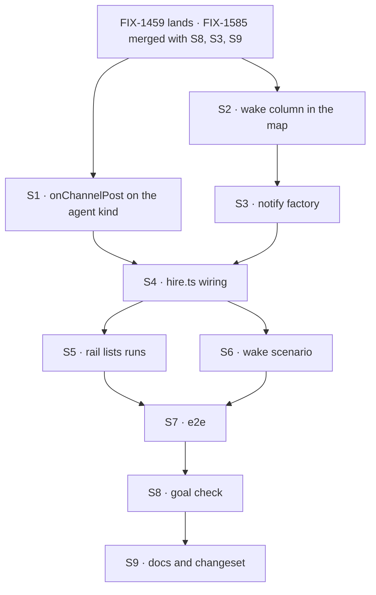

# FIX-1590 · Plan

[Spec](SPEC.md) · [Decisions](DECISIONS.md) · [Rules](BUSINESS-RULES.md) · **Plan** · [Docs](DOCS.md) · [Evolution](EVOLUTION.md)

Written for the implementing agent. IDs cross-reference [BUSINESS-RULES.md](BUSINESS-RULES.md)
(BR-n), [DECISIONS.md](DECISIONS.md) (D-n) and the epic's rules (ER-n). `tdd`. One PR. Starts
when FIX-1589's implementation merges (ER-14); S1 also waits for FIX-1459 (ER-11).

## Surfaces

| ID | Package · role | Change | Rules |
|---|---|---|---|
| S1 | `workforce` · the built-in agent kind (`agent-worker-flow.ts`) | Declare `internal.actions.onChannelPost`: input `channelNotifyInputSchema`; block = the same `agent-run` sequence `run` uses, its input connected to `{ message: heard turn }`; `userMessage` = the heard turn; `concurrency: "queue"` (D1). Builds on FIX-1585's S8 line in the same file | BR-7 BR-8 BR-10 BR-13 |
| S2 | kitchen-sink · the shell's names module (`lib/workforce-shell.ts`, FIX-1585's S3 map) | A wake column: `agent` → `onChannelPost`, `desk-clerk` → none, `followup-runner` → none. Keyed on `SEAT_KINDS`, the same strings a `WORKER.md` spells `flow:` and a roster row stores as `hiredSeatRowSchema.flow`. Stays import-free (BP-019) | BR-2 BR-15 BR-16 |
| S3 | kitchen-sink · `workforce/channel-notify.ts` | Becomes a factory over the hired seats: one `dispatcher` per seat whose kind has a wake entry (`flowKind` = the seat id, `action` = the entry, `session: { key }` on the channel), selected by `input.member`; a post with an `author`, or a member with no dispatcher, falls to today's name-only block, which stays as the fallback. **Remove** the header's "a real app puts a dispatcher here" placeholder claim (D3) | BR-1–BR-6 BR-9 BR-11 BR-12 |
| S4 | kitchen-sink · `workforce/hire.ts` | Hire the seats before building the channel kinds, and hand S3 each seat's id and kind | BR-1 BR-6 |
| S5 | kitchen-sink · the rail (`app/page.tsx`) | `includeDispatchRuns` on the `FlowNavigator`, so a seat's channel conversation is listed | BR-8 |
| S6 | kitchen-sink · the scripted model (`lib/e2e-mock-script.ts`) | A `[scenario:wake]` scenario for the agent kind's generators, which FIX-1585's S9 maps. One reply carrying the marker | BR-1 BR-8 |
| S7 | kitchen-sink · e2e | The wake scenario in FIX-1585's talk spec file, not `workforce-shell.spec.ts` | BR-1 BR-2 BR-8 BR-9 |
| S8 | `goals/kitchen-sink-talk/a-post-runs-each-member-agent-once/` | `goal.md` from [SPEC.md's goal](SPEC.md#the-goal-and-how-well-know-its-met); `run.mts` drives a real browser against the production build. `GOAL_CONTROL=name-only-notify` swaps S3 back to the stub | BR-1 BR-2 BR-8 BR-9 |
| S9 | Docs and release note | [DOCS.md](DOCS.md)'s operations; one `minor` changeset for `@flow-state-dev/workforce` (the agent kind gains `onChannelPost`). kitchen-sink is private: no changeset | — |

## Sequence



## Checks

| ID | Runs after | Passes when |
|---|---|---|
| V1 | S1 | Workforce test: the agent kind declares `internal.actions.onChannelPost`; a dispatch to it runs the answer and keeps the heard turn as the user message; the same name on the public route is refused `no-entry` (BR-13). Red state: remove the entry |
| V2 | S2 | FIX-1585's drift test, widened: every wake entry names an internal action that kind declares, read off the kind's `internal` map; "none" only where it declares no channel receiver. Red states: misname `onChannelPost`; drop `followup-runner`'s entry |
| V3 | S3 S4 | kitchen-sink flow test through the real config and the scripted model, the POC's W1–W6 as tests: BR-1, BR-2, BR-3 (the epic's ER-3 package test), BR-4, BR-6, BR-9–BR-12, BR-14. Red states: drop the author filter (BR-3 fails); swap in the stub (BR-1 fails) |
| V4 | all | The workforce-shell VGs, `a-channel-holds-the-work-a-seat-drains`, V14 and the rest of the kitchen-sink e2e suite, unchanged and green (BR-5, ER-18) |
| VG | S8 | [The goal](SPEC.md#the-goal-and-how-well-know-its-met): `goals/kitchen-sink-talk/a-post-runs-each-member-agent-once/run.mts` PASSES keyless, after the same run FAILED under `GOAL_CONTROL=name-only-notify` |

Second paths (BP-035): the seat-authored post, the channel with no agent, the missing seat, the
refused wake and two posts at once (V3); the public call to an internal entry (V1).

## Pinned names

| Where | Name | Why pinned |
|---|---|---|
| Internal entry on the agent kind | `onChannelPost` | Public: an app's dispatcher names it, and the channels guide does |
| Scenario marker | `[scenario:wake]` | The goal check's signal reads it (epic ER-7) |
| Goal control | `GOAL_CONTROL=name-only-notify` | The epic names the stub as leg b's control |

Everything else is yours to name, including the factory in S3 and the map's column.

## Guardrails

| Rule | Because |
|---|---|
| In `agent-worker-flow.ts`, only S1, and only after FIX-1459 lands and on top of FIX-1585's S8 | ER-11. Two issues and another thread edit that file |
| The wake's kind lookup is the map's column. No kind table in `channel-notify.ts` or in `workforce` | ER-6, ER-10. The POC's local `WAKE_ACTION` table stands in for S2 and must not ship |
| A seat's address comes from the seats the app hired at boot, never from the channel's stored members | The dispatch substrate refuses a target read from stored data, and a stored list is caller-reachable input on a delivery path (BP-031) |
| The fan-out stays in the channel's hand-off request | A seat's answer must not count against the next poster's queue wait |
| `onChannelPost` reuses `run`'s sequence; no second answer path | A seat that answers a post differently from a person is two agents under one name |
| `desk-clerk.ts` and the `answer` action are not touched | The seam with FIX-1589, which owns them. A clerk member stays on the name-only line whatever `answer` does |
| No Workforce vocabulary enters `core`, `engine`, `client` or `react` | ER-8. The wake uses core's `dispatcher` and router as shipped; the rail uses a shipped navigator prop |

## Docs

Reconcile and publish [DOCS.md](DOCS.md) after VG passes and its control fails. The kitchen-sink
README paragraph waits until FIX-1594's half is true too (the epic's ownership table).

## Sketch · pseudocode, illustrative, react to the shape

```
at boot (hire.ts):
    seats ← hire the roster
    notify ← for each seat whose kind's wake entry is not none:
                 a dispatcher to (seat id, wake entry), keyed on the channel
             chosen by member; fallback = today's name-only block
             a post with an author → fallback
the agent kind:
    internal onChannelPost(post) → run's sequence with message = "<writer> in <channel>: <body>"
```

**POC:** [`poc/wake-premises/`](poc/wake-premises/README.md), on kitchen-sink's real wiring with
a temporary patch. The premise held: a scripted agent seat runs keyless through an internal
entry dispatched from the notify slot (W1–W3); the run is hidden from the ordinary listing (W6),
which is why S5 exists; a second post lands in the same conversation (W4); a seat-authored post
wakes nobody (W5). Today's stub fails W1, W3, W4 and W6; dropping the filter fails W5. Nothing in
the design moved.

## At implement time

- **FIX-1585** may have landed S3's map in a different shape. Add the column to whatever it
  shipped; don't start a second structure beside it.
- **FIX-1589** may have changed `desk-clerk.ts`, `desk-note` or the scripted model file. Rebase;
  expect no conflict with S3 or S6.
- **FIX-1459** edits `agent-worker-flow.ts` and `packages/workforce/README.md`. Rebase S1 onto it;
  the README change here is in the Channels section only.
- **FIX-1594** is specced against this receiver. If it has merged a spec, check its reading of
  the heard turn and the channel id before building S1.
- `utility.keyedRouter` with a `fallback` fits S3; the POC used a plain router.
- Re-run `poc/wake-premises/probe.mts` against current `main` with the patch before starting. A
  W-row that flips is a spec finding.

## Follow-ups

- **Waking clerks** is one wake entry once the `escalations` call is made (epic D1, FIX-1591).
- **A busy channel outgrows a seat's history window** (D2). No summary pass exists; flag if a
  real flow hits it.
