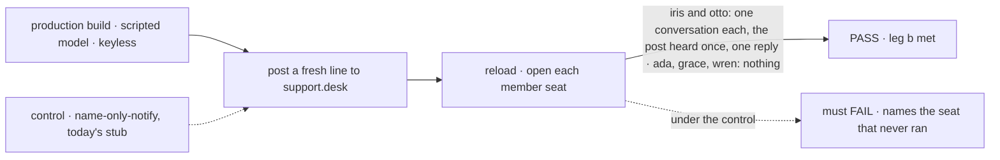
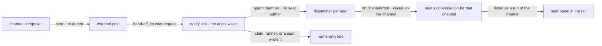

# FIX-1590 · Kitchen-sink: a channel post runs each member agent seat once

**Spec** · [Decisions](DECISIONS.md) · [Rules](BUSINESS-RULES.md) · [Plan](PLAN.md) · [Docs](DOCS.md) · [Evolution](EVOLUTION.md)

Feature · `workforce` (the agent kind) + kitchen-sink · medium · 1 PR · epic
[FIX-1592](https://linear.app/fixpoint-labs/issue/FIX-1592), leg b · after FIX-1589 and FIX-1459

## Five people, before and after

| Someone who… | Today | After |
|---|---|---|
| **posts to `support.desk` from the page** | Every member is "notified": a line naming them goes by, and none of them runs | `support.iris` and `support.otto`, the two agent seats in the channel, each run once on the post |
| **opens `support.otto` after posting** | Nothing about the post | A `support.desk` conversation in its list, holding the post as what it heard and its answer under it. It survives a reload, and the next post lands in the same conversation |
| **is a clerk or runner member (`support.ada`, `support.grace`, `support.wren`)** | A name-only line | The same name-only line. Nothing runs |
| **is a seat that posts to the channel** (FIX-1594, or `author` from the CLI) | Every other member gets a name-only line | The same. No seat runs, so two agents never answer each other |
| **builds a channel app on Workforce's agent kind** | Can't wake an agent seat: its only action is public, and a dispatch reaches only internal entries | Points a dispatcher at the kind's `onChannelPost`, following the router recipe the channels guide already gives |

A channel is how you talk to several agents at once. Today a post reaches nobody who can
answer.

## The goal, and how we'll know it's met

**When a person posts to `support.desk` from the page, each agent seat in that channel runs once
on the post and no other seat runs, and each run is there in that seat's conversation after a
reload.**

| Is it the right goal? | |
|---|---|
| **The real need** | The epic's [leg b](../../epics/FIX-1592/SPEC.md#the-goal-and-how-well-know-its-met): *"one post runs iris and otto once each, no other seat."* The owner, 2026-09-25: *"if you talk to a channel, it sends it to the agents."* |
| **Smaller, and rejected** | "Every member is notified." Today's stub already meets it with a line naming each member, and nobody runs. So does "a seat runs when you call the CLI": a person on the page sees nothing |
| **Bigger, and not this issue's** | The agent answering back in the channel (FIX-1594, leg c). Waking clerks too, which waits on the `escalations` call held with FIX-1591 ([epic D1](../../epics/FIX-1592/DECISIONS.md#d1)) |
| **Not done if** | The package tests are green and the browser check never ran on a production build · a seat runs twice for one post, or on a post a seat wrote · the check reads the fan-out's output instead of the seat's conversation · it passes only with a key · a clerk runs |



The check reads the seats' own conversations after a reload, so only a real run passes. Under
the dashed control, today's stub, it must fail on iris and otto.

| How we verify | |
|---|---|
| **Goal check** | `goals/kitchen-sink-talk/a-post-runs-each-member-agent-once/`, a real browser on the production build. Run by the implementer at completion, locally first, else handed to `fsd-qa`. Verdict in the implementation PR; run again with the epic's other checks at wrap ([ER-17](../../epics/FIX-1592/BUSINESS-RULES.md#the-proof)) |
| **Model** | Scripted, keyless ([epic D3](../../epics/FIX-1592/DECISIONS.md#d3)). The goal is who ran, not what they said |
| **Signal** | After a reload, `support.otto` and `support.iris` each list exactly one conversation holding the post's token, heard once, with one reply carrying the wake marker under it. `support.ada`, `support.grace` and `support.wren` hold nothing with the token |
| **Input** | A post carrying `[scenario:wake]` and a fresh token. A second post, with different text, must land in the same conversation of each agent and pass too |
| **Anti-game** | Don't assert on the reply's wording, the fan-out's output, a dispatch handle, the transient name-only line, a package test or a CLI run |
| **Control that must fail** | `GOAL_CONTROL=name-only-notify` puts today's stub back. Today's `main` fails too. The PR shows the FAIL before the PASS |

## What changes


Read the row of five seats. Only the two agent seats move, and the bottom row is the rule that
stops agents waking each other ([epic D2](../../epics/FIX-1592/DECISIONS.md#d2)).

**The framework side, all of it:**

```diff
  // @flow-state-dev/workforce · the built-in agent kind
  actions: { run: { inputSchema, block: run } },
+ // reached only by a dispatch: a channel's fan-out hands one post to one seat
+ internal: { actions: { onChannelPost: { block: the same answer as run, the post as its turn } } }
```

**The app side, as the notify slot is built:**

```diff
- defineChannelFlow({ notify })        // one name-only line per member
+ defineChannelFlow({ notify: notifyFor(seats) })
+ // one dispatcher per agent member → that seat's onChannelPost, one conversation per channel;
+ // every other member, and every post a seat wrote, still gets the name-only line
```

## How a post reaches a seat



The post returns before any seat runs. The wake picks who hears it; the seat runs its ordinary
answer; the rail lists the run once kitchen-sink turns on dispatch runs.

## What stays as it is

- The post contract and the writer skip: nobody is told about their own post (FIX-1476 BR-16a,
  leg V14).
- `support.ada`'s `answer`, which FIX-1589 is changing. A post never runs a clerk.
- The channel kind itself, its hand-off request and its per-member rescue. No Layer 1 change.
- A seat's public `run` and the page's composer for it (FIX-1585).
- How an agent posts back into the channel. That is FIX-1594's.

## Sign off

**[The goal](#the-goal-and-how-well-know-its-met), at that size:** one post, each agent member
once, nobody else, read from the seats' own conversations after a reload. If wrong: we ship a
wake a person can't see, or hold this open for the reply, which is FIX-1594's.

1. **[D1](DECISIONS.md#d1) · The agent kind hears a post through a new internal entry,
   `onChannelPost`, which runs the same answer as `run` with the post as its turn.** If wrong: a
   published entry on Workforce's agent kind that takes the channel's delivery shape, which the
   next app inherits.
2. **[D2](DECISIONS.md#d2) · A seat keeps one conversation per channel; every post it hears
   there lands in it.** If wrong: that conversation grows with every post, and a busy channel
   pushes its early posts out of what the seat remembers.
3. **[D3](DECISIONS.md#d3) · The wake is the app's notify block, one dispatcher per agent member,
   the kind read off FIX-1585's map.** If wrong: every app writes its own twenty-line wake
   instead of calling one from the package.

**Open: none.** Number 1 is the one to weigh: it changes a published package. Reasoning and what
lost: [DECISIONS.md](DECISIONS.md). The cases: [BUSINESS-RULES.md](BUSINESS-RULES.md).
