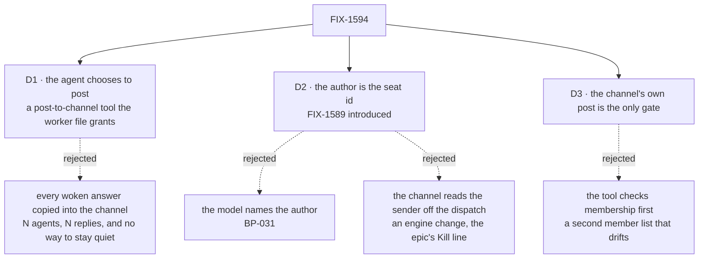

# FIX-1594 · Decisions

[Spec](SPEC.md) · **Decisions** · [Rules](BUSINESS-RULES.md) · [Plan](PLAN.md) · [Docs](DOCS.md)

What was considered, what was chosen, why, and what each choice locks in. Three decisions are the
sign-off surface. The epic's D2 (a post a seat wrote wakes no seat) is FIX-1590's and is consumed
here, not re-decided. So is FIX-1589's `seatId`, the seat's own id imposed by the hire.

## The tree

Solid edges are what you're signing. Dashed edges lost, and the label says why.

## D1 · An agent replies in a channel by choosing to: a `post-to-channel` tool, granted by naming it in the worker file's `tools:`

| | |
|---|---|
| **Instead of** | The woken turn's answer posted into the channel automatically, by FIX-1590's receiver · or a control tool every agent seat holds, the way `discover` is held |
| **Because** | Jake's words are *"the agent can respond back"*. A seat is its own conversation first; a channel gets what the agent means to say there. Copying every answer in turns one post in a channel of five agents into five replies, with no way for an agent to stay quiet. Posting is an effect other people read, so a seat holds it only when its file says so, as it holds `hire` ([`seat-hire-capability.ts`](../../../packages/workforce/src/seat-hire-capability.ts) makes the same split). The epic's D3 already bet on a scripted tool call, and the [POC](poc/seat-posts/README.md) ran one keyless (P1, P2) |
| **Locks in** | Whether a live model posts depends on its prompt; only the scripted proof is guaranteed. The model can name the channel because FIX-1590 pins the heard turn as `<writer> in <channel>: <body>`, where `<channel>` is the channel's session id, the same id the tool takes ([FIX-1590 DECISIONS](../FIX-1590/DECISIONS.md), its BR-8). An agent can also post when talked to directly, to any channel it is in. In kitchen-sink only `support.otto` names the tool |

**What would change my mind:** a flow where every member's answer belongs in the channel, such as
a standup. Then auto-posting is a per-kind option on FIX-1590's receiver, beside this tool rather
than instead of it.

## D2 · The name on the line uses the seat id FIX-1589 introduced; the model supplies only the channel and the words

| | |
|---|---|
| **Instead of** | (a) An `author` argument on the tool. (b) The channel reading who sent the post from the dispatch record. (c) The member name the wake hands the woken turn. (d) A `seatId` of this issue's own |
| **Because** | A block cannot see which seat it runs in; the seat's settings are the only per-seat fact it can read, and only the hire writes them. FIX-1589's clerk needed the same fact first, so FIX-1589 imposes `seatId` at the hire and refuses it when a worker file writes it; this issue reads it. (a) lets a model sign as anyone on the roster (BP-031, epic ER-4): the author has to come from a server-set source, and the seat's settings are one. (b) The dispatch record names the sending session, not the seat: an engine change, which is the epic's Kill line. (c) Exists only on a woken turn, so a directly asked seat could not post. The POC's negative control shows what the author carries: without it the line reads `devuser`, the seat wakes itself, and a channel it is not in accepts the post (P1, P2, P4 red) |
| **Locks in** | The key is on every seat, not only on seats holding the tool, because every mint path (the file roster, the runtime `hire`, the boot reload) goes through the one hire step, and a seat minted without it would post unattributed: read as `devuser`, wake every member, and skip the member check. Scoping it to otto re-opens this decision. A seat whose settings lack `seatId` is refused by the tool, never posted author-less. The line is still stored `authorVerified: false`: the server set the name, but the channel cannot check who called, which stays [FIX-1493](https://linear.app/fixpoint-labs/issue/FIX-1493)'s |

## D3 · The channel's own `post` is the only gate; the tool reports that it handed the post over, not that it landed

| | |
|---|---|
| **Instead of** | The tool checking membership first against the roster files · the tool waiting for the post's result |
| **Because** | The channel already refuses an author who is not a member, and it reads the members of the channel as opened. A copy taken from the files drifts from that: an edited `members:` never reaches an open channel. A dispatch into another session starts a request there and returns; it does not wait. One gate, at the convergence point every writer passes (tenet 5) |
| **Locks in** | A seat that names a channel it is not in is told the post was handed over, and nothing appears. A refusal the dispatch returns at once does reach the seat as a failed call: an unknown channel, or a host whose dispatcher hands work to an external queue, where a delivery into an existing session is refused before anything is enqueued ([`dispatch-operation.ts`](../../../packages/engine/src/context/dispatch-operation.ts)). So the tool works where dispatch runs in process; a queue-safe route is a follow-up. The refusal is on the channel's request log, not in the seat's turn (POC P4). Only the built-in channel kind is reachable: `support.noticeboard` runs on `digest`, whose `post` another flow cannot call, and a post there is refused by name. A reply telling the seat its post was refused is a follow-up |

## Decided, not asked

- **The tool is `post-to-channel`, in `packages/workforce`, composed into the agent kind through
  `uses`.** No edit to `agent-worker-flow.ts`; FIX-1590 owns the receiver there.
- **The channel is named by its id.** The seat reads it off the woken message or its own
  `discover`. No "the channel that woke me" default, which would need state on the seat's session.
- **In kitchen-sink only `support.otto` names the tool.** `support.iris` answers in its own
  conversation. With `no-author-filter`, iris is woken by otto's line and has nothing to post
  with, so the control fails once and ends rather than looping.
- **The `post-without-author` control lives in kitchen-sink**, as a test-mode stand-in for the
  tool. The published tool has no switch that drops the author.
- **The goal check uses one new marker, `[scenario:reply-in-channel]`,** in the one script file.
  It rides FIX-1589's scripted-model fix (match the latest user turn, a cursor per request),
  which is what lets two seats run the same generator at once.
- **No EVOLUTION.md.** FIX-1476's post contract and notify rule are used as they are; nothing is
  amended or superseded.

## Considered and dropped

| Alternative | Why not |
|---|---|
| Auto-post in FIX-1590's receiver | D1. Also an edit to `agent-worker-flow.ts`, the file FIX-1590 is changing |
| A preset on `createWorkforceCapability`, beside `discover` | That door is a control every seat holds because it only reads. Posting is a grant a seat names |
| Expose the flow instance id on the block context | A core change. The Kill line |
| The tool routes to any channel kind, looked up from the inventory | Kitchen-sink runs no inventory, and `digest` declares no internal `post`. One kind covers the proof |
| An assistant tool that posts for a seat | An epic fence: a second path to the same action |

## Settled

- **A scripted tool call posts into a channel as the seat, keyless, from a direct turn and from a
  woken one** — **CONFIRMED** on kitchen-sink's real wiring in test mode, P1–P5, with a negative
  control that turns P1, P2 and P4 red. The woken run used a stand-in receiver, since FIX-1590's
  is not built. [`poc/seat-posts/`](poc/seat-posts/README.md).

## How it got here

- **Draft** — framed as the epic's leg c: the return path from a woken seat to its channel. A
  granted tool posting through the channel's own `post`, the author from a hire-imposed `seatId`,
  one gate at the channel; the POC confirmed the premise keyless before drafting.
- **Review round 1** — cross-spec review moved `seatId` to FIX-1589, whose clerk needs it first;
  D2 now reads it, and the changeset is the tool alone. Codex found that a delivery into an
  existing session is refused behind an external queue: the tool is limited to in-process
  dispatch and reports the refusal. The POC's P3 now asserts that nothing is written and that the
  call failed on `author`, with its own red state.

**Open: none.**
