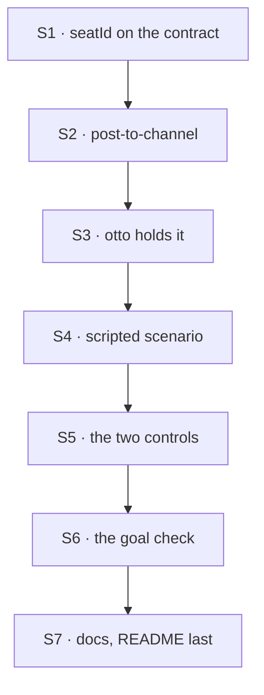

# FIX-1594 · Plan

[Spec](SPEC.md) · [Decisions](DECISIONS.md) · [Rules](BUSINESS-RULES.md) · **Plan** · [Docs](DOCS.md)

Written for the implementing agent. IDs cross-reference [BUSINESS-RULES.md](BUSINESS-RULES.md)
(BR-n), [DECISIONS.md](DECISIONS.md) (D-n) and the epic's rules (ER-n). `tdd`. One PR. Starts
when FIX-1590's implementation merges (ER-14).

## Surfaces

| ID | Package · role | Change | Rules |
|---|---|---|---|
| S1 | `workforce` · the worker contract (`worker-config.ts`) and the hire step (`hire.ts`) | Declare `seatId` on `workerConfigSchema()`; the hire imposes it on every record from the record's id, and refuses a record that authors it. Update the contract's key count and header prose | BR-16 BR-17 BR-18 · D2 |
| S2 | `workforce` · a new capability beside `createSeatHireCapability` | Contributes one catalog tool, `post-to-channel`: closed input `{ channel, body }`; reads the author from `seatId`; dispatches the built-in channel kind's internal `post` into the named channel's session. Returns the dispatch handle and says "handed over", nothing more. No membership check of its own (D3). Export it from the package root | BR-1–BR-8 · D1 D3 |
| S3 | kitchen-sink · `workforce/hire.ts` and `support.otto`'s `WORKER.md` | Compose S2 into the agent kind's `uses`; add `post-to-channel` to otto's `tools:`. Nobody else names it | BR-7 |
| S4 | kitchen-sink · the scripted model (`lib/e2e-mock-script.ts`) | The `[scenario:reply-in-channel]` scenario for the agent kind's generators: a step with a `post-to-channel` call and no text, then a text step. The line's body carries a line marker and the run's token. Choose the step from the turn's own input, since iris and otto run it at once (ER-7) | BR-2 · goal check |
| S5 | kitchen-sink · the two controls, test mode only | `GOAL_CONTROL=post-without-author` makes S2 send no author. `GOAL_CONTROL=no-author-filter` switches off FIX-1590's filter, through whatever switch FIX-1590 left; add one there if it left none. Neither is reachable outside `KITCHEN_SINK_TEST_MODE=1` | goal check |
| S6 | `goals/kitchen-sink-talk/agent-replies-in-the-channel/` | `goal.md` from [SPEC.md's goal](SPEC.md#the-goal-and-how-well-know-its-met), `run.mts` driving a real browser against the production build. Reads woken turns the way FIX-1590's leg-b check does | BR-9 BR-12 BR-13 |
| S7 | Docs and release note | [DOCS.md](DOCS.md)'s operations, the kitchen-sink README last (ER-19). One `minor` changeset for `@flow-state-dev/workforce`: the new tool and the `seatId` contract key | — |

## Sequence



## Checks

| ID | Runs after | Passes when |
|---|---|---|
| V1 | S1 | Every seat minted by `hireWorkforce`, the runtime `hire` tool and the boot reload carries `seatId` equal to its id (BR-16). An authored `seatId` is refused by name (BR-17). A kind with a hand-written schema lacking it refuses at boot naming the key (BR-18). Red first: no `seatId` on today's bag |
| V2 | S2 | Workforce test on real channel and agent kinds, scripted model: BR-1, BR-3, BR-4, BR-5 (nothing written, refusal on the channel's request), BR-6, BR-7, BR-8. The author assertion is on the stored line, never the tool's input. Second path (BP-035): a runtime-hired seat posts with its own id |
| V3 | S3 S4 | Kitchen-sink flow test through the real config: a post with the marker wakes otto (FIX-1590), otto's line lands authored `support.otto`, and otto's own conversation holds the tool call, not a copy of the line (BR-2, BR-15) |
| V4 | S3 | Otto's line triggers no woken run on any seat (BR-9). Red under `no-author-filter` |
| VG | S6 | [The goal](SPEC.md#the-goal-and-how-well-know-its-met): `goals/kitchen-sink-talk/agent-replies-in-the-channel/run.mts` PASSES on the production build, keyless, after it FAILED under each of `GOAL_CONTROL=no-author-filter` and `GOAL_CONTROL=post-without-author`, each on its own half |
| V5 | S7 | The workforce-shell checks, `a-channel-holds-the-work-a-seat-drains` and FIX-1585's and FIX-1590's goal checks stay green (ER-18) |

## Pinned names · the only three

| Where | Name | Why pinned |
|---|---|---|
| The tool | `post-to-channel` | A worker file types it in `tools:` |
| The contract key | `seatId` | Imposed and refused by name; a hand-written kind declares it |
| The scenario marker | `[scenario:reply-in-channel]` | The goal check and the script share it |

Everything else, including the capability's export name, is yours.

## Guardrails

| Rule | Because |
|---|---|
| The tool's input has no author and is closed | D2 and BP-031. A model that can name the author can post as anyone on the roster |
| Every mint path gets `seatId` from the one hire step (tenet 5) | A seat hired at runtime without it would post unattributed and wake everyone |
| The only writer of a line is the channel's own `post` | ER-4 and ER-12. No second messaging path, no assistant item on the channel |
| No edit to `agent-worker-flow.ts`, core, engine, client or react | FIX-1590 owns the receiver; ER-8. A needed core or engine change stops the work and comments up on the epic (ER-15) |
| This issue never wakes anyone | The fan-out and its filter are FIX-1590's (epic seam). A seat post that did not stamp its author would defeat that filter |
| Controls exist only in test mode | A production switch that removes the author filter is the loop D2 exists to prevent |

## Docs

Reconcile and publish [DOCS.md](DOCS.md) after VG passes. The kitchen-sink README's channel half
goes last, once FIX-1585's, FIX-1589's and FIX-1590's sentences are true (epic DOCS, ER-19).

## Sketch · pseudocode, illustrative, react to the shape

```
post-to-channel (a sequencer, not a handler: it runs a dispatcher):
    input from the model:  { channel, body }                ← closed, no author
    author  ← the seat's own settings: seatId               ← written by the hire
    dispatch  channel kind · internal action "post"
              session { id: channel }
              payload { body, author }
    return "handed to <channel>"                            ← not "posted" (D3)

the hire, for every record:
    settings.seatId ← record.id ; refuse an authored seatId
```

**POC:** [`poc/seat-posts/`](poc/seat-posts/README.md), on kitchen-sink's real wiring in test
mode, keyless. A scripted call posted as `support.otto` from a direct turn (P1) and from a turn a
person's post woke through a stand-in receiver (P2); a forged `author` was refused (P3); a channel
otto is not in refused the post, unseen by the turn (P4); iris, without the tool, posted nothing
(P5). With the author dropped, P1, P2 and P4 went red. The premise held; D3's wording came from P4.

## At implement time

- FIX-1590's receiver: what the woken message carries. If it does not name the channel, a live
  model can't pick it; add the channel id to the woken message there, with FIX-1590's owner.
- FIX-1590's filter: where it lives and whether it already has a test-mode switch for S5.
- FIX-1585's `post` emits a `channel-post` item. Confirm a post from an internal dispatch leaves
  the item client-visible; the POC ran on the older transcript in state.
- Each seat post costs the channel two requests (the post and its fan-out) against `read`'s
  window (FIX-1585 D1). Nothing to do; know it.
- Re-read `seat-hire-capability.ts` for the sibling's current shape before writing S2.

## Follow-ups

- Tell a seat when the channel refused its post (a reply dispatch back to the sender), so an agent
  never believes a refused post landed (D3).
- Posting into a custom channel kind: that kind declares an internal `post`, and the tool routes by
  the channel's kind.
