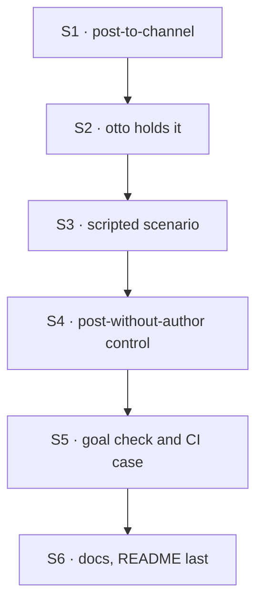

# FIX-1594 · Plan

[Spec](SPEC.md) · [Decisions](DECISIONS.md) · [Rules](BUSINESS-RULES.md) · **Plan** · [Docs](DOCS.md)

Written for the implementing agent. IDs cross-reference [BUSINESS-RULES.md](BUSINESS-RULES.md)
(BR-n), [DECISIONS.md](DECISIONS.md) (D-n) and the epic's rules (ER-n). `tdd`. One PR. Starts
when FIX-1589's and FIX-1590's implementations merge (ER-14): it reads FIX-1589's `seatId` and
scripted-model fix, and FIX-1590's heard turn, filter and `no-author-filter` control.

## Surfaces

| ID | Package · role | Change | Rules |
|---|---|---|---|
| S1 | `workforce` · a new capability beside `createSeatHireCapability` | Contributes one catalog tool, `post-to-channel`: closed input `{ channel, body }`; reads the author from the seat's `seatId` (FIX-1589's key: the seat record's id, as `members:` lists it, [FIX-1589 D3](../FIX-1589/DECISIONS.md#d3)) and refuses by name when it is missing; dispatches the built-in channel kind's internal `post` into the named channel's session. Returns "handed over", or fails the call with the refusal the dispatcher returns at once (`external-dispatcher`, unknown channel). No membership check of its own (D3), and no test-mode switch. Export it from the package root | BR-1–BR-8 BR-16 BR-17 BR-19 · D1 D2 D3 |
| S2 | kitchen-sink · `workforce/hire.ts` and `support.otto`'s `WORKER.md` | Compose S1 into the agent kind's `uses`; add `post-to-channel` to otto's `tools:`. Nobody else names it | BR-7 |
| S3 | kitchen-sink · the scripted model (`lib/e2e-mock-script.ts`) | The `[scenario:reply-in-channel]` scenario for the agent kind's generators: a step with a `post-to-channel` call and no text, then a text step. The line's body carries a line marker and the run's token. Reuses FIX-1589 S4's dispatcher fix (latest-user-turn matching, a cursor per request); adds the scenario only | BR-2 · goal check |
| S4 | kitchen-sink · the `post-without-author` control, test mode only | Under `GOAL_CONTROL=post-without-author` and `KITCHEN_SINK_TEST_MODE=1`, kitchen-sink registers its own `post-to-channel` that dispatches the same `post` without `author`, in place of S1's. `GOAL_CONTROL=no-author-filter` is FIX-1590's, pinned there and consumed here | goal check |
| S5 | `goals/kitchen-sink-talk/agent-replies-in-the-channel/` and FIX-1585's talk Playwright spec | `goal.md` from [SPEC.md's goal](SPEC.md#the-goal-and-how-well-know-its-met), `run.mts` driving a real browser against the production build, reading woken turns the way FIX-1590's leg-b check does. The same scenario, without controls, as a case in FIX-1585's talk spec, so leg c has a CI regression | BR-9 BR-12 BR-13 |
| S6 | Docs and release note | [DOCS.md](DOCS.md)'s operations, the kitchen-sink README last (ER-19). One `patch` changeset for `@flow-state-dev/workforce`: the new tool. Additive, since `seatId` and its boot refusal are FIX-1589's; nothing existing changes shape, so pre-1.0 it is a `patch`, as FIX-1590's additive entry is | — |

## Sequence



## Checks

| ID | Runs after | Passes when |
|---|---|---|
| V1 | S1 | Workforce test on real channel and agent kinds, scripted model: BR-1, BR-3, BR-4, BR-5 (nothing written, refusal on the channel's request), BR-6, BR-7, BR-8, BR-17, and BR-19 on a host whose dispatcher is external. The author assertion is on the stored line, never the tool's input. Second path (BP-035): a runtime-hired seat posts with its own id (BR-16). Start from `packages/workforce/test/channel-post-fences.test.ts` for the dispatch shape |
| V2 | S2 S3 | Kitchen-sink flow test through the real config: a post with the marker wakes otto (FIX-1590), otto's line lands authored `support.otto`, and otto's own conversation holds the tool call, not a copy of the line (BR-2, BR-15) |
| V3 | S2 | Otto's line triggers no woken run on any seat (BR-9). Red under `no-author-filter` |
| VG | S5 | [The goal](SPEC.md#the-goal-and-how-well-know-its-met): `goals/kitchen-sink-talk/agent-replies-in-the-channel/run.mts` PASSES on the production build, keyless, after it FAILED under each of `GOAL_CONTROL=no-author-filter` and `GOAL_CONTROL=post-without-author`, each on its own half. The talk-spec case passes in CI |
| V4 | S6 | The workforce-shell checks, `a-channel-holds-the-work-a-seat-drains` and FIX-1585's, FIX-1589's and FIX-1590's goal checks stay green (ER-18) |

## Pinned names

| Where | Name | Why pinned |
|---|---|---|
| The tool | `post-to-channel` | A worker file types it in `tools:` |
| The scenario marker | `[scenario:reply-in-channel]` | The goal check and the script share it |
| Read, pinned elsewhere | `seatId` (FIX-1589) · `GOAL_CONTROL=no-author-filter` and the heard turn `<writer> in <channel>: <body>` (FIX-1590) | Consumed as those specs pin them |

Everything else, including the capability's export name, is yours.

## Guardrails

| Rule | Because |
|---|---|
| The tool's input has no author and is closed | D2 and BP-031. A model that can name the author can post as anyone on the roster |
| The author is `seatId` or nothing: a seat without it is refused, never posted as the principal | A post without an author would wake every seat and skip the member check |
| The only writer of a line is the channel's own `post` | ER-4 and ER-12. No second messaging path, no assistant item on the channel |
| No edit to `agent-worker-flow.ts`, the hire, core, engine, client or react | FIX-1590 owns the receiver, FIX-1589 the key; ER-8. A needed core or engine change stops the work and comments up on the epic (ER-15) |
| This issue never wakes anyone | The fan-out and its filter are FIX-1590's (epic seam). A seat post that did not stamp its author would defeat that filter |
| Controls exist only in kitchen-sink's test mode, never inside the published package | A production switch that removes the author or the filter is the loop D2 exists to prevent |

## Docs

Reconcile and publish [DOCS.md](DOCS.md) after VG passes. The kitchen-sink README's channel half
goes last, once FIX-1585's, FIX-1589's and FIX-1590's sentences are true (epic DOCS, ER-19).

## Sketch · pseudocode, illustrative, react to the shape

```
post-to-channel (a sequencer, not a handler: it runs a dispatcher):
    input from the model:  { channel, body }                ← closed, no author
    author  ← the seat's own settings: seatId               ← FIX-1589's, written by the hire
              missing → refuse by name
    dispatch  channel kind · internal action "post"
              session { id: channel }
              payload { body, author }
    refused at dispatch?  fail the call with the reason     ← external-dispatcher, unknown channel
    return "handed to <channel>"                            ← not "posted" (D3)
```

**POC:** [`poc/seat-posts/`](poc/seat-posts/README.md): premise CONFIRMED keyless; D3's wording
came from P4.

## At implement time

- FIX-1590's heard turn is `<writer> in <channel>: <body>`, with `<channel>` the channel's session
  id ([FIX-1590 DECISIONS](../FIX-1590/DECISIONS.md), BR-8): the id the tool takes. The scripted
  step reads it from there.
- FIX-1585's `post` emits a `channel-post` item. Confirm a post from an internal dispatch leaves
  the item client-visible; the POC ran on the older transcript in state.
- Each seat post costs the channel two requests (the post and its fan-out) against `read`'s
  window (FIX-1585 D1). Nothing to do; know it.
- Re-read `seat-hire-capability.ts` for the sibling's current shape before writing S1.

## Follow-ups

- Tell a seat when the channel refused its post (a reply dispatch back to the sender), so an agent
  never believes a refused post landed (D3).
- A route that works behind an external dispatcher, where a delivery into an existing session is
  refused today (BR-19).
- Posting into a custom channel kind: that kind declares an internal `post`, and the tool routes by
  the channel's kind.
