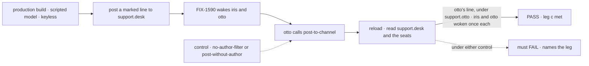
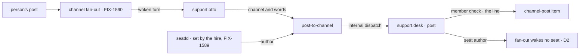

# FIX-1594 · Workforce: an agent seat can reply into a channel it belongs to

**Spec** · [Decisions](DECISIONS.md) · [Rules](BUSINESS-RULES.md) · [Plan](PLAN.md) · [Docs](DOCS.md)

Feature · `workforce` + kitchen-sink · medium · 1 PR · epic [FIX-1592](https://linear.app/fixpoint-labs/issue/FIX-1592), leg c · after [FIX-1589](https://linear.app/fixpoint-labs/issue/FIX-1589) and [FIX-1590](https://linear.app/fixpoint-labs/issue/FIX-1590)

## Five people, before and after

| Someone who… | Today | After |
|---|---|---|
| **posts a question to `support.desk`** | Once FIX-1590 lands, `support.otto` answers in its own conversation, where nobody reading the channel looks | Reads otto's answer in `support.desk`, under `support.otto`, after a reload |
| **reads `support.desk` after otto answered** | Sees only what people posted | Sees otto's line once. It woke no seat, so two agents never answer each other |
| **tells `support.otto` directly "let the desk know"** | Otto can find its channels and can't post to one | Otto posts to a channel it belongs to, as itself |
| **writes a worker file** | Can't let a seat post to a channel | Adds `post-to-channel` to the seat's `tools:`. A seat without it can't post |
| **tries to make an agent post as someone else** | n/a | Can't. The model picks the channel and the words; the server sets the name. A channel the seat is not in refuses the post |

Jake's last sentence is the one the page can't show yet: an agent that heard a post answers back
in that channel. FIX-1585 and FIX-1590 build the rest.

## The goal, and how we'll know it's met

**A person posts to `support.desk`, and `support.otto`'s reply appears in that channel under its
own name, is still there after a reload, and wakes nobody.**

| Is it the right goal? | |
|---|---|
| **The real need** | The epic's [leg c](../../epics/FIX-1592/SPEC.md#the-goal-and-how-well-know-its-met). Jake, 2026-09-25: *"if you talk to an agent through a channel, the agent can respond back to that channel."* Signal c: *"otto's reply is a line in support.desk under its name, survives a reload, runs no seat"* |
| **Smaller, and rejected** | "The seat answers the post." FIX-1590 already makes that true in the seat's own conversation, where nobody reading the channel looks. The issue's own fences say a seat-only reply is not acceptance |
| **Bigger, and not this issue's** | Agents answering each other in a channel ([D2 of the epic](../../epics/FIX-1592/DECISIONS.md#d2), reversed). Live refresh of a line a seat writes while the page is open. Verified identity ([FIX-1493](https://linear.app/fixpoint-labs/issue/FIX-1493)) |
| **Not done if** | The line reads `devuser` · it is gone after a reload · otto's line wakes `support.iris` · it passes only from the CLI, with a key, or as a package test |



The check reads the page after a reload, so only what the channel kept can pass it. Each control
removes one half of "under its own name, wakes nobody", and must fail on that half.

| How we verify | |
|---|---|
| **Goal check** | `goals/kitchen-sink-talk/agent-replies-in-the-channel/`, a real browser on kitchen-sink's production build. The epic's leg c, run again at wrap with the other three ([ER-17](../../epics/FIX-1592/BUSINESS-RULES.md#the-proof)). Run by the implementer at completion; to `fsd-qa` only if no browser runs here. Verdict in the implementation PR |
| **Model** | Scripted, keyless ([epic D3](../../epics/FIX-1592/DECISIONS.md#d3)). A step with a tool call and no text runs the real tool; the [POC](poc/seat-posts/README.md) ran exactly that |
| **Signal** | After a reload: one line in `support.desk` labelled `support.otto` carrying the run's token and the scenario's line marker. `support.iris` and `support.otto` each show one woken turn for the post, and no second one after otto's line |
| **Input** | A post carrying a fresh token and `[scenario:reply-in-channel]`. A different token, or the same post sent twice, must pass too |
| **Anti-game** | Don't assert on the reply's wording, which the script wrote. Don't assert on the tool's return value or a package test. Don't match another run's line: other tests post to the same channel |
| **Control that must fail** | `GOAL_CONTROL=no-author-filter`, FIX-1590's pinned control, drops the epic's D2 filter: otto's line wakes iris, so the "woken once" half fails. `GOAL_CONTROL=post-without-author`, read in kitchen-sink, swaps in a tool that sends no author: the line reads `devuser`, so the "under its name" half fails. Today's `main` fails both: no seat can post |
| **Regression** | The same scenario, without controls, as a case in FIX-1585's talk Playwright spec, so leg c stays covered in CI after the goal check has run |

## What changes


Read the right column top to bottom: otto's answer takes one more step, into the channel's own
`post`, and the name on the line comes from the server. The dashed box is the fan-out for
otto's line, which wakes nobody.

**A worker file, the whole of what an app author writes:**

```diff
  ---
  description: Fields the same questions, carrying only what the kind gives every seat.
- tools: [desk-note]
+ tools: [desk-note, post-to-channel]
  ---
```

**What the model sends, and what the channel stores:**

```diff
+ post-to-channel { channel: "support.desk", body: "Refunds post on Fridays." }
+ // support.desk gets: { author: "support.otto", principal: "devuser", authorVerified: false, body }
```

## How the reply reaches the channel



The author enters at the hire, not at the model: the tool reads the `seatId` FIX-1589 has the
hire write into every seat. The channel's own `post` is the only place a line is written and the
only place membership is checked.

## What stays as it is

- The post contract, `{ body, author? }`, and a browser post naming no author (FIX-1585 D2).
- Who a post wakes, and the no-ping-pong filter: FIX-1590's. This issue only stamps the author.
- The channel panel. A seat's line is labelled by its author, like every line. With the panel
  open, it shows the next time the panel reads the channel, not live (FIX-1585's stated limit).
- Deployments that hand dispatch to an external queue. There a delivery into an existing session
  is refused before anything is enqueued, so the tool works only where dispatch runs in process.
  It reports that refusal as a failed call; a queue-safe route is a follow-up.
- `desk-clerk` and `followup-runner` seats don't post back.

## Sign off

**[The goal](#the-goal-and-how-well-know-its-met), at that size**, and three decisions:

1. **[D1](DECISIONS.md#d1) · An agent replies in a channel by choosing to, with a
   `post-to-channel` tool its worker file grants.** Every woken answer is not copied in. If
   wrong: a live model sometimes answers only in its own conversation, and the demo leans on the
   prompt.
2. **[D2](DECISIONS.md#d2) · The name on the line is the seat id FIX-1589 introduced**, which the
   hire writes into every seat's settings. The model never supplies it. If wrong: the line can
   only be as trustworthy as that key, and a change to it on FIX-1589's side re-gates this.
3. **[D3](DECISIONS.md#d3) · The channel's own `post` is the only gate.** The tool reports that
   it handed the post over, not that it landed; a refusal at dispatch fails the call. If wrong:
   an agent that names a channel it isn't in believes it posted, and nothing appears.

**Open: none.** Number 1 is the one to weigh. Reasoning and what lost:
[DECISIONS.md](DECISIONS.md). The cases: [BUSINESS-RULES.md](BUSINESS-RULES.md).
