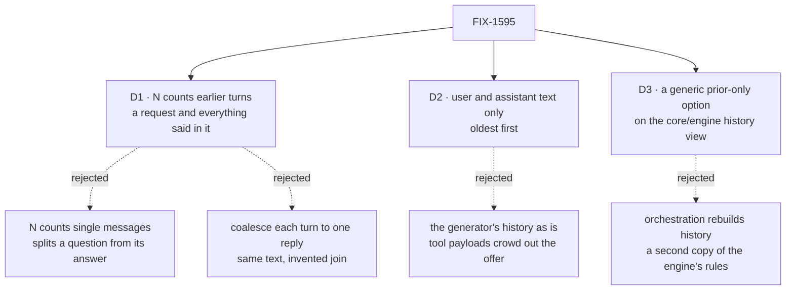

# FIX-1595 · Decisions

[Spec](SPEC.md) · **Decisions** · [Rules](BUSINESS-RULES.md) · [Plan](PLAN.md) · [Docs](DOCS.md) · [Evolution](EVOLUTION.md)

What was considered, what was chosen, and what each choice locks in. D1 and D2 are the
sign-off surface; D3 is an engineering call recorded so its new public field is visible. The API shape itself, `skillEvaluator(model, { recentMessages?: number })`, was
the owner's call on the issue and is not re-asked here.

## The tree

Solid edges are what you're signing. Dashed edges lost, and the label says why.

## D1 · `recentMessages: N` counts the last N earlier turns, not N single messages

A turn is one completed earlier request: the user's message and every user or assistant message
that request kept in history. A flow that answers in one message gives two per turn; a sequenced
flow that answers in several steps gives more.

| | |
|---|---|
| **Instead of** | (a) Counting single messages, so `3` would be a reply, the ask before it, and half of the turn before that. (b) Coalescing each turn into exactly one user and one assistant entry: the same text reaches the model either way, so it saves nothing, and it invents a join the generator's history doesn't have |
| **Because** | The issue asks for "the last N turns", and the framework's history already counts that way: a bare number in a history limit means turns, one request each (`MessageLimit` in core). A turn is the unit a follow-up refers back to; a message count can hand the evaluator a reply without the question it answered |
| **Locks in** | The name says messages; the unit is turns. N bounds how many turns, not how many messages or tokens: those depend on what the turns said. Changing the unit after release silently changes cost and picks for every app that set it, so it is decided now |

**What would change my mind:** the owner meant literal messages. Then the count switches before
it ships; nothing else in the design moves.

## D2 · The evaluator sees what was said: user and assistant text, oldest first

| | |
|---|---|
| **Instead of** | Handing over the generator's history messages as they are, tool calls, tool results and reasoning included |
| **Because** | A follow-up like "yes, go ahead" points at what the assistant *said*. Tool payloads are large and would crowd the offer out of a small evaluation model's view. The turns still come from the same history-kept items the generator uses, with the same visibility and window, so nothing hidden from the generator reaches the evaluator |
| **Locks in** | A follow-up whose referent lived only in a tool result still misses. Adding tool traffic later is additive and opt-in; removing it after release would not be |

## D3 · The in-flight turn is left out by a generic option on the history view

| | |
|---|---|
| **Instead of** | Orchestration selecting completed prior requests and rebuilding visibility, transient and window rules itself. It can't do that from public surface: `items.history()` always appends the in-flight request (`loadLLMHistory` in `packages/engine/src/context/history.ts`) and returns one flat list, and the raw views carry no message role |
| **Because** | Which items count as history is the engine's contract. One optional field on core's `ItemQuery`, honored by `items.history()`, keeps one implementation of it. It is generic, Layer 1, and knows nothing about skills or evaluators |
| **Locks in** | A new public, optional field on `ItemQuery` (core) and its handling in the engine's history view. Omitted, `items.history()` behaves exactly as today. The tier's read becomes one call: the new option, `limit: N` turns, `itemTypes: ["message"]`, `roles: ["user", "assistant"]`. The flow's `historyWindow` already bounds what that view loads |

## Decided, not asked

- **Omit or `0` is today, byte for byte**: the evaluated state is the bare message string and no
  history is read.
- **A bad value is refused when `skillEvaluator` is called**: negative, fractional or non-numeric,
  naming the option. A silent fallback to no context is the failure the option exists to fix.
- **With N above 0 the evaluated state is `{ recentMessages, message }`**, and `recentMessages` is
  an array even when empty, so the shape doesn't flip on turn one.
- **The activator gathers; the helper declares.** Locked on the issue. The helper tells the tier
  N; the tier reads the session and hands turns in as a typed input field.
- **Only on the path that calls the evaluator**: after slash and keyword miss and the catalog is
  non-empty. Turns never stand in for an empty catalog (FIX-1372).
- **The in-flight turn is excluded** ([D3](#d3)). The current message appears once, as `message`.
- **The catalog is re-read after the pick**, exactly as today, with turns on or off: a skill
  removed or disabled while the model answered never activates.
- **The flow's history window caps N**, as it caps the generator. No unbounded transcript.
- **A hand-built evaluator gets `{ message, skills }` unchanged.** It owns its `state` and can
  read the session itself.
- **A session read failure fails the activator**, as an evaluator error does (FIX-1559 BR-12).
- **One PR, `tdd`: `core` (the query field), `engine` (the history view honors it) and
  `orchestration`, with `patch` changesets for all three** (the evaluator option shipped as
  `patch`; both additions are optional fields).

## Considered and dropped

| Alternative | Why not |
|---|---|
| Nothing: a hand-built evaluator whose `state` reads `ctx.session.items.history({ limit: 3 })` | Works today in about five lines, and is the honest simpler option. It lost because the owner chose the option, and because the recipe is subtly wrong today: that history view always appends the in-flight turn's items, whatever the limit, and includes tool traffic. D3's option makes the hand-built recipe correct too |
| The helper's own `state` reads the session | No cross-module wiring, but the issue locks gathering in the activator, and the turns would not appear in the block's input on the trace |
| Concatenate the turns into the choice question's text | Invent-kill on the issue: the evaluator must own a typed field |
| A separate "context-aware" activator or classifier | Invent-kill on the issue |
| The same option on the generator classifier | Out of scope on the issue; a follow-on if wanted |

## How it got here

- **Draft** — framed as follow-ups missing because tier 3 sees one message; the owner's thin
  option on `skillEvaluator`, with the activator gathering the last N exchanges as typed input;
  one PR in `orchestration`.
- **Review round 1** — D1 now counts turns, not two-message exchanges, because one request can
  keep several assistant messages, so "up to six messages" was false. D3 added: the in-flight turn
  is left out by a generic option on the core/engine history view, because public views can't
  express "prior turns only" and orchestration would have duplicated the engine's history rules.
  The post-pick catalog re-read is now stated as kept.

**Open: none.**
